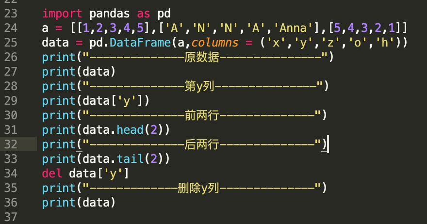
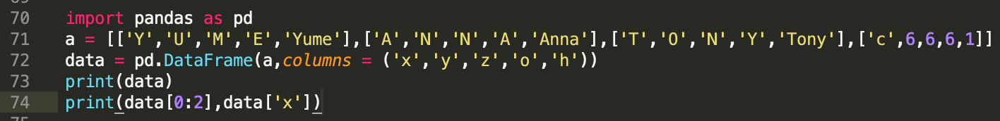
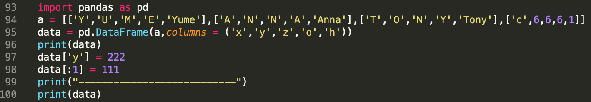
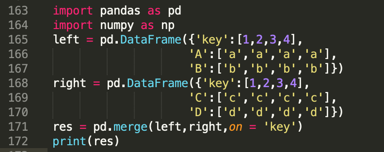
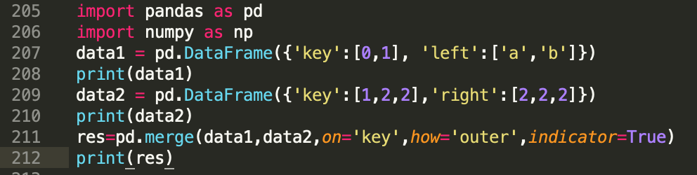
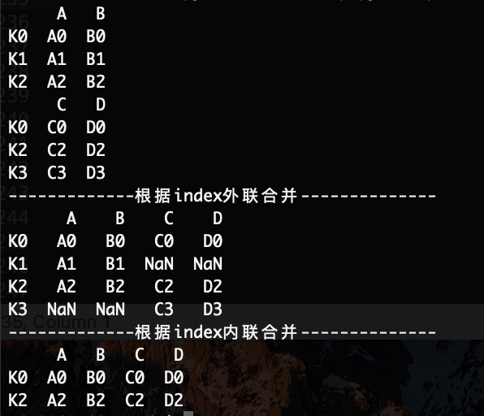

# Python Module Pandas

Version 1.0
Feb 12, 2020

Authors:
Anna Ning         Anna.Ning@quantacn.com

# Content

[TOC]

# Pandas 概述

* 一个快速、高效的DataFrame对象，用于数据操作和综合索引
* 用于在内存数据结构和不同格式之间读写数据的工具：CSV和文本文件、Microsoft Excel、SQL数据库和快速HDF 5格式
* 进行智能数据对齐和丢失数据的综合处理：在计算中获得基于标签的自动对齐，轻松地将凌乱的数据操作为有序的形式
* 对数据集的灵活调整和旋转
* 基于智能标签的切片、选择
* 可以从数据结构中插入和删除列，以实现大小可变
* 通过在强大的引擎中聚合或转换数据，允许对数据集进行拆分应用组合操作
* 对数据集进行高性能合并和连接
* 层次轴索引提供了在低维数据结构中处理高维数据的直观方法
* 时间序列\-功能：日期范围生成和频率转换、移动窗口统计、移动窗口线性回归、日期转换和滞后。甚至在不丢失数据的情况下创建特定领域的时间偏移和加入时间序列
* 对性能进行了高度优化
* Python与Pandas在广泛的学术和商业领域中使用，包括金融，神经科学，经济学，统计学，广告，网络分析，等等

# Pandas 安装与引用

* Pandas安装:
  * pip3 install Pandas
* Pandas引用:
  * import pandas
  * import pandas as pd

# Pandas 数据结构:

* Series
  * Series表示一维数据，表现形式为：索引在左边\,值在右边。如果没有指定索引\,会自动创建一个0到n\-1\(n为数据的长度\)的整数型索引
  * Series本身的属性有两种：一种是index，另一种是values
* DataFrame
  * DataFrame是一个表格型的数据结构
  * DataFrame含有一组有序的列，每列可以是不同的值类型\(数值、字符串、布尔值等\)。DataFrame既有行索引也有列索引，它可以被看做由Series组成的字典
  * 同样地，对于DataFrame来说，有三种属性可以调用，一是index，二是columns，三是values

## Pandas 数据结构---Series

* 创建Series

* 查看series的前两行

## Pandas 数据结构---DataFrame

| 属性/方法    | 说明          |
| ------------ | ------------- |
| values       | DataFrame的值 |
| index        | 行索引        |
| index.name   | 行索引的名字  |
| columns      | 列索引        |
| columns.name | 列索引的名字  |
| head(n)      | 返回前n行     |
| T            | frame行列转置 |
| tail(n)      | 返回前n行     |
| del data[n]  | 删除第n列     |

* 创建DataFrame

* 常用的DataFrame方法

# DataFrame 选择数据

* 切片选择
* 根据loc\-行标签选择数据
* 根据iloc\-序列选择数据
* 根据混合的两种ix
* 判断筛选

| function                      | Description                                      |
| ----------------------------- | ------------------------------------------------ |
| data[0:2]                     | 取前两行数据                                     |
| data.ix[1]                    | 取第2行数据                                      |
| data.iloc[1]                  | 取第2行数据                                      |
| data['x']                     | 取列索引为x的一列数据                            |
| data.loc['A']                 | 取第行索引为”A“的一行数据                        |
| data.loc[:,['x','z'] ]        | 表示选取所有的行以及columns为a,b的列             |
| data.loc[['A','B'],['x','z']] | 表示选取'A'和'B'这两行以及columns为x,z的列的并集 |
| data[data>2]                  | 表示选取数据集中大于2的数据                      |
| data[data.x>5]                | 表示选取数据集中x这一列大于5的所有的行           |
| print data.loc[:,['x','z'] ]  | 表示选取所有的行以及columns为x,z的列             |
| data.loc[['A','B'],['x','z']] | 表示选取'A'和'B'这两行以及columns为x,z的列的并集 |

## 切片选择

* 第一次切片选择 第二次按照筛选条件进行选择

## 根据loc行标签选择数据

* loc\[index\, column\_name\]\,选取指定行和列的数据

## 根据iloc序列进行选择数据

* iloc\[row\_index\, column\_index\]

## 根据混合的ix

* __DataFrame\.ix__ \[行索引的名称或位置或者条件\,列索引名称或位置\]

## 判断筛选

* 输出第z列中为N的数据

# DataFrame 设置数据

* 根据loc或iloc设置
* 根据条件设置
* 根据行或列设置
* 添加数据

## 根据loc或iloc设置

* 设置第2行y列，第2行2列值分别为777\,999

## 根据条件设置

* 设置y列等于N的所在行值为666

## 根据行或列设置

* 设置y列值为222，设置1行之前的数据为111

## 添加数据

* 增加一列

# DataFrame 处理丢失数据

* 处理数据中NaN数据
  * 使用dropna\(\)函数去掉NaN的行或列
  * 使用fillna\(\)函数替换NaN值
* 使用isnull\(\)函数判断数据是否丢失

## 处理数据中NaN数据

* 使用dropna\(\)函数去掉NaN的行或列

* 使用fillna\(\)函数替换NaN值

## 使用isnull\(\)函数判断数据是否丢失

# Pandas 导入导出

* pandas可以读取像csv、excel、json、html、SQL等格式的资料
* pandas可以把数据存为像csv、excel、json、html、SQL等格式的资料

| Format Type | Data Description                                            | Reader                                                       | Writer                                                       |
| ----------- | ----------------------------------------------------------- | ------------------------------------------------------------ | ------------------------------------------------------------ |
| text        | [CSV](https://en.wikipedia.org/wiki/Comma-separated_values) | [read_csv](https://pandas.pydata.org/pandas-docs/stable/user_guide/io.html#io-read-csv-table)() | [to_csv()](https://pandas.pydata.org/pandas-docs/stable/reference/api/pandas.DataFrame.to_csv.html#pandas.DataFrame.to_csv) |
| text        | [JSON](https://www.json.org/)                               | [read_json](https://pandas.pydata.org/pandas-docs/stable/user_guide/io.html#io-json-reader)() | [to_json()](https://pandas.pydata.org/pandas-docs/stable/user_guide/io.html#io-json-writer) |
| text        | HTML                                                        | [read_html](https://pandas.pydata.org/pandas-docs/stable/user_guide/io.html#io-read-html)() | [to_html()](https://pandas.pydata.org/pandas-docs/stable/user_guide/io.html#io-json-writer) |
| binary      | [MS Excel](https://en.wikipedia.org/wiki/Microsoft_Excel)   | [read_excel](https://pandas.pydata.org/pandas-docs/stable/user_guide/io.html#io-excel-reader)() | [to_excel()](https://pandas.pydata.org/pandas-docs/stable/user_guide/io.html#io-json-writer) |
| SQL         | [SQL](https://en.wikipedia.org/wiki/SQL)                    | [read_sql](https://pandas.pydata.org/pandas-docs/stable/user_guide/io.html#io-sql)() | to_sql()                                                     |

## pandas读取csv格式的资料

## pandas把资料存储为json格式

# Pandas 合并concat

* axis合并
* join合并
* append\(\)函数添加合并

* Pandas合并merge
  * 根据key合并
    * 依据一组key合并
    * 依据两组key合并
  * Indicator合并
  * 根据index合并
* Pandas 合并concat
  * pd\.concat\(objs\,axis=0\, join= 'outer'\,ignore\_index= ''\)

## axis合并

## join合并

## append\(\)函数添加合并

## Pandas合并merge

* merge\(left\, right\, how=''\, on=''\,left\_index= '' \,right\_index= ''\, indicator= ''\)

| Params      | Description                                                  |
| ----------- | ------------------------------------------------------------ |
| how=''      | 指的是合并(连接)的方式，有inner(内连接),left(左外连接),right(右外连接),outer(全外连接);默认为inner |
| on=‘’       | 指的是用于连接的列索引名称。必须存在右右两个DataFrame对象中，如果没有指定且其他参数也未指定则以两个DataFrame的列名交集做为连接键 |
| left_index  | 使用左则DataFrame中的行索引做为连接键                        |
| right_index | 使用右则DataFrame中的行索引做为连接键                        |
| indicator   | 显示合并数据中来源情况；如只来自己于左边(left_only)、两者(both)、右边(right_only) |

* 根据key合并
  * 依据一组key合并

* 根据key合并
  * 依据两组key合并

* Indicator合并

* 根据index合并

# END