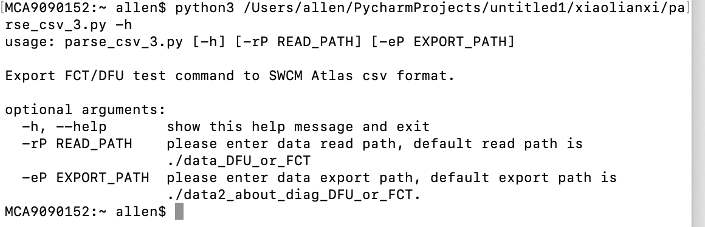
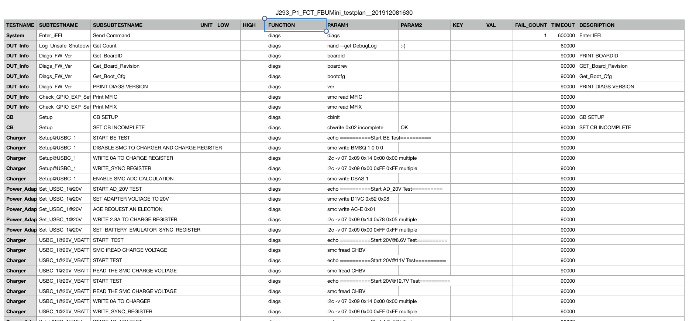
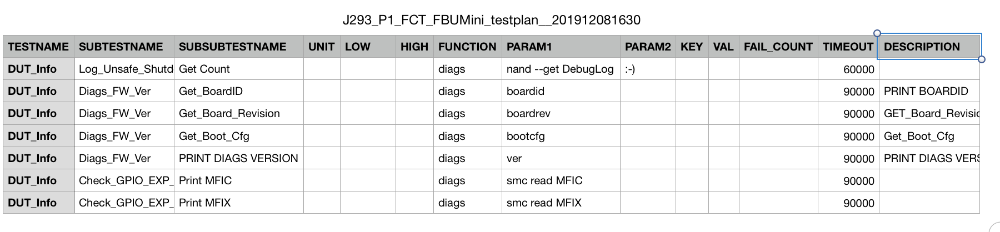
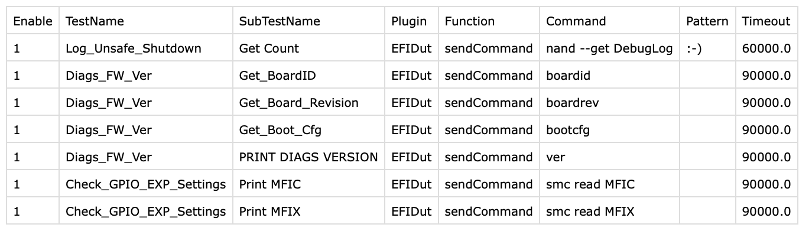

# Purpose

* 从FCT的overlay中抓出diags 相关command&expect value
* 输出格式
  * FCT
    * 输出格式以TESTNAME为文件名，把TESTNAME相同的放入一个以TESTNAME命名的csv文件中。

# Script Argument

查看帮助

python3 /Users/allen/Desktop/Allen\_5\.0/parse\_csv\_2\.py \-h



* 参数
  * \-rP    资源路径   1\.可以是资源文件夹路径，2\.也可以是资源文件的路径
    * Default =  \./data\_DFU\_or\_FCT
  * \-eP     存储路径    存储文件夹中的内层文件夹对应的处理之后的FCT文件，外边为处理的DFU文件
    * Default = \./data2\_about\_diag\_DFU\_or\_FC

# Process Flow

* 1\.接收参数，读取数据\-dP资源路径，\-eP 存储路径
  * paraseArgs\(\)
  * readInputData\(read\_Path\)
* 2\.遍历文件夹中的csv文件
  * 处理FCT有关的文件
    * find\_FCT\_diags\(df,save\_name,export\_path\)







文件名：TESTNAME（DUT\_Info）

```
Enable："1"

TestName：SUBTESTNAME

SubTestName：SUBSUBTESTNAME

Plugin："EFIDut"

Function:"sendCommand"

Command:PARAM1

Pattern:PARAM2

Timeout:TIMEOUT
```

# Script Argument

* 带参数执行
  * 一个参数
    * python3   /Users/allen/Desktop/Allen\_5\.0/parse\_csv\_2\.py  \-rP 资源路径
    * python3   /Users/allen/Desktop/Allen\_5\.0/parse\_csv\_2\.py  \-eP  存储路径
  * 两个参数
    * python3   /Users/allen/Desktop/Allen\_5\.0/parse\_csv\_2\.py  \-rP 资源路径     \-eP  存储路径

