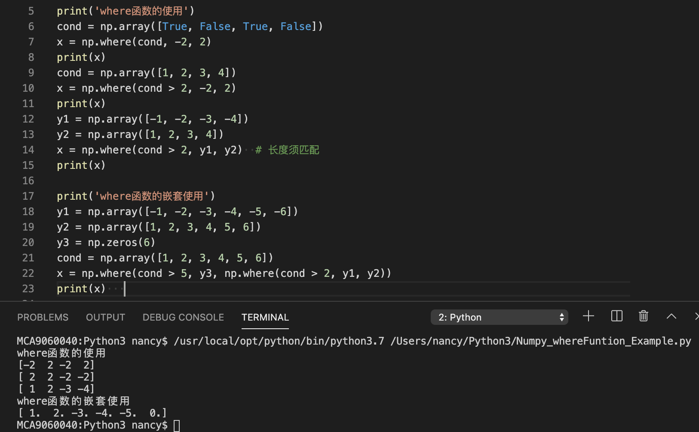
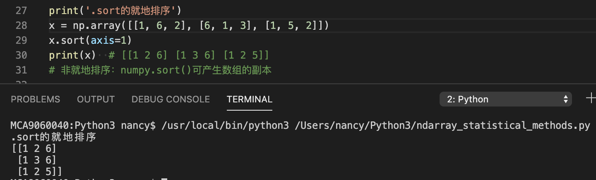
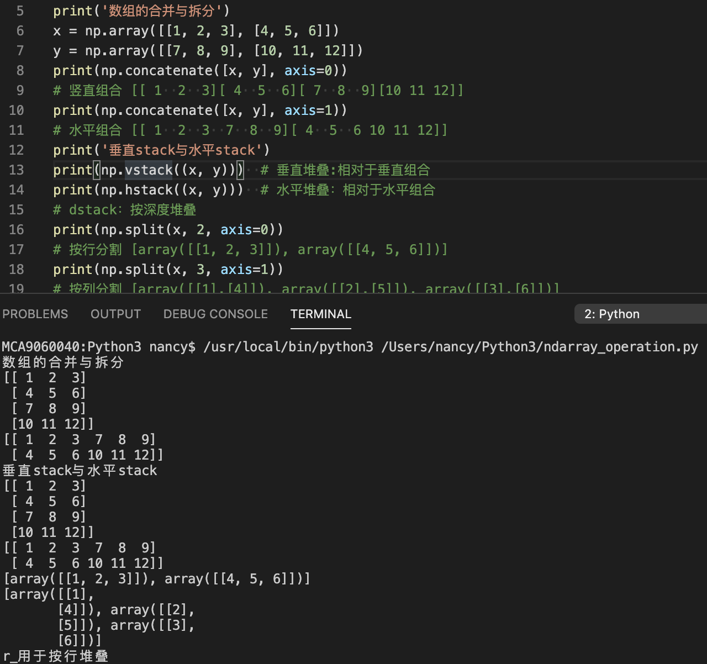
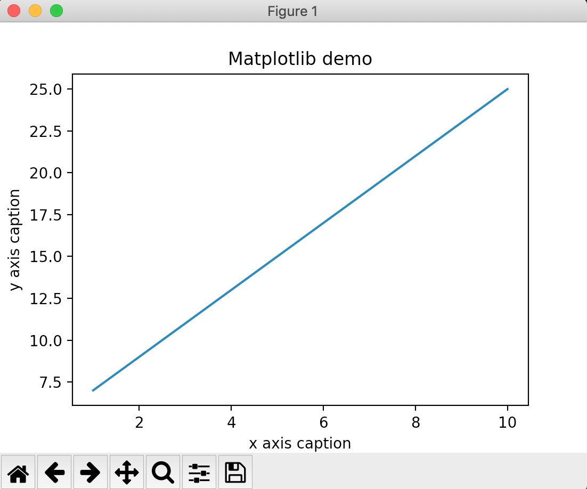
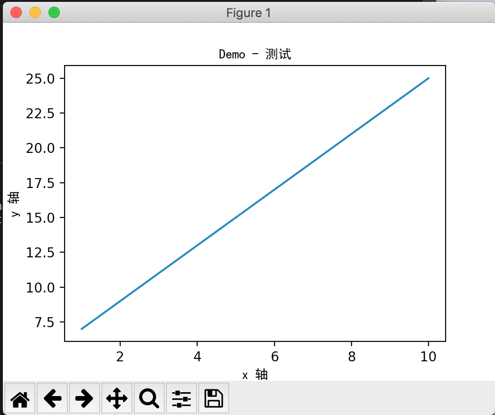
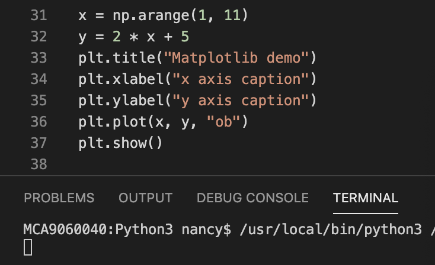

# Python Module Numpy
CM-MacDiags 2019-12-03

# Agenda

NumPy概述

NumPy安装与引用

NumPy Ndarray对象

NumPy数据类型

NumPy数组属性

Numpy创建ndarray数组

Numpy切片和索引

Numpy高级索引

Ndarray的矢量化计算

Ndarray数组的转置和轴对换

Ndarray通用函数

NumPy的where函数使用

Ndarray常用的统计方法

Ndarray数组的去重以及集合运算

Ndarray数组重塑

Ndarray数组的拆分与合并

Ndarray数组的元素重复操作

Numpy IO

Numpy中的线性代数（附件）

Numpy中的随机数生成 （附件）

# Numpy 概述

* _NumPy_ \(Numerical Python\)是Python语言的一个扩展程序库，支持大量的 _维度数组与矩阵运算_ ，此外也针对 _数组运算_ 提供大量的 _数学函数库_ 。
* NumPy的前身Numeric最早是由Jim Hugunin与其它协作者共同开发，2005年，Travis Oliphant _在_  _Numeric_  _中结合了另一个同性质的程序库_  _Numarray_ 的特色，并加入了其它扩展而开发了NumPy。
* NumPy是一个运行速度非常快的数学库，主要用于数组计算，包含：
  * 一个强大的N维数组对象Ndarray
  * 广播功能函数
  * 整合C/C\+\+/Fortran代码的工具
  * 线性代数、傅里叶变换、随机数生成等功能

* Numpy的优缺点
  * NumPy的优点：
    * 对于同样的数值计算任务，使用NumPy要比直接编写Python代码便捷得多；
    * NumPy中的数组的 _存储效率_ 和 _输入输出性能_ 均远远优于Python中等价的基本数据结构，且其能够提升的性能是与数组中的元素成比例的；
    * NumPy的大部分代码都是用 _C_  _语言_ 写的，其底层算法在设计时就有着优异的性能，这使得NumPy比纯Python代码高效得多
* NumPy的缺点：
  * 由于NumPy使用 _内存映射文件_ 以达到最优的数据读写性能，而内存的大小限制了其对TB级大文件的处理
  * NumPy数组的通用性不及Python提供的list容器

# NumPy 安装与引用

* NumPy安装
  * 安装NumPy最简单的方法就是使用pip工具： pip3 install numpy
    * pip是Python包管理工具，提供了对Python包的查找、下载、安装、卸载的功能。
    * pip官网：  _https://pypi.org/project/pip/_ 

# Module Numpy

* NumPy引用
  * import numpy
  * import numpy as np

# NumPy Ndarray 对象

* Ndarray对象
  * ndarray：N维数组对象（矩阵），所有元素必须是相同类型，以0下标为开始进行集合中元素的索引。
  * ndarray中的每个元素在内存中都有相同存储大小的区域。
  * 创建一个ndarray只需调用NumPy的array函数即可：
    * numpy\.array\(object, \[dtype = None,\] \[copy = True,\] order = None, subok = False, ndmin = 0\)
* 参数说明：
* dtype参数
* 说明：  _ndarray_  _对象_ 由计算机 _内存的连续一维部分_ 组成，并结合 _索引模式_ ，将每个元素映射到内存块中的一个位置。内存块以行顺序\(C样式\)或列顺序\(FORTRAN或MatLab风格\)来保存元素。

# NumPy 数据类型

  * numpy支持的数据类型比Python内置的类型要多很多，基本上可以和C语言的数据类型对应上。下表列举了常用NumPy基本类型。

* numpy的数值类型实际上是dtype对象的实例，并对应唯一的字符，包括np\.bool\_，np\.int32，np\.float32，等等
* 数据类型对象\(dtype\)：用来描述与数组对应的内存区域如何使用，这依赖如下几个方面：
  * 数据的类型（整数，浮点数或者Python对象）
  * 数据的大小（例如， 整数使用多少个字节存储）
  * 数据的字节顺序（小端法或大端法）
  * 在结构化类型的情况下，字段的名称、每个字段的数据类型和每个字段所取的内存块的部分
  * 如果数据类型是子数组，它的形状和数据类型
  * 字节顺序是通过对数据类型预先设定"<"或">"来决定的。"<"意味着小端法\(最小值存储在最小的地址，即低位组放在最前面\)。">"意味着大端法\(最重要的字节存储在最小的地址，即高位组放在最前面\)。
  * dtype对象是使用以下语法构造的： numpy.dtype(object, align, copy)
  * object \-要转换为的数据类型对象
  * align \-如果为true，填充字段使其类似C的结构体
  * copy \-复制dtype对象 ，如果为false，则是对内置数据类型对象的引用

  * dtype实例
* 每个内建类型都有一个唯一定义它的字符代码，如下：

# NumPy 数组属性

NumPy数组的维数称为秩（rank），秩就是轴的数量，即数组的维度，一维数组的秩为1，二维数组的秩为2，以此类推。

NumPy的数组中比较重要ndarray对象属性有：

* 实例ndarray\.ndim，用于返回数组的维数，等于秩。
* 实例ndarray\.itemsize，以字节的形式返回数组中每一个元素的大小。
  * 例如，一个元素类型为float64的数组itemsize属性值为8\(float64占用64个bits，每个字节长度为8，所以64/8，占用8个字节），又如，一个元素类型为complex32的数组itemsize属性为4（32/8）。

ndarray\.flags返回ndarray对象的内存信息，包含以下属性：

# Numpy 创建ndarray数组

  * ndarray：N维数组对象（矩阵），所有元素必须是相同类型。
  * ndarray属性：ndim属性，表示维度个数；shape属性，表示各维度大小；dtype属性，表示数据类型。
  * 创建ndarray数组函数：

  * numpy\.empty方法用来创建一个指定形状（shape）、数据类型（dtype）且未初始化的数组：
      * numpy\.empty\(shape, dtype = float, order = 'C'\)
*  __注意__   −  数组元素为随机值，因为它们未初始化。

  * numpy\.zeros方法创建指定大小的数组，数组元素以0来填充：
    * numpy\.zeros\(shape, dtype = float, order = 'C'\)

  * numpy\.ones方法创建指定形状的数组，数组元素以1来填充：
    * numpy\.ones\(shape, dtype = None, order = 'C'\)

  * numpy\.asarray方法类似numpy\.array，但numpy\.asarray参数只有三个，比numpy\.array少两个。
    * numpy\.asarray\(a, dtype = None, order = None\)

  * numpy\.frombuffer方法用于实现动态数组，接受buffer输入参数，以流的形式读入转化成ndarray对象。
    * numpy\.frombuffer\(buffer, dtype = float, count = \-1, offset = 0\)
*  _注意：_    buffer _是字符串的时候，_   Python3   默认  str   _是_    _Unicode_    类型，所以要转成   bytestring   _在原_    str    _前加上_    b    _。_ 

  * numpy\.fromiter方法从可迭代对象中建立ndarray对象，返回一维数组。
    * numpy\.fromiter\(iterable, dtype, count=\-1\)

  * numpy\.arange   numpy包中的使用arange函数创建数值范围并返回ndarray对象，函数格式如下：
    * numpy\.arange\(start, stop, step, dtype\)
    * 根据start与stop指定的范围以及step设定的步长，生成一个ndarray。

  * numpy\.linspace  函数用于创建一个一维数组，数组是一个等差数列构成的，格式如下：
    * numpy\.linspace  (  start  ,  stop  ,  num  =  50  ,  endpoint  =  True  ,  retstep  =  False  ,  dtype  =  None  \)

  * numpy\.logspace函数用于创建一个于等比数列。格式如下：
    * numpy\.logspace\(start, stop, num=50, endpoint=True, base=10\.0, dtype=None\)
    * base参数意思是取对数的时候log的下标

# Numpy 索引和切片

* 一维数组的索引：与Python的列表索引功能相似
* 多维数组的索引：
  * arr\[r1:r2, c1:c2\]
  * arr\[1,1\]等价arr\[1\]\[1\]
  * \[:\]代表某个维度的数据
* ndarray对象的内容可以通过索引或切片来访问和修改，就像python的内置容器对象一样。
* nadarray对象中的元素遵循基于零的索引，有三种可用的索引方法类型：字段访问，基础切片和高级索引。
* 基本切片是Python中基本切片概念到n维的扩展，通过start，stop和step参数提供给内置函数的slice函数来构造一个Python slice对象，此slice对象被传递给数组来提取数组的一部分。
* 切片还可以包括省略号…，来使选择元组的长度与数组的维度相同。 如果在行位置使用省略号，它将返回包含行中元素的ndarray。

# Numpy 高级索引

  * NumPy比一般的Python序列提供更多的索引方式。除了之前看到的用整数和切片的索引外，数组可以由整数数组索引、布尔索引及花式索引。
    * 整数数组索引
* 以下实例获取了4X3数组中的四个角的元素。 行索引是\[0,0\]和\[3,3\]，而列索引是\[0,2\]和\[0,2\]。返回的结果是包含每个角元素的ndarray对象。

  * NumPy比一般的Python序列提供更多的索引方式。除了之前看到的用整数和切片的索引外，数组可以由整数数组索引、布尔索引及花式索引。
  * 整数数组索引
    * 可以借助切片:或…与索引数组组合。如下：

  * NumPy比一般的Python序列提供更多的索引方式。除了之前的用整数和切片的索引外，数组可以由整数数组索引、布尔索引及花式索引。
    * 布尔索引
* 使用布尔数组作为索引。arr\[condition\]，condition为一个条件/多个条件组成的布尔数组。

  * NumPy比一般的Python序列提供更多的索引方式。除了之前看到的用整数和切片的索引外，数组可以由整数数组索引、布尔索引及花式索引。
    * 花式索引
* 使用整型数组作为索引。

# Ndarray矢量化计算

* 矢量运算：相同大小的数组键间的运算应用在元素上
* 矢量和标量运算：“广播”—将标量“广播”到各个元素
* 广播\(Broadcast\)是numpy对不同形状\(shape\)的数组进行数值计算的方式， 对数组的算术运算通常在相应的元素上进行。
        * 简单理解：对两个数组，分别比较他们的每一个维度（若其中一个数组没有当前维度则忽略），满足：
  * 数组拥有相同形状。
  * 当前维度的值相等。
  * 当前维度的值有一个是1。

# Ndarray 数组的转置和轴对换

* 数组的转置/轴对换只会返回源数据的一个视图，不会对源数据进行修改。

# Ndarray 通用函数

通用函数（ufunc）是一种对ndarray中的数据执行元素级运算的函数。

一元通用函数：

* 通用函数（ufunc）是一种对ndarray中的数据执行元素级运算的函数。
* 二元通用函数：

* 通用函数（ufunc）是一种对ndarray中的数据执行元素级运算的函数。
* 一元、二元通用函数实例：

# Numpy 的where函数使用

* np\.where\(condition\[x, y\]\)，第一个参数为一个布尔数组，第二个参数和第三个参数可以是标量也可以是数组。
  * 这里x,y是可选参数，condition是条件，这三个输入参数都是array\_like的形式；而且三者的维度相同；
  * 当conditon的某个位置的为true时，输出x的对应位置的元素，否则选择y对应位置的元素；
  * 如果只有参数condition，则函数返回为true的元素的索引；

# Ndarray 常用的统计方法

* 通过这些基本统计方法对整个数组/某个轴的数据进行统计计算。

* 实例：

* 用于布尔数组的统计方法：
  * sum: 统计数组/数组某一维度中的True的个数
  * any: 统计数组/数组某一维度中是否存在一个多个True
  * all: 统计数组/数组某一维度中是否都是True

# Ndarray 常用的去重以及集合运算

常用方法：

# Ndarray 数组重塑

实例：

# Ndarray 数组的拆分与合并

常用方法：

实例：

# 数组的元素重复操作

实例：

# Numpy IO

* Numpy可以读写磁盘上的文本数据或二进制数据。
* NumPy为ndarray对象引入了一个简单的文件格式：npy。
* npy文件用于存储重建ndarray所需的数据、图形、dtype和其他信息。
* 常用的IO函数有：
  * load\(\)和save\(\)函数是读写文件数组数据的两个主要函数，默认情况下，数组是以未压缩的原始二进制格式保存在扩展名为\.npy的文件中。
  * savez\(\)函数用于将多个数组写入文件，默认情况下，数组是以未压缩的原始二进制格式保存在扩展名为\.npz的文件中。
  * loadtxt\(\)和savetxt\(\)函数处理正常的文本文件\(\.txt等)

numpy\.save\(\)函数将数组保存到以\.npy为扩展名的文件中。

numpy \. save \( file , arr , \[allow\_pickle =  True \] , \[fix\_imports =  True \] \)

参数说明：

file：要保存的文件扩展名为\.npy，如果文件路径末尾没有扩展名\.npy，该扩展名会被自动加上。

arr:要保存的数组

allow\_pickle:可选，布尔值，允许使用Python pickles保存对象数组，Python中的pickle用于在保存到磁盘文件或从磁盘文件读取之前，对对象进行序列化和反序列化。

fix\_imports:可选，为了方便Pyhton2中读取Python3保存的数据。

 _可以看出文件是乱码的，因为它们是_    _Numpy_    _专用的二进制格式后的数据。_ 

 _可以使用_    _load\(\)_    _函数来读取数据：_ 

numpy\.savez\(\)函数将多个数组保存到以npz为扩展名的文件中。

numpy\.savez\(file, \*args, \*\*kwds\)

参数说明：

file：要保存的文件，扩展名为\.npz，如果文件路径末尾没有扩展名\.npz，该扩展名会被自动加上。

args:要保存的数组，可以使用关键字参数为数组起一个名字，非关键字参数传递的数组会自动起名为arr\_0, arr\_1, …。

kwds:要保存的数组使用关键字名称。

numpy\.savetxt\(\)  函数是以简单的文本文件格式存储数据，对应的使用  loadtxt\(\)  函数来获取数据。

np\.loadtxt\(FILENAME, dtype=int, delimiter=' '\)

np\.savetxt\(FILENAME, a, fmt="%d", delimiter=","\)

参数  delimiter  可以指定各种分隔符、针对特定列的转换器函数、需要跳过的行数等。

# Python Module Numpy
附件

# Numpy 中的线性代数

import numpy\.linalg模块。线性代数（linear algebra）

常用的numpy\.linalg模块函数：

实例：

# Numpy 中的随机数生成

import numpy\.random模块。

常用的numpy\.random模块函数：

实例：

# Python Module Matplotlib

# Numpy Matplotlib

* Matplotlib概述
  * Matplotlib是Python的绘图库。 它可与NumPy一起使用，提供了一种有效的MatLab开源替代方案。 它也可以和图形工具包一起使用，如PyQt和wxPython。
* Matplotlib安装
  * sudo python \-mpip install matplotlib
  * python \-m pip list | grep matplotlib（查看matplotlib的版本）
* Matplotbib引用
  * import Matplotlib
  * import matplotlib\.pyplot as plt

* 实例：
  * np\.arange\(\)函数创建x轴上的值。y轴上的对应值存储在另一个数组对象y中。 这些值使用matplotlib软件包的pyplot子模块的plot\(\)函数绘制。图形由show\(\)函数显示。
  * plot \(\)函数调用
    * 单条线 plot\(\[x\], y, \[fmt\], data=None, \*\*kwargs\)
    * 多条线一起画 plot\(\[x\], y, \[fmt\], data=None, \*\*kwargs\)
      * 可选参数\[fmt\]是一个字符串来定义图的基本属性如：颜色（color），点型（marker），线型（linestyle），具体形式  __fmt__  = '\[color\]\[marker\]\[line\]'，fmt接收的是每个属性的单个字母缩写。
      * 若属性用的是全名则不能用 _fmt_ 参数来组合赋值，应该用关键字参数对单个属性赋值如：
      * plot\(x, y2, color='green', 'marker='o', 'linestyle='dashed', linewidth=1, markersize=6\)
      * plot\(x, y3, color='\#900302', marker='\+', linestyle='\-'\)
      * 常见的颜色参数：   __Colors__   也可以对关键字参数  color  赋十六进制的  RGB  字符串如  color='\#900302'
      * 点型参数   __Markers__   ,  如：  marker='\+'  这个只有简写，英文描述不被识别
      * 线型参数   __LineStyles__   ，  linestyle='\-'

实例：

* 图形文字显示实例：
  * Matplotlib默认情况不支持中文，我们可以使用以下简单的方法来解决：
  * 首先下载字体（注意系统）：  _https://www.fontpalace.com/font-details/SimHei/
  * SimHei\.ttf文件放在当前执行的代码文件中：

  * 作为线性图的替代，可以通过向plot\(\)函数添加格式字符串来显示离散值。 可以使用以下格式化字符。

  * 作为线性图的替代，可以通过向plot\(\)函数添加格式字符串来显示离散值。 可以使用以下格式化字符。

  * 以下是颜色的缩写：

  * 使用ob作为plot\(\)函数中的格式字符串。

* 绘制正弦波实例：

* subplot\(\)  函数允许你在同一图中绘制不同的东西。
* 以下实例绘制正弦和余弦值  :

bar\(\) pyplot  子模块提供  bar\(\)  函数来生成条形图。

以下实例生成两组  x  和  y  数组的条形图。

numpy\.histogram\(\)函数是数据的频率分布的图形表示。 水平尺寸相等的矩形对应于类间隔，称为bin，变量height对应于频率。

numpy\.histogram\(\)函数将输入数组和bin作为两个参数。bin数组中的连续元素用作每个bin的边界。

numpy\.histogram\(a, bins=10, range=None, normed=False, weights=None, density=None\)\[source\]

计算一组数据的直方图

实例 ：

plt\(\) Matplotlib  可以将直方图的数字表示转换为图形。  pyplot  子模块的  plt\(\)  函数将包含数据和  bin  数组的数组作为参数，并转换为直方图。

