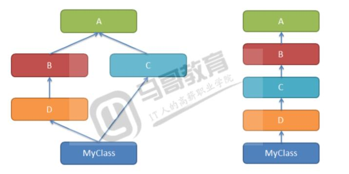

# Python 面向对象

Python从设计之初就已经是一门面向对象的语言，正因为如此，在Python中创建一个类和对象是很容易的。本章节我们将详细介绍Python的面向对象编程。

如果你以前没有接触过面向对象的编程语言，那你可能需要先了解一些面向对象语言的一些基本特征，在头脑里头形成一个基本的面向对象的概念，这样有助于你更容易的学习Python的面向对象编程。

# 面向对象技术简介

__类\(Class\):__ 用来描述具有相同的属性和方法的对象的集合。它定义了该集合中每个对象所共有的属性和方法。对象是类的实例。

__类变量：__ 类变量在整个实例化的对象中是公用的。类变量定义在类中且在函数体之外。类变量通常不作为实例变量使用。

__数据成员：__ 类变量或者实例变量, 用于处理类及其实例对象的相关的数据。

__方法重写：__ 如果从父类继承的方法不能满足子类的需求，可以对其进行改写，这个过程叫方法的覆盖（override），也称为方法的重写。

__局部变量：__ 定义在方法中的变量，只作用于当前实例的类。

__实例变量：__ 在类的声明中，属性是用变量来表示的。这种变量就称为实例变量，是在类声明的内部但是在类的其他成员方法之外声明的。

__继承：__ 即一个派生类（derived class）继承基类（base class）的字段和方法。继承也允许把一个派生类的对象作为一个基类对象对待。例如，有这样一个设计：一个Dog类型的对象派生自Animal类，这是模拟”是一个（is\-a）"关系（例图，Dog是一个Animal）。

__实例化：__ 创建一个类的实例，类的具体对象。

__方法：__ 类中定义的函数。

__对象：__ 通过类定义的数据结构实例。对象包括两个数据成员（类变量和实例变量）和方法。

# 创建类

使用 class 语句来创建一个新类，class 之后为类的名称并以冒号结尾:

class\_suite 由类成员，方法，数据属性组成。

类的帮助信息可以通过ClassName\.\_\_doc\_\_查看。

```python
class ClassName :
“ 类的帮助信息 ” #类文档字符串
class_suite #类体
```

# 实例

* 以下是一个简单的 Python 类的例子:
* empCount 变量是一个类变量，它的值将在这个类的所有实例之间共享。你可以在内部类或外部类使用 Employee\.empCount 访问。
* 第一种方法\_\_init\_\_\(\)方法是一种特殊的方法，被称为类的构造函数或初始化方法，当创建了这个类的实例时就会调用该方法。
* self 代表类的实例，self 在定义类的方法时是必须有的，虽然在调用时不必传入相应的参数。
```python
class Employee :

“ 所有员工的基类 ”

empCount = 0
def __init__ (self, name, salary) :
self.name = name
self.salary = salary
Employee.empCount += 1
def displayCount (self):
print ( " Total Employee %d " % Employee.empCount)
def displayEmployee ( self ) :
print ( "Name: ", self.name , " Salary: ", self.salary)
```


# self代表类的实例，而非类

类的方法与普通的函数只有一个特别的区别——它们必须有一个额外的 __第一个参数名称__ , 按照惯例它的名称是 self。

以上实例执行结果为：

从执行结果可以很明显的看出，self 代表的是类的实例，代表当前对象的地址，而 __self\.\_\_class\_\___ 则指向类。

self 不是 python 关键字，我们把他换成 runoob 也是可以正常执行的:


```python
class Test :
def prt ( self ) :
print ( self )
print ( self . __class__ )
t = Test ()
t . prt ()
<__main__.Test object at 0x10e0d4390>
<class '__main__.Test'>
class Test :
def prt ( runoob ) :
print ( runoob )
print ( runoob . __class__ )
t = Test ()
t . prt ()
```


# 创建实例对象

实例化类其他编程语言中一般用关键字 new，但是在 Python 中并没有这个关键字，类的实例化类似函数调用方式。

以下使用类的名称 Employee 来实例化，并通过 \_\_init\_\_ 方法接收参数。

您可以使用点号 __\.__ 来访问对象的属性。使用如下类的名称访问类变量:

"创建 Employee 类的第一个对象"

emp1 = Employee\("Zara", 2000\)

"创建 Employee 类的第二个对象"

emp2 = Employee\("Manni", 5000\)

emp1\.displayEmployee\(\)

emp2\.displayEmployee\(\)

print \(“Total Employee %d" %Employee\.empCount\)

# 完整实例：

* 执行以上代码输出结果如下：

```python
#!/usr/bin/python
# -*- coding: UTF-8 -*-
class Employee :
' 所有员工的基类 '
empCount = 0
def __init__ ( self , name , salary ) :
self . name = name
self . salary = salary
Employee . empCount += 1
def displayCount ( self ) :
print " Total Employee %d " % Employee . empCount
def displayEmployee ( self ) :
print ( “ Name : " , self . name , " , Salary: " , self . salary)
" 创建 Employee 类的第一个对象 "
emp1 = Employee ( " Zara " , 2000 )
" 创建 Employee 类的第二个对象 "
emp2 = Employee ( " Manni " , 5000 )
emp1 . displayEmployee ()
emp2 . displayEmployee ()
print ( “ Total Employee %d " % Employee . empCount)
Name : Zara , Salary : 2000
Name : Manni , Salary : 5000
TotalEmployee 2
```

__你可以添加，删除，修改类的属性，如下所示：__

__继承：__ 即一个派生类（derived class）继承基类（base class）的字段和方法。继承也允许把一个派生类的对象作为一个基类对象对待。例如，有这样一个设计：一个Dog类型的对象派生自Animal类，这是模拟”是一个（is\-a）"关系（例图，Dog是一个Animal）。

__你也可以使用以下函数的方式来访问属性：__

__getattr\(obj, name\[, default\]\) : 访问对象的属性。__

__hasattr\(obj,name\) : 检查是否存在一个属性。__

__setattr\(obj,name,value\) : 设置一个属性。如果属性不存在，会创建一个新属性。__

__delattr\(obj, name\) : 删除属性。__

emp1\.age = 7  \# 添加一个 'age' 属性

emp1\.age = 8  \# 修改 'age' 属性

del emp1\.age  \# 删除 'age' 属性

<span style="color:#008080">hasattr</span>  <span style="color:#808000">\(</span>  <span style="color:#0055AA">emp1</span>  <span style="color:#808080">,</span>  <span style="color:#8B0000">'</span>  <span style="color:#AA1111">age</span>  <span style="color:#8B0000">'</span>  <span style="color:#808000">\)</span> \# 如果存在 'age' 属性返回 True。

<span style="color:#008080">getattr</span>  <span style="color:#808000">\(</span>  <span style="color:#0055AA">emp1</span>  <span style="color:#808080">,</span>  <span style="color:#8B0000">'</span>  <span style="color:#AA1111">age</span>  <span style="color:#8B0000">'</span>  <span style="color:#808000">\)</span> \# 返回 'age' 属性的值

<span style="color:#008080">setattr</span>  <span style="color:#808000">\(</span>  <span style="color:#0055AA">emp1</span>  <span style="color:#808080">,</span>  <span style="color:#8B0000">'</span>  <span style="color:#AA1111">age</span>  <span style="color:#8B0000">'</span>  <span style="color:#808080">,</span>  <span style="color:#800000">8</span>  <span style="color:#808000">\)</span> \# 添加属性 'age' 值为 8

<span style="color:#008080">delattr</span>  <span style="color:#808000">\(</span>  <span style="color:#0055AA">emp1</span>  <span style="color:#808080">,</span>  <span style="color:#8B0000">'</span>  <span style="color:#AA1111">age</span>  <span style="color:#8B0000">'</span>  <span style="color:#808000">\)</span> \# 删除属性 'age'

# Python内置类属性

\_\_dict\_\_ : 类的属性（包含一个字典，由类的数据属性组成）

\_\_doc\_\_ :类的文档字符串

\_\_name\_\_: 类名

\_\_module\_\_: 类定义所在的模块（类的全名是'\_\_main\_\_\.className'，如果类位于一个导入模块mymod中，那么className\.\_\_module\_\_ 等于 mymod）

\_\_bases\_\_ : 类的所有父类构成元素（包含了一个由所有父类组成的元组）

文档字符串。注意，是 \_\_doc\_\_ ，前后各两个下划线。一般而言，是对函数/方法/模块所实现功能的简单描述\.

每个对象都会有一个\_\_doc\_\_属性，用于描述该对象的作用。在一个模块被import时，其文件中的某些特殊的字符串会被python解释器保存在相应对象的\_\_doc\_\_属性中。比如，一个模块有模块的\_\_doc\_\_，一个class或function也有其对应的\_\_doc\_\_属性。在python中，一个模块其实就是一个\.py文件。在文件中特殊的地方书写的字符串就是所谓的docstrings，就是将被放到\_\_doc\_\_的内容。这个“特殊的地方”包括：

一个文件任何一条可执行的代码之前

一个类，在类定义语句后，任何可执行代码前

一个函数，在函数定义语句后，任何可执行代码前

实例：

```python
#use  __doc__ 属性
class MyClass:
'string.'
def printSay():
'print say welcome to you.'
print （’say welcome to you.’）
print （MyClass.__doc__） #打印类的信息
print （MyClass.printSay.__doc__） #打印方法的信息
#输出结果
string.
print say welcome to you.
```

# Python内置类属性调用实例如下：

* 执行以上代码输出结果如下：


```python
#!/usr/bin/python
# -*- coding: UTF-8 -*-
class Employee :
' 所有员工的基类 '
empCount = 0
def __init__ ( self , name , salary ) :
self . name = name
self . salary = salary
Employee . empCount += 1
def displayCount ( self ) :
print ( “ Total Employee %d " % Employee . empCount)
def displayEmployee ( self ) :
print ( " Name : " , self . name , " , Salary: " , self . salary)
print ( " Employee.__doc__: " , Employee . __doc__)
print ( " Employee.__name__: " , Employee . __name__)
print ( " Employee.__module__: " , Employee . __module__)
print ( " Employee.__bases__: " , Employee . __bases__)
print ( " Employee.__dict__: " , Employee . __dict__)
Employee.__doc__: 所有员工的基类
Employee.__name__: Employee
Employee.__module__: __main__
Employee.__bases__: (<class 'object'>,)
Employee.__dict__: {'__module__': '__main__', '__doc__': '所有员工的基类', 'empCount': 0, '__init__': <function Employee.__init__ at 0x106079b90>, 'displayCount': <function Employee.displayCount at 0x106079dd0>\ 'displayEmployee': <function Employee.displayEmployee at 0x1060798c0>, '__dict__': <attribute '__dict__' of 'Employee' objects>, '__weakref__': <attribute '__weakref__' of 'Employee' objects>}
```

# python对象销毁(垃圾回收)

Python 使用了引用计数这一简单技术来跟踪和回收垃圾。

在 Python 内部记录着所有使用中的对象各有多少引用。

一个内部跟踪变量，称为一个引用计数器。

当对象被创建时， 就创建了一个引用计数， 当这个对象不再需要时， 也就是说， 这个对象的引用计数变为0 时， 它被垃圾回收。但是回收不是"立即"的， 由解释器在适当的时机，将垃圾对象占用的内存空间回收。

垃圾回收机制不仅针对引用计数为0的对象，同样也可以处理循环引用的情况。循环引用指的是，两个对象相互引用，但是没有其他变量引用他们。这种情况下，仅使用引用计数是不够的。Python 的垃圾收集器实际上是一个引用计数器和一个循环垃圾收集器。作为引用计数的补充， 垃圾收集器也会留心被分配的总量很大（及未通过引用计数销毁的那些）的对象。 在这种情况下， 解释器会暂停下来， 试图清理所有未引用的循环

a = 40      \# 创建对象  \<40>

b = a       \# 增加引用， \<40> 的计数

c = \[b\]     \# 增加引用\.  \<40> 的计数

del a       \# 减少引用 \<40> 的计数

b = 100     \# 减少引用 \<40> 的计数

c\[0\] = \-1   \# 减少引用 \<40> 的计数

实例

以上实例运行结果如下：

__注意：__ 通常你需要在单独的文件中定义一个类

```python
#!/usr/bin/python
# -*- coding: UTF-8 -*-
class Point :
def __init__ ( self , x = 0 , y = 0 ) :
self . x = x
self . y = y
def __del__ ( self ) :
class_name = self . __class__ . __name__
print （ class_name , “ 销毁 "）
pt1 = Point ()
pt2 = pt1
pt3 = pt1
print （ id ( pt1 ) , id ( pt2 ) , id ( pt3 )） # 打印对象的id
del pt1
del pt2
del pt3
```

4413912400 4413912400 4413912400

Point 销毁

# 类的继承

面向对象的编程带来的主要好处之一是代码的重用，实现这种重用的方法之一是通过继承机制。

通过继承创建的新类称为 __子类__ 或 __派生类__ ，被继承的类称为 __基类__ 、 __父类__ 或 __超类__ 。

继承语法

class 派生类名\(基类名\)

\.\.\.

在python中继承中的一些特点：

1、如果在子类中需要父类的构造方法就需要显示的调用父类的构造方法，或者不重写父类的构造方法。

2、在调用基类的方法时，需要加上基类的类名前缀，且需要带上 self 参数变量。区别在于类中调用普通函数时并不需要带上 self 参数

3、Python 总是首先查找对应类型的方法，如果它不能在派生类中找到对应的方法，它才开始到基类中逐个查找。（先在本类中查找调用的方法，找不到才去基类中找）。

如果在继承元组中列了一个以上的类，那么它就被称作"多重继承" 。

语法：

派生类的声明，与他们的父类类似，继承的基类列表跟在类名之后，如下所示：

class SubClassName \(ParentClass1\[, ParentClass2, \.\.\.\]\):

\.\.\.



左图是多继承（菱形继承），右图是单一继承。

多继承带来路径选择问题，究竟继承哪个父类的特征呢？

Python使用MRO（method resolution order方法解析顺序）解决基类搜索顺序问题。

历史原因，MRO有三个搜索算法：

1\. 经典算法：按照定义从左到右，深度优先策略。2\.2版本之前 左图的MRO是MyClass,D,B,A,C,A

2\. 新式类算法：是经典算法的升级，深度优先，重复的只保留最后一个。2\.2版本 左图的MRO是MyClass,D,B,C,A,object

3\. C3算法：在类被创建出来的时候，就计算出一个MRO有序列表。2\.3之后，Python3唯一支持的算法 左图中的MRO是MyClass,D,B,C,A,object的列表

1\. C3算法解决多继承的二义性

经典算法有很大的问题，如果C中有覆盖A的方法，就不会访问到了，因为先访问A（深度优先）。

新式类算法，依然采用了深度优先，解决了重复问题，但是同经典算法一样，没有解决继承的单调性。

C3算法，解决了继承的单调性，它阻止创建之前版本产生二义性的代码。求得的MRO本质是为了线性化，且确定了顺序。

单调性：假设有A、B、C三个类，C的mro是\[C, A, B\]，那么C的子类的mro中，A、B的顺序一致就是单调的。

实例

结果：

```python
#!/usr/bin/python
# -*- coding: UTF-8 -*-
class Parent : # 定义父类
parentAttr = 100
def __init__ ( self ) :
print ( " 调用父类构造函数 "）
def parentMethod ( self ) :
print （ ’ 调用父类方法 ’）
def setAttr ( self , attr ) :
Parent . parentAttr = attr
def getAttr ( self ) :
print ( " 父类属性 : " , Parent . parentAttr）
class Child ( Parent ) : # 定义子类
def __init__ ( self ) :
print （ ” 调用子类构造方法 ”）
def childMethod ( self ) :
print （ ’ 调用子类方法 ’）
c = Child () # 实例化子类
c . childMethod () # 调用子类的方法
c . parentMethod () # 调用父类方法
c . setAttr ( 200 ) # 再次调用父类的方法 - 设置属性值
c . getAttr () # 再次调用父类的方法 - 获取属性值
```

调用子类构造方法

调用子类方法

调用父类方法

父类属性: <span style="color:#006666">200</span>

你可以继承多个类

你可以使用issubclass\(\)或者isinstance\(\)方法来检测。

issubclass\(\) \- 布尔函数判断一个类是另一个类的子类或者子孙类，语法：issubclass\(sub,sup\)

isinstance\(obj, Class\) 布尔函数如果obj是Class类的实例对象或者是一个Class子类的实例对象则返回true。

class A:        \# 定义类 A

\.\.\.\.\.

class B:         \# 定义类 B

\.\.\.\.\.

class C\(A, B\):   \# 继承类 A 和 B

\.\.\.\.\.

# 方法重写

如果你的父类方法的功能不能满足你的需求，你可以在子类重写你父类的方法：

实例：

执行以上代码输出结果如下：

```python
#!/usr/bin/python
# -*- coding: UTF-8 -*-
class Parent : # 定义父类
def myMethod ( self ) :
print ' 调用父类方法 '
class Child ( Parent ) : # 定义子类
def myMethod ( self ) :
print ' 调用子类方法 '
c = Child () # 子类实例
c . myMethod () # 子类调用重写方法
```

# 基础重载方法

下表列出了一些通用的功能，你可以在自己的类重写：

# 运算符重载

Python同样支持运算符重载，实例如下：

实例：

以上代码执行结果如下所示:

```python
#!/usr/bin/python
class Vector :
def __init__ ( self , a , b ) :
self . a = a
self . b = b
def __str__ ( self ) :
return ' Vector (%d, %d) ' % ( self . a , self . b )
def __add__ ( self , other ) :
return Vector ( self . a + other . a , self . b + other . b )
v1 = Vector ( 2 , 10 )
v2 = Vector ( 5 ,- 2 )
print v1 + v2
```

# 类属性与方法

类的私有属性

__\_\_private\_attrs__ ：两个下划线开头，声明该属性为私有，不能在类的外部被使用或直接访问。在类内部的方法中使用时 __self\.\_\_private\_attrs__ 。

类的方法

在类的内部，使用 __def__ 关键字可以为类定义一个方法，与一般函数定义不同，类方法必须包含参数 self,且为第一个参数

类的私有方法

__\_\_private\_method__ ：两个下划线开头，声明该方法为私有方法，不能在类的外部调用。在类的内部调用 __self\.\_\_private\_methods__

实例

结果：


```python
#!/usr/bin/python
# -*- coding: UTF-8 -*-
class JustCounter :
__secretCount = 0 # 私有变量
publicCount = 0 # 公开变量
def count ( self ) :
self . __secretCount += 1
self . publicCount += 1
print self . __secretCount
counter = JustCounter ()
counter . count ()
counter . count ()
print counter . publicCount
print counter . __secretCount # 报错，实例不能访问私有变量

1

2

2

Traceback ( most recent call last ):
File "test.py" , line 17 , in <module>
print counter . __secretCount # 报错，实例不能访问私有变量
AttributeError : JustCounter instance has no attribute '__secretCount'
```

Python不允许实例化的类访问私有数据，但你可以使用 __object\.\_className\_\_attrName__ （ __对象名\.\_类名\_\_私有属性名__ ）访问属性，参考以下实例：

执行以上代码，执行结果如下：

```python
#!/usr/bin/python
# -*- coding: UTF-8 -*-
class Runoob:
__site = "www.runoob.com"
runoob = Runoob()
print runoob._Runoob__site
```

# thanks

