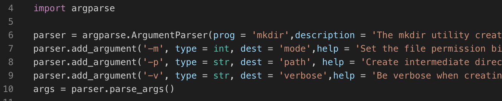
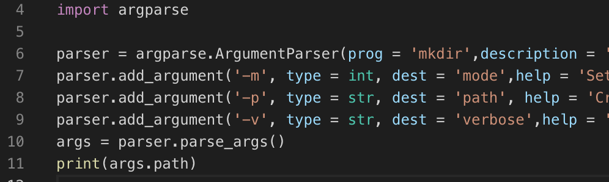
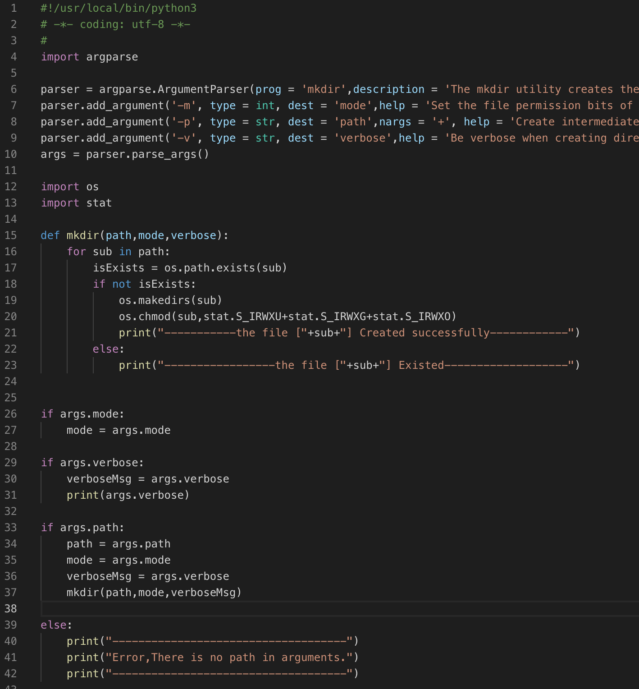
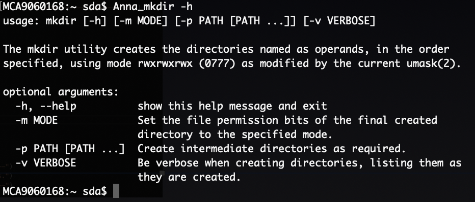
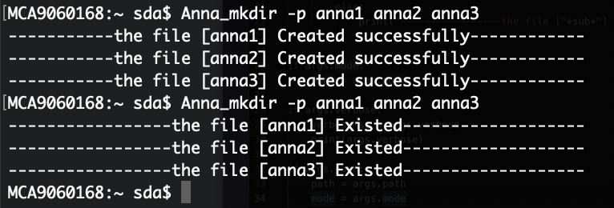
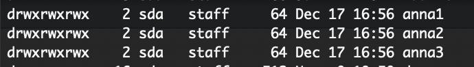

# Module Argparse

* Argparse Introduction
  * Argparse是标准库推荐使用的命令行解析模块，argparse模块作为optparse的一个替代被添加到Python2\.7。argparse的实现支持一些不易于添加到optparse以及要求向后不兼容API变化的特性，因此以一个新模块添加到标准库

* Argparse Framework
  * argparse\.ArgumentParser\(\)创建一个解析器对象
  * 调用 add\_argument\(\) 方法添加参数
  * 使用 parse\_args\(\) 解析添加的参数

# Argparse Framework

* argparse\.ArgumentParser\(\)创建一个解析器对象

  * ArgumentParser\(prog\,usage\,description\,epilog\,parents\,formatter\_class\,prefix\_chars\,fromfile\_prefix\_chars\,argument\_default\,conflict\_handler\, add\_help\)

    | Param                 | Description                                                  |
    | --------------------- | ------------------------------------------------------------ |
    | prog                  | command命名，我们可以使用%(prog)s引用，默认的command 为文件名 |
    | usage                 | 帮助信息的usage字段，展示可选参数                            |
    | description           | 显示这个命令的帮助信息                                       |
    | epilog                | optional arguments字符段之后的字符段，默认为空               |
    | parents               | 继承的父parser，为了避免一些公共的内容重复定义，父parser在初始化时会设置add_help=False，这是为了防止出现父与子parser的-h冲突而抛出异常 |
    | for_matter_class      | 对于help输出进行格式化，除了输出的样式外，如果设置为ArgumentDefaultsHelpFormatter，则会自动在help输出中添加已定义的default值 |
    | prefix_chars          | options前的字符，默认为'-'，可以添加其他字符，如'-+'，但是如果没有包括'-'，那么对应的option如'-h'就无法解析 |
    | fromfile_prefix_chars | 使用文件给parse_args()传入参数，为了能够识别文件字符串，如"demo.txt"，需要设置此值，如"@"，那么所有以此字符为开头的字符串都被当作是文件，所以传给parse_args()的参数应该是@demo.txt。在该文件中，一行只能有一个参数。如文件中的'-f\nbar'会被解析成['-f','bar'] |
    | argument_default      | 指定一个解析器范围的参数默认值                               |
    | conflict_handler      | 关于设置同一个选项具有两个动作                               |
    | add_help              | 是否添加-h/help 默认为True                                   |

* 调用 add\_argument\(\) 方法添加参数

  * add\_argument\( name or flags \[action\] \[nargs\] \[const\] \[default\] \[type\] \[choices\] \[required\] \[help\] \[metavar\] \[dest\]\)

    | Param         | Description                                                  |
    | ------------- | ------------------------------------------------------------ |
    | name or flags | 是必须的参数，该参数接受选项参数或者是位置参数               |
    | action        | 指定了这个命令行参数应当如何处理                             |
    | nargs         | 当选项后接受多个或者0个参数时需要这个来指定，当选项接受1个或者不需要参数时指定nargs=’?’，当不指定值时Positional argument 使用default，Optional argument使用 const；* 表示0或多个参数；+ 号表示 1 或多个参数 例如：add_argument(‘-u’,nargs=2) -u选项接受2个参数 |
    | const         | 用于保存不从命令行中读取但被各种 ArgumentParser 动作需求的常数值 |
    | default       | default是add_argument的命名参数，默认为None，指定了在命令行参数未出现时应当使用的值 |
    | type          | 允许任何(int,float,open,boolean…)类型检查和类型转换(默认的参数类型是str类型) |
    | choices       | choices中会给定一组限制值，解析命令行时，将检查参数值，如果不满足限制条件，显示error信息 |
    | required      | argparse中’—foo’之类的参数在命令行中可以将其省略,为了使选项成为必须,可以设置add_argument的required=True parser.add_argument(‘--foo’, required=True) |
    | help          | 描述选项作用                                                 |
    | metavar       | 在 usage 说明中的参数名称，对于必选参数默认就是参数名称（上面的 name or flags），对于可选参数默认是全大写的参数名称. |
    | dest          | 返回的对象所添加的属性的名称。默认情况下，对于可选参数选取最长的名称，中划线转换为下划线. |

* 使用 parse\_args\(\) 解析添加的参数
  * parse\_args\(args=None\, namespace=None
    * 将args转换为namespace对象的一个值。默认情况下，sys\.argv赋值给args，一个空的Namespace对象会被创建。
    * 解析时，会对传入的参数进行检查，若不符合要求就会报错。一般情况下，会自动判断传入的值到底是一个可选参数，还是一个负数（都用'\-'开头）。但有时位置参数的值必须是一个'\-'开头的值，如'\-f'，那么使用parser\.parse\_args\(\['\-\-'\, '\-f'\]\)，'\-\-'代表后续的所有传入值都需要看做是位置参数。parse\_args\(\)会返回填充好的Namespace对象

# Case Analysis

* Case analysis
  * mkdir：make directories
    * \-m： Set the file permission bits of the final created directory to the specified mode\.
    * \-p：Create intermediate directories as required\.
    * \-v：Be verbose when creating directories\, listing them as they are created\.

* Case analysis
  * 1\.引入argparser
    * import argparser
  * 2\.创建一个argparser对象
    * parser = argparse\.ArgumentParser\( arguments \)
  * 3\.添加mkdir optional arguments
    * parser\.add\_argument\('\-m'\,…\)
    * parser\.add\_argument\('\-p'\,…\)
    * parser\.add\_argument\('\-v'\,…\)

* Case analysis
  * 4\.对传入的参数进行解析
    * args = parser\.parse\_args\(\)
  * 5\.调用解析后的参数
    * args\.arguments

Case analysis

Please pick one from the following commands and write a simple program with argparse\.

1\.mv                  2\.tail               3\.pwd

* 1\. mv: move files
  * \-f：Do not prompt for confirmation before overwriting the destination path\.
  * \-i：Cause mv to write a prompt to standard error before moving a file that would overwrite an existing file\.  If the response from the standard input begins with the character \`y' or \`Y'\, the move is attempted\.
  * \-n：Do not overwrite an existing file\.
  * \-v：Cause mv to be verbose\, showing files after they are moved\.

* 2\. tail: display the last part of a file
  * \-b：The location is number 512\-byte blocks\.
  * \-c：The location is number bytes\.
  * \-n：The location is number lines\.
  * \-q：Suppresses printing of headers when multiple files are being examined\.
  * \-f：The \-f option causes tail to not stop when end of file is reached\, but rather to wait for additional data to be appended to the input\.  The \-f option is ignored if the standard input is a pipe\, but not if it is a FIFO\.

* 3\. pwd: return working directory name
  * \-L：Display the logical current working directory\.
  * \-P：Display the physical current working directory \(all symbolic links resolved\)\.

