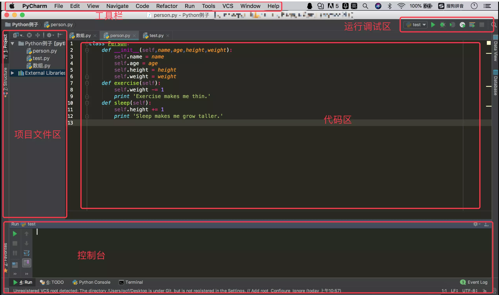

# Introduction
* python语言是一种面向对象的解释型计算机程序设计语言
* python语言的特点
    * 优点
        * 易学容易上手：代表简单主义思想的语言
        * 免费，开源 ：Python是Floss(自由/开放源码软件)之一
        * 高层语言：无需管理程序使用的内存一类的底层细节
        * 可移植性：可移植性强，稍加改动就可运用到不同平台，不使用依赖于系统的特性，无需修改。
        * 解释性：无需编译，直接用解释器运行
        * 面向对象：程序是由数据和功能组合而成的对象构建起来的。
        * 可扩展性：代码运行的快或着希望算法不公开，可以把部分代码用c或c++编写
        * 丰富的库：正则表达式，单元测试，线程，GUI，os，argparse，jieba，urllib, socket，pillow
        * 规范的代码：Python采用强制缩进的方式使得代码具有极佳的可读性
    * 缺点
        * 运行速度慢：运用c++改写关键部分
        * 国内市场较小 ：较少的web用python 开发
        * 中文资料匮乏：入门教材多，高阶内容只能开英文版
        * 架构选择太多：Django,Flask,CherryPy,Web2py

# Start Python on Mac
* Setup environment
  * 利用Homebrew安装Python 解释器
  * Homebrew:是一款Mac OS平台下的软件包管理工具，拥有安装、卸载、更新、查看、搜索等很多实用的功能。简单的一条指令，就可以实现包管理，而不用你关心各种依赖和文件路径的情况，十分方便快捷。
    * 安装Homebrew
      * 要求
        * Intel CPU
        * OS X 10\.9 or higher
        * Xcode命令行工具
        * 支持shell\(sh或着bash）
      * 安装

        * /usr/bin/ruby  -e "$\(curl  -fsSL https://raw.githubusercontent.com/Homebrew/install/master/install)"

* Homebrew基本使用（ https://www.jianshu.com/p/de6f1d2d37bf ）
  * 安装任意包
    * brew install <packageName>
  * 安装python3
    * $brew install python3
  * 卸载python3
    * $brew uninstall python3

# start Python on Mac
* Suggest  IDE  PyCharm
  * PyCharm介绍
    * Pycharm是一种Python IDE，带有一整套可以帮助用户在使用Python语言开发时提高其效率的工具，比如调试，语法高亮，Project管理，代码跳转，智能提示，自动完成，单元测试，版本控制。还支持Django框架下的专业web开发。
  * PyCharm主界面
    * PyCharm包含4个主要区分，分别为菜单工具栏、项目结构区、代码区、信息显示区。
  * PyCharm主界面( https://blog.csdn.net/yuyuyuj1e/article/details/89042419 ）

  * PyCharm简单上手( https://jingyan.baidu.com/article/ce4366495ce7f53773afd3ad.html)
    * 点击创建工程，选择存放工程的路径，然后点击create
    * 创建python文件
    * 输入文件名称helloworld.py
    * 编写helloworld.py
    * 运行程序
    * 控制台查看结果

# Basic syntax
* Variable
    * 变量概念
        * 变量用于描述计算机的数据存储空间
    * 变量作用
        * 在计算机内存保存数据
    * 变量语法格式
        * 定义变量：变量名 = 值           #(identifier [=value])   a=‘abc’
        * 使用变量：变量名
    * 特殊使用格式
        * a=b=1    相当于 b=1   a=b
    * 注意事项
        * 首次使用变量在内存中划分空间，并初始化值
        * 再次使用变量不再划分空间，修改或使用原空间中的值
    * 变量的数据类型
        * Numbers，String，List，Tuple，Dictionary
        | 名称 |  中文名称 | 作用 |
        |-----|----|----|
        | int | 整型 | 表示所有的整数 |
        | float|    浮点型  |  表示所有的小数|
        |complex  |  复数 |   表示复数|
        * 变量类型获取
            * 使用type(数据)即可获取数据对应的类型
        * 变量命名符合标识符的命名规则
    * Python标识符
        * 标识符用于Python语言的变量，关键字，函数，对象等数据的命名。标识符的命名需要遵循下面的命名规则。
            * 可以由字母(大写A-Z或小写a-z)，数字(0-9)和_(下划线)组合而成，但不能由数字开头；
            * 不能包含除_以外的任何特殊字符，如：%，#，&，逗号，空格等；
            * 标识符不能是Python语言的关键字和保留字；
            * 标识符区分大小写，num1和num2是两个不同的标识符。
* 命名约束
  * 下划线分割法\(多个单词组成的名称，使用全小写字母书写，中间使用\_分割）
    * first\_name, user\_name ,card\_id
  * 驼峰命名法\(多个单词组成的名称，每个单词首字母使用大写字母书写，其余字母使用小写字母书写）
    * FirstName，UserName， CardId
* Python标识符命名示例
  * 正确命名示例
    * width，Book，book\_p, W\_9,
  * 错误命名示例
    * 123rate,  Book Author ,  Address, class,

* sequence type
  * 序列中元素类型是否一致
    * 容器序列\(Container sequences\):list, tuple, collections\.deque，这些序列能存放不同类型的数据
    * 固定序列\(Flat sequences\):str, bytes, bytearray, memoryview, array\.array。这些序列只存放一种类型
  * 序列中元素是否能够被修改
    * 可变序列\(Mutable sequences\):list, bytearray, array\.array, collections\.deque, memory viewe
    * 不可变序列\(Immutable sequences\):包括tuple，str，bytes
* sequence
    * list：一种有序集合，可以随时添加和删除其中的元素（可以有不同的数据类型）
        * 列表的操作
            * len（）//获取列表的长度
            * append（）//在list中末尾添加元素
            * insert(a,b) //指定位置插入元素
            * pop（）//移除末尾的元素
    * tuple：元组是由简单的对象构成，十分类似于列表，不同的地方在于元组是不可在原处修改的。

* 切片操作
    * 只使用于线性结构，有索引才会有切片，支持切片的线型结构：列表，元组，字符串，bytes，bytearray等
* 切片
    * sequence[start:stop] 表示返回[start, stop]区间的子序列。
    * 支持负索引
    * start为0，可以省略
    * stop 为末尾，也可以省略
    * [:]表示从头到尾，全部元素被取出，等效于copy()方法
* 字符串切片实例
    * L='abcdefgh'
    * L[0:3]                  #0,1,2,不包括索引3
    * L[-1]                    #倒数取第一个元素
    * L[-2:]                  #从倒数第二个开始取
    * L[-2:-1]               #从倒数第二个开始到倒数第一个单不包括
    * L[:7:2].                #从第0个索引开始，到第7个，每两个取一个
    * L[::5].                  #每五个取一个
    * L[:]                       #取所有相当于复制
* operator
    * 算术运算符
        | 符号 |  作用 | 格式 |
        |-----|----|----|
        | + | 加法 | a+b |
        | - |  减法  | a-b |
        | * |  乘法 |  a*b |
        | / | 除法 | a/b|
        | // | 除法向下取整 |a//b|
        | % | 取余 | a%b |
        |** | 幂次 | a**b |
    *  赋值运算符
        | 符号 |  作用 | 格式 |
        |-----|----|----|
        | = | 赋值 | a=b，将b的值给a |
        | += |  加后赋值  | a+=b，将a+b的值给a |
        | -= |  减后赋值 |  a-=b，将a-b的值给a |
        | *= | 乘后赋值 | a*=b，将a*b的值给a|
        | /= | 除后赋值 |a/=b，将a/b的值给a|
        | //= | 整除后赋值 | a//=b，将a//b的值给a |
        | %= | 取余后赋值 | a%=b，将a%b的值给a |
        | **= | 次方后赋值 | a**=b，将a的b次方的值给a |

    * 位运算符
        * a(60)=0011 1100      b(13)=0000 1101
        | 符号 |  作用 | 格式 |
        |-----|----|----|
        | & | 参与运算的两个值，两个相应位都为1,则该位的结果为1,否则为0 | (a&b)输出结果12，二进制解释：0000 1100 |
        | \| | 参与运算的两个值, 只要有一个位置为1，则该位的结果为1 | (a\|b)输出结果61，二进制解释：0011 1101 |
        | ^ |   参与运算的两个值,如果两个相应位数值不同，则结果为1，若相同，则结果为0  | (a^b)输出结果49，二进制解释：0011 0001 |
        | ~ |  对数据的每个二进制位取反,即把1变为0,把0变为1 | (~a)输出结果-61，二进制解释：1100 0011 |
        | << | 将数据对应的二进制数集体向左移动2位，后面空余的2位补零 | 原a二进制：0011 1100, a << 2 ,得 1111，0000加黑为补零位|
        | >> | 将数据对应的二进制数集体向右移动2位，前面空余的2位补零 |原a二进制：0011 1100, a >> 2 ,得 0000 1111，加黑为补零位。|
    * 逻辑运算符(x=10,y=20)
        | 符号 |  作用 | 格式 |
        |-----|----|----|
        | 布尔and |  如果 x 为 False，x and y 返回 False，否则它返回 y 的计算值。 | (x and y)返回20 |
        | 布尔或or| 如果 x 是非 0，它返回 x 的值，否则它返回 y 的计算值 |  (x or y)返回10|
        |  布尔非not  |   如果 x 为 True，返回 False 。如果 x 为 False，它返回 True| not(x and y) 返回False |
        
    * 成员运算符a=2, b=[1,3,4,2]

        | 符号 |  作用 | 格式 |
        |-----|----|----|
        | in |  若 x 在 y 的序列中，则返回True，否则返回False。 | a in b 返回True|
        | not in | 若 x 不在 y 的序列中，则返回True，否则返回False |  a not in 返回False |
    * 身份运算符
        | 符号 |  作用 | 格式 |
        |-----|----|----|
        | is |  如果引用的是同一个对象则返回 True，否则返回 False。 | x is y|
        | is not  | 如果引用的不是同一个对象则返回结果 True  |  x is not y ||

* Loops
    * while循环
        * 语法
            while 条件：
            ____反复执行的代码
            ……
            break  #执行到break跳出循环
            Continue #执行到continue，结束本次循环执行

* 分支语句
    * 语法格式
            格式一:
                    if 条件:
                        条件成立执行的代码
            格式二:
                    if  条件:
                        条件成立执行的代码
                    else:
                        条件不成立执行的代码
            格式三:
             if 条件1:
                        条件1成立执行的代码
            elif 条件2:
                        条件2成立执行的代码
            elif 条件3:
                        条件3成立执行的代码
            else:
                    条件都不成立执行的代码
# Basic function
* function：
    * 函数(function)是将具有独立功能的代码块组织成为一个整体，使其具有特殊功能的代码集。
    * 定义函数的关键字 def
    * 语法格式
                定义格式：
                        def 函数名(参数)：
                        ____函数体
    * 参数类型
        * 位置参数
        * 默认参数
        * 可变参数
            * 可变参数就是传入的参数个数是可变的，可以是1个、2个到任意个，还可以是0个，在函数调用时自动组装成一个tuple。
        *  关键字参数
            * 关键字参数允许你传入0个或任意个含参数名的参数，在函数调用时自动组装为一个字典
        * 命名关键字参数
            * 命名关键字参数，可以限制关键字参数的名字

# class
* 类
    * 类定义语法格式
                class 类名：
                        pass

    * 类的命名规则
                满足大驼峰命名规则

    * 创建对象语法格式
                对象名=类名（）
* 类
    * 成员变量
        * 公有属性/公有变量 :self.变量名=值
        * 私有变量：self._属性名=值
        * 独有属性/独有变量:   对象名.变量名=值
        * 公有变量与独有变量的区别
        * 公有变量在__init__方法中声明，每个对象都具有该变量
        * 独有变量在创建对象后声明，只有当前对象具有此变量
        * 定义对象的独有变量时，如果独有变量名与公有变量名相同，视为修改公有变量的值；如果独有变量名与公有变量名不相同，视为定义新的独有属性
  * 成员方法
    * 概念：成员方法用于描述对象的固有行为。
    * 格式
        * 格式一（无参方法)：
                class 类名:
                        def  方法名(self):
                                方法体
        * 格式二（有参方法):
                class 类名:
                        def  方法名(self，形参1，形2，.....):
                                方法体

* 魔术方法在类的声明，定义的方法，执行时无需手工调用，自动执行。
    * __init__  方法：也称为构造方法，创建对象时初始化成员变量
    * __str__方法：用于返回对象的规范化字符串变现形式

# OS module of python
* OS(opreate system)
    * OS模块是Python标准库的一个用于访问操作系统功能的模块，使用OS模块中提供的接口，可以实现跨平台访问。
        * 系统操作
            * os.sep:主要用于系统路径的分隔符。
            * os.name:指示你正在使用的工作平台。
            * os.getenv(环境变量名称):读取环境变量。
            * os.getcwd()：获取当前的路径

        * 目录操作-增删改查
            * os.listdir():返回指定目录下的所有文件和目录名
            * os.mkdir():创建一个目录，只创建一个目录文件。
            * os.rmdir():删除一个空目录,若目录中有文件则无法删除。
            * os.makedirs(dirname):可以生成多层递归目录。若目录全部存在，则创建目录失败。
            * os.chdir():改变当前目录，到指定目录中。
            * os.rename():重命名目录名或者文件名，若重命名后的文件名已存在，则重命名失败。

        * path模块
            * os.path.exists(path):判断文件或者目录是否存在，存在则返回True，负责返回False.
            * os.path.isfile(path):判断是否为文件。是文件则返回True，否则返回False
            * os.path.isdir(path):判断是否为目录，是目录则返回True，否则返回False
            * os.path.basename(path):返回文件名。
            * os.path.dirname(path):返回文件路径
            * os.path.getsize(name):获得文件大小。

# appendix
* 修改下载源，提高包下载速度
https://blog.csdn.net/weixin_33937499/article/details/89734647
* 第三方库的安装方法(pycharm)
https://blog.csdn.net/xiao_xian_/article/details/88181845
* 虚拟环境创建（项目包管理）
https://blog.csdn.net/weixin_43256057/article/details/84236429