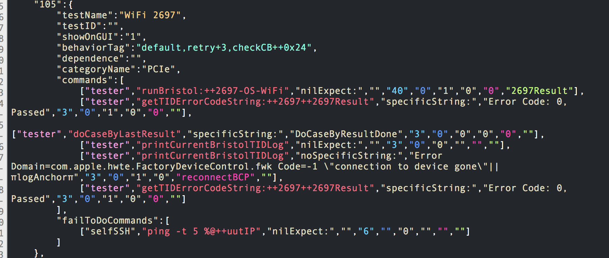
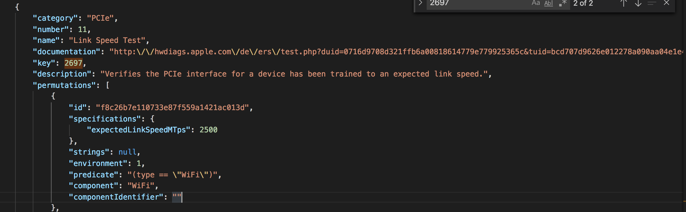
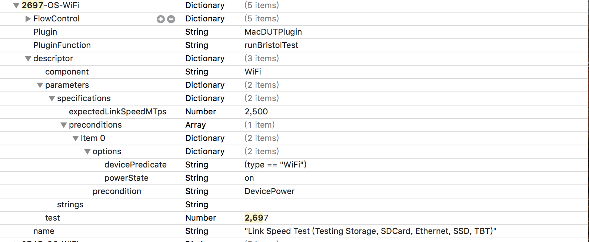

# J137 TEST

# 

# 测试环境

MacOS多数为runBristol 的测试，先Write CB 再做Firmware的check和update（为啥要每次都Write CB）

材料SDCard /USB\-C Cable /Xenon盒子

# 第一篇：脚本shell command
解释

# xxd -r -p

xxd \-r \-pxxd make a hexdump\-r 转为二进制\-p 输出

eg先simon$ touch ~/Desktop/beam\.txt再simon$ echo 123 123 144123 124 123 241 23123 > ~/Desktop/beam\.txt用xxd 来make a hexdump：MCA7090115:~ simon$ xxd ~/Desktop/beam\.txt 就会出现00000000: 3132 3320 3132 3320 3134 3431 3233 2031  123 123 144123 100000010: 3234 2031 3233 2032 3431 2032 3331 3233  24 123 241 2312300000020: 0a最后转换成二进制输出：MCA7090115:~ simon$ xxd \-r \-p ~/Desktop/beam\.txt1\#A\#A\#$1\#MCA7090115:~ simon1\#A\#A\#$1\#MC就是抓换的结果当然也可以echo出来：MCA7090115:~ simon$ echo $\(xxd \-r \-p ~/Desktop/beam\.txt\)结果是什么？

# cat && tail

cat && tailcat很简单就是cat 命令用于连接文件并打印到标准输出设备上。常用的格式有：cat \-n：\-n 或 \-\-number：由 1 开始对所有输出的行数编号。eg：MCA7090115:~ simon$ echo \-e "11\\n22" > ~/Desktop/bean\.txtMCA7090115:~ simon$ cat \-n ~/Desktop/bean\.txt结果？cat \-b：\-b 或者—number\-nonblank 和 \-n 相似，只不过对于空白行不编号。同样可以echo \-e "33\\n \\n44 \\n55" >> ~/Desktop/bean\.txt用cat \-b ~/Desktop/bean\.txt输出结果是什么？如果手动在bean\.txt输入空白行再执行呢？用法：可以把fileA加上行号后输入到fileBcat \-n fileA > fileB

cat && tailtail 命令可用于查看文件的内容，有一个常用的参数 \-f 常用于查阅正在改变的日志文件。tail \-f filename 会把filename文件里的最尾部的内容显示在屏幕上，并且不断刷新，只要 filename 更新就可以看到最新的文件内容。这个以前常用语看testd log\-f 是循环读取\-n n\<行数> 显示文件的尾部 n 行内容eg：tail /AppleInternal/Diagnostics/Logs/testd\.log如果想要从某一行看可以用：tail 20 /AppleInternal/Diagnostics/Logs/testd\.log就会从倒数第 20 行至文件末尾tail \-20 /AppleInternal/Diagnostics/Logs/testd\.log前19行不显示，会从倒第 20 行至文件末尾

# awk print grep

awk print grepawk针对列进行切割 预设时空格grep针对行进行切割print 打印制定内容eg：system\_profiler SPUSBDataType > ~/Desktop/bean\.txt把usbdate 输入到bean\.txt如果我们想要拿到Location ID：后边的 0x14200000cat ~/Desktop/bean\.txt | grep 'Location ID:’先进行行切割结果为：Location ID: 0x14200000再对Location ID: 0x14200000 进行列切割MCA7090115:~ simon$ cat ~/Desktop/bean\.txt | grep 'Location ID:'|awk \-F ':' '\{print $2\}'0x14200000（注意awk \-F ':' '\{print $2\}’要有空格 ':' ‘）还有其他的grep用法：grep \-c / grep \-A / grep \-o / grep \-BMCA7090115:~ simon$ cat ~/Desktop/bean\.txt | grep \-c 'Location ID'cat ~/Desktop/bean\.txt | grep \-A 3 'Location ID'cat ~/Desktop/bean\.txt | grep \-B 3 'Location ID’

# xargs

xargs之所以能用到这个命令，关键是由于很多命令不支持|管道来传递参数，而日常工作中有有这个必要，所以就有了xargs命令eg:先touch一个simon\.txt然后MCA7090115:~ simon$ touch ~/Desktop/simon\.txt | echo aa bb cc aaa bbb ccc dd11 22 33 > ~/Desktop/simon\.txt再 ls | catMCA7090115:~ simon$ ls ~/Desktop/simon\.txt |cat结果是/Users/simon/Desktop/simon\.txt并没有我echo的东西（当然如果用 ls ~/Desktop/simon\.txt |cat ~/Desktop/simon\.txt是可以的）如果用ls | xargs catMCA7090115:~ simon$ ls ~/Desktop/simon\.txt |xargs cat结果会是aa bb cc aaa bbb ccc dd11 22 33这只是简单的xargs的作用xargs还有很多用法例如：

xargs \-0

xargs \-e

xargs \-n

xargs \-t

xargs \-d\(有待求助）

xargs \-0

xargs \-0xargs 可以读入 stdin 的资料，并且以空白字元或断行字元作为分辨，将 stdin 的资料分隔成为 arguments 。 因为是以空白字元作为分隔，所以，如果有一些档名或者是其他意义的名词内含有空白字元的时候， xargs 可能就会误判了\,如果需要处理特殊字符，需要使用\-0参数进行处理。（在unix系统调用中\,标准输入描述字用stdin\,标准输出用stdout\,标准出错用stderr表示）eg:MCA7090115:~ simon$ echo "//a b c /' "|xargs echo结果会是xargs: unterminated quote因为有特殊的/'这个时候可以用xargs \-0来处理特殊字符echo "//a b c /' "|xargs \-0 echo结果就是：//a b c /'\- 0 也会把特殊字符打印出来

xargs \-e\-e flag ，注意有的时候可能会是\-E，flag必须是一个以空格分隔的标志，当xargs分析到含有flag这个标志的时候就停止eg:MCA7090115:~ simon$ echo \-e "11\\n2" > ~/Desktop/simon\.txt这个时候cat simon\.txt会输出什么？MCA7090115:~ simon$ cat ~/Desktop/simon\.txt会发现simon\.txt里边的数字变了，是因为重定向会替换原有的资料，所以需要重定向追加>>MCA7090115:~ simon$ echo \-e "aa bb cc aaa bbb ccc dd11 22 33 44\\n55 66" >> ~/Desktop/simon\.txt这个时候cat 会出现：112aa bb cc aaa bbb ccc dd11 22 33 4455 66如果想要遇到 ‘bbb’就停止下来可以：MCA7090115:~ simon$ cat ~/Desktop/simon\.txt| xargs \-E 'bbb' echo但是结果为：11 2 aa bb cc aaa如果这个flag是11呢？MCA7090115:~ simon$ cat ~/Desktop/simon\.txt| xargs \-E '11' echo

所以flag必须是一个以空格分隔的标志flag必须是一个以空格分隔的标志

xargs \-n\-n num 后面加次数，表示命令在执行的时候一次用的argument的个数，默认是用所有的。eg：如果想要执行命令的时候指定个数的argument，可以用 \-n指定先cat ~/Desktop/simon\.txt 输出为如果用cat ~/Desktop/simon\.txt | xargs \-n 3 echo结果是每3个一行输出

xargs \-t\-t 表示先打印命令，然后再执行。例如我想要执行一个echo的命令想要在simon\.txt里echo 输入 bean：cat ~/Desktop/simon\.txt | xargs \-t echo bean会发现命令会先打印出来。然后再显示执行结果

# kextstat

kextstatkextstat | grep com\.apple\.kext\.AMD | wc \-lkextstat | grep \-v comapple kextstat | grep \-v comapple查看第三方内核扩展的完整语法如下kextstat | grep com\.apple\.kext\.AMD | wc \-l就是查看com\.apple\.kext\.AMD并列出数量MCA7090115:~ simon$ kextstat | grep com\.apple\.kext\.AMD可以看到com\.apple\.kext\.AMD 进程，wc \-l 列出行数

# nohup

nohup命令（在应用Unix/Linux时，我们一般想让某个程序在后台运行，于是我们将常会用 & 在程序结尾来让程序自动运行。）不挂断地运行命令。该命令的一般形式为：nohup command &nohup命令: 该命令可以在你退出帐户/关闭终端之后继续运行相应的进程。nohup就是不挂起的意思\( n ohang up\)。使用nohup命令提交作业eg：输入：nohup echo "simon" > ~/Desktop/simon\.txt 2>&1 &MCA7090115:~ simon$ nohup echo "simon" > ~/Desktop/simon\.txt 2>&1 &return ：\[1\] 87606这个时候cat ~/Desktop/simon\.txt 会发现把simon输入到simon\.txt如果想要查看任务可以使用jobsMCA7090115:~ simon$ jobs\[1\]\+  Done                    nohup echo "simon" > ~/Desktop/simon\.txt 2>&1关闭任务用fg %n用法：nohup Command \[ Arg … \] \[　& \]eg：\["UUT"\,"nohup \./remext > /AppleInternal/Diagnostics/Logs/removeDriver\_%@\.txt\+\+startTestTime"\,"nilExpect:"\,""\,"3"\,"0"\,"0"\,""\,""\,""\]nohup \./remext > /AppleInternal/Diagnostics/Logs/removeDriver\_%@\.txt就是不断执行remext并重定向输出到removeDriver\_这里

# 第二篇：TEST COVERAGE

# J137测试内容

WIFI

Bluetooth

VBIOS

Thunderbolt

Ethernet

Display Type

SensorGroup

AMD driver

VideoController

SDCard

USB Port

Controlbits check

controlbits write \-\-offset=0x15

ThunderboltController

controlbits write —offset=0x1B

EthernetController

controlbits write —offset=0x1A

controlbits write —offset=0x27

Check AMD driver

SensorGroup 3116

Update Ethernet FW

Check AMD driver

Check AMD driver

VideoController 3125

Check Ethernet FW

WIFI

Bluetooth

VBIOS

Thunderbolt

Ethernet

Display Type

SensorGroup

AMD driver

VideoController

SDCard

USB Port

# WIFI

WiFi 3394

WiFi 3111

WiFi 3394

WiFi 2479

WiFi 2744

WiFi 2696

WiFi 2697

TESD LOG

GOKU

# J137测试内容

nohup命令

WIFI

Bluetooth

VBIOS

Thunderbolt

Ethernet

Display Type

SensorGroup

AMD driver

VideoController

SDCard

USB Port

