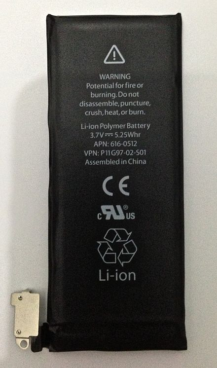
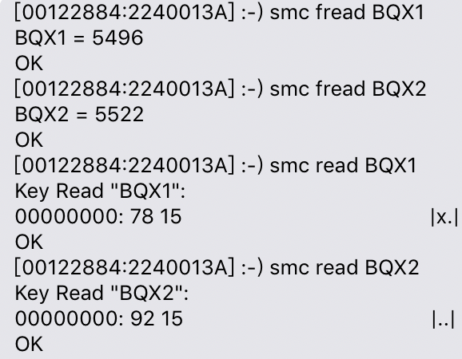

# Lithium Battery

* 锂电池\(Lithium battery\)：严格意义上的锂电池是锂原电池，内含纯态的锂金属，为一次性使用，不可充电。
* 锂离子电池：使用非水液态有机电解质，主要由正极（含锂化合物），负极（碳素材料），电解液和隔膜四部分组成，它主要依靠锂离子在正极和负极之间移动来工作。
* 锂离子电池根据所用电解质材料的不同，可分为：液态锂离子电池（Liquified Lithium\-Ion Battery）和聚合物锂离子电池\(Polymer Lithium\-Ion Battery\)。
* 锂离子聚合物电池（Lithium\-ion polymer batteries）：是普通锂离子电池的改良，利用胶态或固态聚合物取代液态有机溶剂的可充电锂离子电池，其安全性较好不会爆炸且可以塑造各种不同形状的电芯，广泛应用在手机笔记本电脑和数码产品中。
* 锂离子电池的优缺点：
  * 优点：1\. 能量密度高 2\. 开路电压高 3\. 输出功率大 4\.低自放电（<5％～10％/月）
  * 缺点：1\. 不耐受过放电 2\. 不耐受过充 3\. 衰老怕热

# Battery term

循环计数：表示电池在一定数量的循环内使用。该数值表示在整个寿命过程中全部和部分充放电的总数。

全负荷容量：以 mAh\(毫安\-小时\)为单位，指电池能够容纳的电量减去设备关机所需的电量。随着电池因使用和寿命而逐渐耗尽，这个数值会越来越小。

已损耗：这个数值表示电池中当前剩余的电量，以 mAh（毫安\-小时）为单位。在没有连接交流电源的情况下使用电脑时，随着电池数量逐渐耗尽，这个数值会越来越小。

充电终止电压：在规定的恒流充电期间，电极上的活性物质已达到饱和状态，再继续充电电池的电压也不会上升，此时的电压称为充电终止电压，到达终止电压后若继续充电即为过充。锂离子电池为4\.2V或4\.35V。

放电终止电压：指电池放电时电压下降到不宜再放电的最低工作电压值。

自放电率：一段时间内，电池在没有使用的情况下，自动损失的电量占总容量的百分比，一般常温下锂离子电池的自放电率为5%\-8%。

# Battery Charge

充电：对电池进行充电时，电池的正极上有锂离子生成，生成的锂离子经过电解液运动到负极，作为电池负极的碳层结构材料，表面有很多微孔，运动到负极的锂离子就嵌入到微孔中。

放电：对电池进行放电时，嵌在负极碳层中的锂离子脱出，又运动回到正极。

传统的锂离子电池都先以恒流后恒压方式充电，由于锂电池完全放电后只可以以较小的电流充电，所以充电器需先检查电池电压，若偏低则需要以较小的电流充电，当电流回升至一定水平后才以正常电流充电。当以恒流充电时，电池电压会随之上升，直至电压达至4\.2V时，充电器需转换为恒定电压方式充电，因为电压高过4\.2V的话就会对电池造成损坏。

例如：一种800mA\.h容量的电池，其终止充电电压为4\.2V。电池以800mA恒流充电，开始时电池电压以较大的斜率上升，当电池电压接近4\.2V时，改成4\.2V恒压充电，锂电池电流渐降，电压变化不大，到充电电流降为1/10C（约80mA）时，认为接近充满，可以终止充电。

锂离子电池对充电要求很高，它要求精密的充电电路以保证充电的安全，终止充电电压精度允许差值为±1%。

过充/过放电：从分子层面看，过度充电会将过多的锂离子硬塞进负极碳性结构中，从而使得其中一些锂离子再也无法释放出来，降低电池的容量。而过度放电将会导致负极碳性材料释放出过多锂离子，使得其片层机构变得不稳定而出现塌陷，一旦塌陷无法靠普通手段恢复，会对电池造成不可逆的损害。

BMS\(Battery management system\)：又叫电源管理系统，各大手机厂商对与电池的管理方式各有区别，但即使将充电器一直插在电源上，手机将在电池电量充满之后自行切断开关停止向电池继续充电。\(据说Apple的电源管理，在充满电之后并不会停止充电，而是开始放电，放出5%左右，再充，如此循环\)。

# Quick Charge Technology

目前手机快充主要分为三大类：QuickCharge\(QC\)高通快充技术，MTK联发科Pump Express快充技术和VOOC闪充技术。

QuickCharge\(QC\)是由高通主导的快速充电技术，专为配备Qualcomm骁龙处理器的终端而研发的新一代快速充电技术，主要特点是高电压，低电流。

MTK联发科Pump Express快充技术，允许充电器根据电流决定充电所需的初始电压，由PMIC\(Power Management IC\)发出脉冲电流指令通过USB的Vbus传送给充电器，充电器依照这个指令调变输出电压，电压逐渐增加至高达5V达到最大充电电流。

VOOC闪充采用低电压高电流的方案，与传统充电技术最大的区别在于将充电控制电路移植到了适配器端，减少了手机中的发热源。

USB\-PD\(USB Power Delivery\)

* USB\-PD：是一种快速充电协议，简称PD，它统一了市面上的很多快充协议，由于手机充电都是通过USB接口充电的，所以USB标准化规定必须通过USB\-PD协议来调节电压和电流，这样的好处可以使各个手机用户都可以更快的享受快充技术。Apple全系列产品从iPhone到MacBook Air/MacBook Pro均使用此PD协议，该PD是以Type\-C输出的，因为Type\-C具有常见USB\-A接口不具备的新特性。
* Type\-C的优点：
  * 支持正反插\(解决了USB总是插不准的世界性难题\)
  * 支持更强的电力传输\(最高实现100W的充电功率\)
  * 支持更高的传输速度\(最高10Gbps\)
  * 体积上更轻薄

# Apple Power Adapter

Apple Mac笔记本电脑的电源适配器有29W，30W，45W，60W，61W，85W，87W和96W八种功率规格，Apple 29W USB\-C 电源适配器是一款典型的PD协议充电器。

使用瓦特数偏高的兼容充电器并不会提高电脑的充电速度，也不会改变电脑的运行情况，如果所用电源适配器的瓦特数低于Mac原配的瓦特数，则无法为计算机提供足够的功率。

# Apple-PD Quick Charge

First Stage: 假如iphone X电量为0%处于关机状态，这时插入PD充电器iphone会检测是否支持Apple 5V2\.4A协议，是的话会以5V2\.4A进行充电，直至开机。Apple原厂PD充电器都是自带 Apple 5V2\.4A 协议的。

Second Stage: 充电自动开机后iphone开始通讯并与PD握手，向充电器申请PDO2（第二个电压档），然后全速大功率进行充电，这个时候的充电速度是最快的，但发热和损耗同时也很大。

Third Stage：随着iphone电池电压升高饱和度提升，为了寿命考虑这时候开始持续降低输入，功率开始缓慢降低，此阶段电量百分比为80%左右。

Fourth Stage: 充电进入尾声，转为传统恒压方式充电，电流逐渐减少直至充满\,这样可以减少发热，保护手机硬件，延长电池的寿命。

# Battery Capacity

* 电池容量是衡量电池性能重要标准之一，它表示在一定条件下（放电率，温度，终止电压等）电池放出的电量通常以A·H为单位\(1A· h=3600C电荷量\)
* 电池容量的计算方法：Q = It
    * 容量C = 放电电流\(恒流\)I X 放电时间\(小时\)t
    * 反之，放电时间t = 容量C / 放电电流\(恒流\)I
* 例如：一块电池用500mA\(毫安\)的恒定电流放电2小时，那么这块电池的容量就等于500mA X 2H = 1000mAH = 1AH。
* 但是Q = It并未涉及到电压，因此mAh只能说明电池内部能够容纳多少库伦\(C\)的电荷，并不能说明该电池能够做多少功，以及该电池能够提供的最大功率。

# Calculate Battery Capacity

在比较电池大小时通常以mAh作为单位，但如果两个不同产品的电池它们的工作电压不一样，则不能再使用mAh比较，而应使用瓦时\(Wh\)为单位进行比较。

电流做功的定义：W = UIt = UQ，电压U乘以电流I的单位为W\(瓦\)\.

再如容量高达12000mAh的移动电源，单从mAh来看它的容量比Apple的6559mAh要高很多，但是换算为Wh之后发现：5V\*12000mAh/1000 = 60Wh，实际是比Apple13寸RetinaMacBookPro的容量要小。

Apple13寸RetinaMacBook

Pro内置电池容量74\.9Wh

74\.Wh=11\.42V\*6559mAh/1000

# Battery Charge Cycle

电池的循环计数：电池充电周期是当电池已经耗尽到0%，然后再填充到最大容量100%，而不是每次插入电源适配器。假如一天内使用了电池一半电量，然后将其充满，第二天同样如此，则会计做一次充电循环，而非两次。通过这种方式，可能需要几天才能完成一个充电循环。

目前MacBookPro\(2017/2019\)的battery charge cycle最大为1000次，当电池达到最大循环计数后，仍可以使用，但是电池续航能力会大大下降，此时建议更换电池。

# My MacBookPro

# SMC

SMC is an independent chip on the machine\, which is mainly used to monitor the status of the entire system\, such as current\(电流\)\, voltage\(电压\)\, temperature\(温度\)\, sensors\(传感器\)\, etc\. smc command is used in iEFI environment\.

# J230_smc_keys

For example，executed the command "smc fread B0FG and BRSC" to get the unit battery status\.

# Test Item

* J230: QT0 Check Battery
  * BRSC
  * B0OS
  * B0CT
* J293:Battery Capacity
  * BQX1
  * BQX2

J223 QT0 Check Battery

# BRSC

* BRSC：Battery Relative State of Charge\(%\)\.
* read：读出以十六进制形式为输出的数值\.
* smc read BRSC：读出DUT电池的电量以十六进制形式输出：64
* 十六进制数字64换算为十进制数字为100\.

# B0OS

* B0OS：Battery Operation Status\.
* fread：f\-\->format\, convert to human\-readable format\.
* smc fread B0OS: 读出4位十六进制数字E4 43，转换为二进制数字为：1110 0100 0011 0011

检查转换后的16位二进制数字，

从左到右第3位上的二进制数字\,

看是否为1\,如果为1\,则返回:TRUE:

# B0CT

B0CT：Battery Cycle Count\.

smc fread B0CT：B0CT = 4 means battery cycle count is 4\.

# J293 Battery Capacity

BQX1: Battery bank 1 Qmax\. \(mAh\)

BQX2: Battery bank 2 Qmax\. \(mAh\)

J293\_QT0

Thanks！

