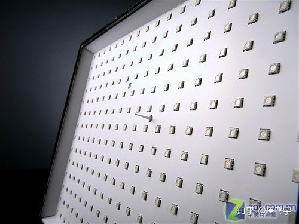
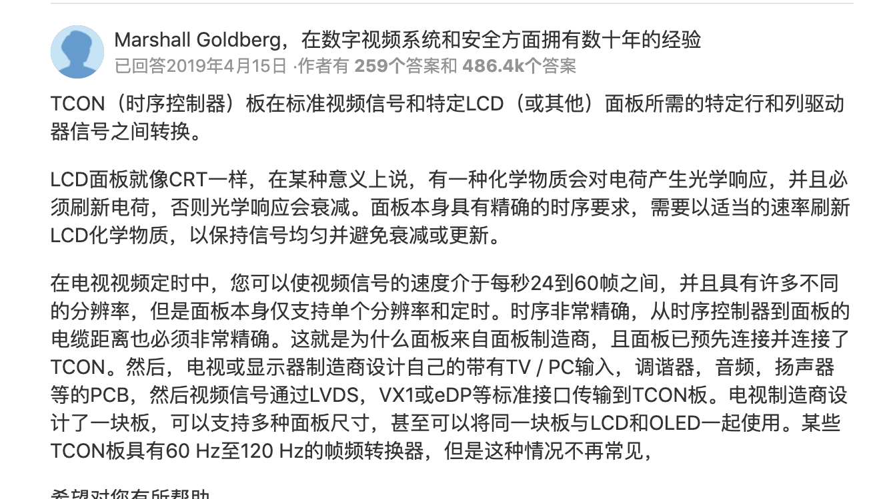

# Display Introduce


# Display Introduce

## [Display](https://en.wikipedia.org/wiki/Display_device)
A display device is anoutput devicefor presentation ofinformationinvisual<sup>[[1]](https://en.wikipedia.org/wiki/Display_device#cite_note-University_of_West_Florida-1)</sup> or tactile form (the latter used for example intactile electronic displaysfor blind people).<sup>[[2]](https://en.wikipedia.org/wiki/Display_device#cite_note-Office_of_the_Chief_information_Officer-2)</sup> When the input information that is supplied has an electrical signal the display is called an electronic display.

显示装置是一种输出装置，用于以视觉或触觉形式显示信息(后者用于盲人触觉电子显示器)。当所提供的输入信息具有电信号时，显示器称为电子显示器。

Computer monitor: https://en.wikipedia.org/wiki/Computer_monitor

A computer monitor is an output device that displays information in pictorial form. A monitor usually comprises thedisplay device,circuitry, casing, andpower supply. The display device in modern monitors is typically athin film transistor liquid crystal display(TFT-LCD) withLED backlightinghaving replacedcold-cathode fluorescent lamp(CCFL) backlighting.

计算机显示器是一种以图形形式显示信息的输出设备。显示器通常包括显示装置、电路、外壳和电源。现代显示器的显示设备通常是薄膜晶体管液晶显示器(TFT-LCD)， LED背光取代了冷阴极荧光灯(CCFL)背光。

CCFL结构如图所示。


1. Cathode-Ray Tube (CRT)

最早的电子显示器之一是 [阴极射线管](https://en.wikipedia.org/wiki/Cathode_ray_tube)(CRT)，该阴极射线管于1897年首次展示，并于1922年投入商业生产。<sup>[[1]](https://en.wikipedia.org/wiki/History_of_display_technology#cite_note-1)</sup> CRT由电子枪组成，该 [电子枪](https://en.wikipedia.org/wiki/Electron_gun) 通过将电子发射到涂有 [荧光粉](https://en.wikipedia.org/wiki/Phosphor) 的屏幕上来形成图像。最早的CRT是单色的，主要用于 [示波器](https://en.wikipedia.org/wiki/Oscilloscope) 和黑白电视。第一个商业彩色CRT于1954年生产。CRT是半个多世纪以来在 [电视机](https://en.wikipedia.org/wiki/Television_set) 和 [计算机显示器](https://en.wikipedia.org/wiki/Computer_monitor) 中使用的最流行的显示技术。直到2000年代，LCD才开始逐渐取代它们。

2. Liquid-crystal display(LCD)

[液晶显示器](https://en.wikipedia.org/wiki/Liquid-crystal_display) (LCD)是一种 [平板显示器](https://en.wikipedia.org/wiki/Flat_panel_display) 或其他 [电子调节光学装置](https://en.wikipedia.org/wiki/Electro-optic_modulator) 使用的光调制特性的 [液晶]() (LC)。液晶不直接发光，而是使用 [背光](https://en.wikipedia.org/wiki/Backlight) 或 [反射镜](https://en.wikipedia.org/wiki/Reflector_(photography)) 产生彩色或 [单色](https://en.wikipedia.org/wiki/Monochrome) 图像。<sup>[[1]](https://en.wikipedia.org/wiki/Liquid-crystal_display#cite_note-1)</sup>LCD可用于显示任意图像(如在通用计算机显示器中)或信息内容较少的固定图像，这些图像可以显示或隐藏，例如预设字词，数字和 [七段式显示器](https://en.wikipedia.org/wiki/Seven-segment_display) ，例如一个 [数字时钟](https://en.wikipedia.org/wiki/Digital_clock) 。它们使用相同的基本技术，除了任意图像由许多小 [像素组成](https://en.wikipedia.org/wiki/Pixel) ，而其他显示器则具有更大的元素。LCD可以正常打开(正)或关闭(负)，具体取决于偏振器的布置。例如，带有背光的字符正LCD将在背景上具有黑色字样，即背光的颜色，而带有字符的LCD将具有黑色背景，其字母与背光的颜色同色。光学滤镜被添加到蓝色LCD的白色上，以赋予其独特的外观。

3. Organic light-emitting diode(OLED) [有机发光二极管](https://en.wikipedia.org/wiki/Organic_light-emitting_diode)

有机发光二极管(OLED)是一个发光二极管[(LED)]，其中发射的电致发光层是一薄膜响应电流而发光的有机化合物。该有机层位于两个电极之间。通常，这些电极中的至少一个是透明的。OLED是用于创建数字显示在诸如电视屏幕，计算机显示器，便携式系统，如智能手机，手持游戏机和PDA。研究的主要领域是开发用于固态照明应用的白色OLED器件。

OLED主要有两个家族：基于小分子的OLED和使用聚合物的OLED 。将移动离子添加到OLED会创建一个发光电化学电池(LEC)，该电池的工作模式略有不同。

OLED显示器可以采用无源矩阵(PMOLED)或有源矩阵(AMOLED)控制方案来驱动。在PMOLED方案中，显示器中的每一行(和每一行)都是依次控制的，一个接一个，而AMOLED控制使用薄膜晶体管背板直接访问和打开或关闭每个单独的像素，从而实现更高的显示分辨率和更大的显示尺寸。

OLED显示器可以发射可见光，因此无需背光即可工作。因此，它可以显示深黑色电平，并且比液晶显示器(LCD)更薄更轻。在低环境光条件下(例如，黑暗的房间)，无论LCD使用冷阴极荧光灯还是LED背光灯，OLED屏幕均可实现比LCD 更高的对比度。

OLED与LCD结构对比 如图:


Now the mainstream display device. 如图:


1. 液晶显示器 (LCD : [Liquid-crystal display](https://en.wikipedia.org/wiki/Liquid-crystal_display))

薄膜晶体管液晶显示器TFT-LCD :

[Thin-film-transistor liquid-crystal display](https://en.wikipedia.org/wiki/Thin-film-transistor_liquid-crystal_display)

- 1-1. TN  (Twisted Nematic)
- 1-2. IPS (In Panel Switching)
- 1-3. VA  (Vertical Alignment)
- 1-4. VFFS (Advanced Fringe Field Switching)

2. 发光二极管 (LED : Light Emitting Diode)

量子点发光二极管 QLED quantum-dot light emitting diode

3. 有机发光二极管 (OLED : Organic light-emitting diode)

LCD Display RGB 排列， 如图:


LCD LED OLED 比较 如图:


What's kind of display is the better?

1. [亮度](https://en.wikipedia.org/wiki/Luminance) : 以每平方米坎德拉(cd / m 2也称为Nit)进行测量。

2. [色深](https://en.wikipedia.org/wiki/Color_depth) : 以每种原色的位数或所有颜色的位数衡量。

3. [色域](https://en.wikipedia.org/wiki/Gamut) : 作为CIE 1931颜色空间中的坐标进行测量。名称 [sRGB](https://en.wikipedia.org/wiki/SRGB) 或 [AdobeRGB](https://en.wikipedia.org/wiki/Adobe_RGB_color_space) 是速记符号。

4. [长宽比](https://en.wikipedia.org/wiki/Display_aspect_ratio) : 是水平长度与垂直长度的比率。监视器通常具有纵横比为 [4:3](https://en.wikipedia.org/wiki/4:3), [5:4](https://en.wikipedia.org/wiki/5:4) , [16:10](https://en.wikipedia.org/wiki/16:10) 或 [16:9](https://en.wikipedia.org/wiki/16:9) 。

5. [可视图像的尺寸](https://en.wikipedia.org/wiki/Viewable_image_size) : 通常是对角线测量的，但是实际的宽度和高度更有意义，因为它们不受高宽比的影响相同。对于CRT，可视尺寸通常比灯管本身小1英寸(25毫米)。

6. [显示分辨率](https://en.wikipedia.org/wiki/Display_resolution) : 是每个维度中可以显示的不同像素数。对于给定的显示尺寸，最大分辨率受点间距的限制。

7. [点间距](https://en.wikipedia.org/wiki/Dot_pitch) : 是相同颜色的子像素之间的距离，以毫米为单位。通常，点距越小，图片将越清晰。刷新率是指显示屏每秒亮起的次数。最大刷新率受响应时间限制。

8. [响应时间](https://en.wikipedia.org/wiki/Response_time_(technology)) : 是监视器中的像素从活动(白色)变为不活动(黑色)并再次回到活动(白色)所花费的时间，以毫秒为单位。较低的数字意味着更快的过渡，因此可见图像伪影更少。

9. [对比度](https://en.wikipedia.org/wiki/Contrast_ratio) : 是显示器能够产生的最亮颜色(白色)的亮度与最暗颜色(黑色)的亮度之比。功耗以瓦特为单位。

10. [Delta-E](https://en.wikipedia.org/wiki/Color_difference) ：颜色精度以delta-E度量；E越低，颜色表示越准确。低于1的delta-E对人眼是不可见的。2到4的Delta-E被认为是好的，并且需要敏锐的眼睛才能发现差异。

11. [视角](https://en.wikipedia.org/wiki/Viewing_angle) : 是在不过度降低图像质量的情况下可以观看监视器图像的最大角度。它是水平和垂直度数。

12. fps : 32Hz, 60Hz, 144Hz.

# Apple Display

https://en.wikipedia.org/wiki/Apple_displays

[Apple Studio Display](https://en.wikipedia.org/wiki/Apple_Studio_Display) (1998–2004)

[Apple Cinema Display](https://en.wikipedia.org/wiki/Apple_Cinema_Display) (1999–2011)

[Apple Thunderbolt Display](https://en.wikipedia.org/wiki/Apple_Thunderbolt_Display) (2011–2016)

[Apple Pro Display XDR](https://en.wikipedia.org/wiki/Apple_Pro_Display_XDR) (2019-Current)


LCD背后的LED灯排列样式如图:





1. 视网膜显示器(Retina Display)的目标是使文本和图像的显示极其清晰，从而使肉眼看不到像素。

2. Apple的Retina显示器并非绝对标准，会根据设备上显示器的尺寸以及用户通常在观看屏幕时的距离而有所不同。

3. Retina的优点在许多用途中可见，特别是对于显示文本而言，字体的弯曲边缘比以前的显示技术要平滑得多。

# TCON Introduce

What is TCON(Timing Controller)?

https://www.quora.com/What-does-the-T-Con-Board-in-a-TV-do

The timing controller, also called TCON and T-CON, is to generate the horizontal and vertical timing panel signals.
TCON详细介绍如图7所示：



TCON 逻辑图 如图8所示：

<https://www.cnblogs.com/lifan3a/articles/6089021.html>


TCON逻辑板的六大供电电路的作用:<https://kknews.cc/science/65zvnvp.html>

1、VEEG/VGL/voff：-6V -TFT组件关闭GATE的电压给GATE使用。

2、VGH/VDDG/Von：GATE ON控制电压，这个电压一般是16v-32v等。

3、VCOM：3.6V-5v基准共通电压和阶调电压的差值来驱动液晶，给面板使用。为了不让电源瞬间的开与关，而引起内部组件突然承受过大的电流而破坏 IC，因而再TURNON和 TURNOFF的个电压启动顺序必须符合先后顺序。

4、VDD：3.3V 、5.0V、12V数字电路部分供电电源。VDD+5V表示5V。

5、VDDA/AVDD/VDA:模拟电源 , 9.2V-13V为灰阶调电压的最大值，再转成个阶调所需电压给 SCANIC的GAMMA电压。

6、GM1---GM14:GAMMA校正电压，该电压为分级的阶梯形式的电压。用V1-V14来表示。

(1)M/POL：液晶驱动极性转换信号，用于产生VCOM信号。

(2)GVON,GVOFF时序控制信号，是由时序控制芯片发出的。

(3)PWRONC/DC转换IC开启信号，这个信号是有时序芯片发送出来的。

LCD屏常见故障：

1、白屏：检查VDD、VDA的电压为0或者低。

2、幕出现彩条竖条、满屏竖条、杂波淡淡的图像、有时候黑屏：检查VGH电压。

3、满屏竖条、并杂有图像、并下部竖条无图像：检查VGL电压为0v、或者电压偏低。

4、图像暗淡、对比度差：检查 VGH偏低。

5、白屏：检查多为校正电压全为0v、全为VREF电压。

6、负像：某个或者多个校正电压偏低。

7、亮度偏高、负像：检查 多为VCOM电压

8、花屏、图像撕裂、无图像、图像左右颠倒检查： 时序控制错误 无RSDS信号输出或者丢失部分RSDS信号。

## TCON Sequence
如图9，图10 是J290 QT1 TCON sequence.


## Check TCON FW


## Update TCON FW
J152 MMI Preburn sequence
```shell

"012":{
        "testName":"Update and Validate TCON EEPROM",
        "testID":"",
        "showOnGUI":"1",
        "behaviorTag":"default",
        "dependence":"",
        "categoryName":"Display",
        "commands":[
            ["UUT","cd /AppleInternal/Tools/","specificString:","root#","10","","0","","",""],
            ["UUT","xattr -c Banksia_Updater_v4-04c.app","specificString:","root#","10","","0","","",""],
            ["UUT","chmod 777 x1322_tcon_eeprom_flash_v04.sh","specificString:","root#","10","","0","","",""],
            ["UUT","chmod 777 x1322_tcon_eeprom_version_check_v03.sh","specificString:","root#","10","","0","","",""],
            ["UUT","./x1322_tcon_eeprom_version_check_v03.sh","specificString:","OK| Version 09_0A is correct","10","","0","","",""],
            ["tester","doCaseByLastResult","specificString:","DoCaseByResultDone","5","0","0","0","0",""],
            ["tester","echoString:++No Need To Flash TCON EEPROM.","specificString:","No Need To Flash TCON EEPROM.","2","0","1","","",""],
            ["UUT","./x1322_tcon_eeprom_flash_v04.sh","specificString:","TCON EEPROM Write success","40","","0","","",""]
        ],
   "failToDoCommands":[
            ["selfSSH","ping -t 4 %@++uutIP","nilExpect:","","6","1","0","","",""],
            ["tester","failCaseDUTNetworkNoResponse:++uutIP++机器网路没有反应, 终止测试并上传资料, 请找 PE/指导员来确认机器状态","nilExpect:","","30","","0","","",""]
        ]
    },

```

# VCOM Introduce

What is VCOM?

<http://developer.vectorworks.net/index.php/VCOM:VCOM_(Vectorworks_Component_Object_Model)>

1. VCOM(Vectorworks Component Object Model) 向量工程组件对象模型 :

是一种在Vectorworks运行时提供组件服务的API。

2. 不同的Gamma电压与Vcom电压之间的压差造成液晶旋转角度不同从而形成亮度的差异，Vcom电压最好的状况是位于G0和G14的中间值，

## VCOM Sequence
J290 QT1的VCOM Sequence 如图11所示:


## CPU/GPU & VCOM & TCON

TFT电路驱动原理：

由CPU通过LCD接口送来的视频信号及时钟经过TCON的时序转换，RGB数据经过D/A转换送到SOURCE端，同时TCON产生移位时钟信号驱动GATE端，选通一行，打开这一行的所有晶体管， SOURCE向液晶电容充电，液晶产生灰度并保持，通过GATE的移位，继续向下面行写入液晶图像，当整个行写完，又重新从第一行开始。

如果一直显示静止的图像，液晶电极上的电压就会一直不变，当撤销电压时，液晶很难回复原状，容易造成液晶损坏。解决这问题的方法就是改变液晶的控制电压的极性，也就是说即使是静止的图像，液晶电极上的电压也一直在翻转。一般的LCD都采用行翻转的形式，通过改变公共端的电压极性VCOM而达到翻转的目的。TCON IC一般会送出一个M或者POL的信号，我们用这个信号产生VCOM，一般的转换电路使用非们或者运方电路。通过调节VCOM的DC端，我们可以改变LCD的色彩，调节AC端，可以改变LCD的对比度。也许是由于行翻转的缘故，有的LCD会产生水平的条纹(Flicker现象)