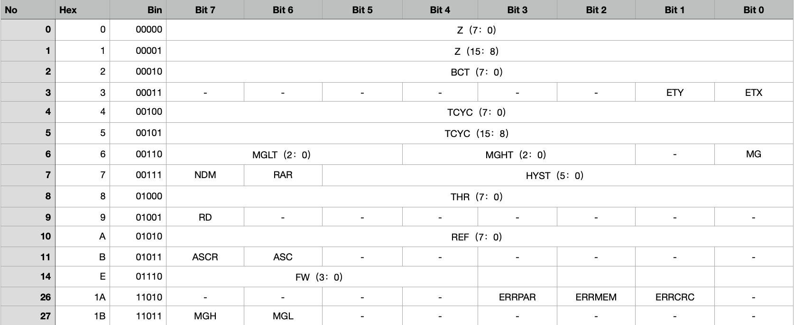

# LAS Sensor

# 1. Glossary

| Parameters                    | Symbol | Number of Bits | Description                                                  |
| ----------------------------- | ------ | -------------- | ------------------------------------------------------------ |
| Zero Setting                  | Z      | 16             | Sets the zero position.                                      |
| Bias Current Trimming         | BCT    | 8              | For side-shaft configuration: reduces the bias current of the X or Y Hall device. |
| Enable Trimming X             | ETX    | 1              | Biased current trimmed in the X direction Hall device.       |
| Enable Trimming Y             | ETY    | 1              | Biased current trimmed in the Y direction Hall device.       |
| Cycle Time                    | TCYC   | 16             | ASC mode: time for an active + idle cycle.                   |
| Magnetic Field Low Threshold  | MGLT   | 3              | Sets the field strength low threshold.                       |
| Magnetic Field High Threshold | MGHT   | 3              | Sets the field strength high threshold.                      |
| Magnetic Field Strength       | MG     | 1              | Enables the field strength detection.                        |
| Threshold                     | THR    | 8              | ASC mode: threshold for change detection.                    |
| ND Mode                       | NDM    | 1              | ND pin logic or latched mode                                 |
| ND pin Hysteresis             | HYST   | 6              | Determines hysteresis applied to ND pin.                     |
| Rotation Direction            | RD     | 1              | Determines the sensor positive direction.                    |
| Reference                     | REF    | 8              | ASC mode: Angle of reference for detection of change         |
| Reference Auto Refresh        | RAR    | 1              | ASC mode: automatically updates the reference at each detection change. |
| Auto Sampling Cycle           | ASC    | 1              | Enables the ASC mode.                                        |
| ASC Register driven           | ASCR   | 1              | Allows the enabling of the ASC mode via register settings.   |
| Filter Window                 | FW     | 4              | Size of the filter window. Determines the resolution         |

# 2. spi cmd Explanation

### 2.1 SPI Read Register

A read register operation is constituted of two 16- bit frames. The first frame sends a read request, which contains the 3-bit read command (010) followed by the 5-bit register address. The last 8 bits of the frame must be all set to 0. The second frame returns the 8-bit register value (MSB byte) with a 8-bit angle value.

command=[15bit:13bit]       reg address=[12bit:8bit]                The last 8 bits of the frame must be all set to 0

| 15   | 14   | 13   | 12   | 11   | 10   | 9    | 8    | 7    | 6    | 5    | 4    | 3    | 2    | 1    | 0    |
| ---- | ---- | ---- | ---- | ---- | ---- | ---- | ---- | ---- | ---- | ---- | ---- | ---- | ---- | ---- | ---- |
| 0    | 1    | 0    | A4   | A3   | A2   | A1   | A0   | 0    | 0    | 0    | 0    | 0    | 0    | 0    | 0    |

##### 2.1.1 SPI Command List Overview

| Command Function               | Command bits [15:13] | Register Address Required | Register Value Required | Returned Value               |
| ------------------------------ | -------------------- | ------------------------- | ----------------------- | ---------------------------- |
| Read Angle                     | 000                  | No                        | No                      | 16-bit Angle                 |
| Read Register                  | 010                  | Yes                       | No                      | 8-bit Angle + Register Value |
| Write Register                 | 100                  | Yes                       | Yes                     | 8-bit Angle + Register Value |
| Store Single Register to NVM   | 111                  | Yes                       | No                      | 16-bit Angle                 |
| Store All Registers to NVM     | 110                  | No                        | No                      | 16-bit Angle                 |
| Restore All Registers from NVM | 101                  | No                        | No                      | 16-bit Angle                 |
| Clear Error Flags              | 001                  | No                        | No                      | 16-bit Angle                 |

##### 2.1.2 Register Map

##### 2.1.3 Default Value

##### 2.1.4 Read Register Operation 

MOSI= Input

MISO=Output

EX：

第一次发送read Register command：spi -t 5 2 0x4E 0x00        (读取FW的值 )

​																	010  01110    0000 0000

第一次return： 0xFF 0xFE

第一次发送read Register command：spi -t 5 2 0x00 0x00

第二次return： 0x00 0xF0    

​							0000 0000    1111 0000

这里的0xF0才是真正读到的FW值

### 2.2 SPI Write Register

##### 2.2.1 Write Register Operation 

# 3. Test Process

### 3.1 QT0 Process

##### 3.1.1 Zero Setting 

### 3.2 LASDOE1 Process

