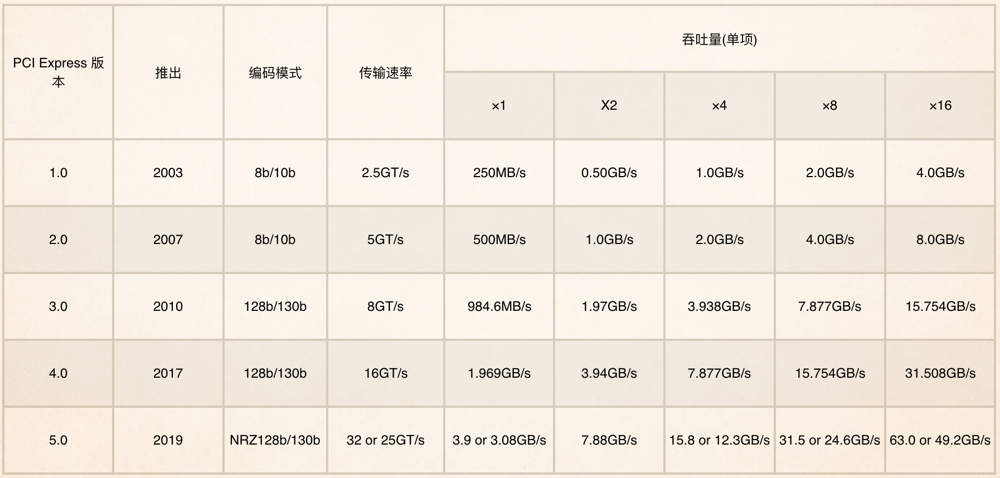
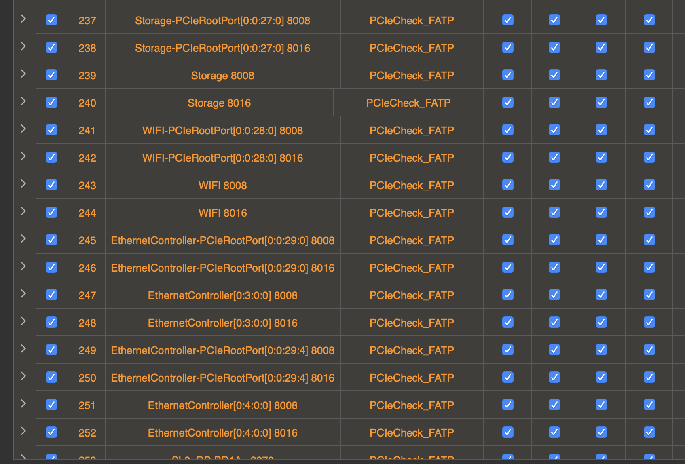

---
author:
    name: Whiteny Ren
    email: Whitney.Ren@quantacn.com
date: 2019-10-29
title: PCIE
---
# PCIE Brief introduction

# PCie 简介

PCI Express\(peripheral component interconnect express\)，简称PCI\-E，是计算机总线的一个重要分支，它沿用现有的PCI编程概念及信号标准，并建构建了更加高速的串行通信系统标准。

计算机总线\(Bus\)是指计算机各种功能部件间规范化的交换数据\(data\)的方式。即以一种通用的方式为各组件提供数据传送和控制逻辑。

# PCIE 历史

2001年的春季英特尔开发者论坛\(IDF\)上Intel 公布取代PCI总线的第三代I/O技术\,被称为“3GIO”。该总线的规范由Intel支持的 _AWG_ （Arapahoe Work Group）负责制定

2002年4月17日，AWG正式宣布3GIO 1\.0规范草稿制定完毕，移交PCI特殊兴趣小组\(PCI\-SIG\)进行审核。

2002年7月23日经过审核后正式公布，改名为“PCI Express”，并根据开发蓝图在2006年正式推出Spec 2\.0（2\.0规范）

2019年5月28日，PCI\-SIG官方发布了PCIe 5\.0的1\.0版基础规范。

# PCIE

PCIe采用了全双工，点对点的传输设计，即允许在同一时刻，同时进行发送和接收数据。

# PCIE 特性

PCIe设备能够支援热拔插以及热交换特性，目前支援的三种电压分别为\+3\.3V、3\.3Vaux以及\+12V。

# PCIe 的热插拔

PCIe总线的热插拔主要指的是PCIe卡设备的热插拔，以及相关的实现机制等。PCIe卡有两个用于热插拔机制的引脚——PRSNT1\#和PRSNT2\#。

# PCIE 的热切换

热切换（Hot swap）功能就是允许用户在不关闭系统，不切断电源的情况下取出和更换损坏的硬盘、电源或板卡等部件，从而提高了系统对灾难的及时恢复能力、扩展性和灵活性等。

# PCie与其他传输规格比较

PCIe的规范主要是为了提升电脑内部所有汇流排的速度，因此频宽有多种不同规格标准，其中PCIe x16是专为显示卡所设计的部分。

# PCI Express 效能

i\. 每个方向\(每条通道\(lane\)是双单工信道\)。

ii\. 出于技术可行性，最初也考虑过25\.0 GT/s

以PCIe 2\.0為例，每秒5GT\(Gigatransfer\)原始數據傳輸率，編碼方式為8b/10b\(每10個位元只有8個有效數據\)，即有效頻寬 為4Gb/s = 500MByte/s。

# PCie 1.0

在2003年由PCI\-SIG正式推出相关规范。PCIe 1\.0a的每通道运行频率为250MHz，相应的数据传输速率为250MB/s，不过更正规的写法被写成2\.5GT/s，也就是每秒2\.5千兆次传输。这里需要注意的是，PCIe的每通道数据是打包传输的，其中不但包括需要传递的目标数据，还包括校验信息。

PCIe 1\.0a实际传输10bit的信息，其中2bit为校验信息，只有8bit为真正有用的信息，其传输带宽开销为20%，因此实际的有效信息传递能力为每通道200MB/s。不过，初始的PCIe 1\.0a版本在发布后很快就被更新的PCIe 1\.1规范替代。相比之前的1\.0a版本，PCIe 1\.1版本增加了一些功能和稳定性设计，带宽和关键性指标完全相同，因此一般将其统一归为PCIe 1\.x时代

# PCIE 2.0

PCIe 2\.0规范发布于2007年1月，其规范主要变化在于相比PCIe 1\.x，PCIe 2\.0的每通道频率翻倍来到了500MHz，相应的传输能力翻倍，达到了500MB/s，也就是5GT/s，不过数据编码依旧使用了8bit/10bit的方式，也就是依旧需要使用20%的校验带宽。

# PCie 3.0

PCI\-E 3\.0规范将数据传输率提升到8GHz|8Gb/s\(最初也预想过10GHz\)，并保持了对PCI\-E 2\.x/1\.x的向下兼容，继续支持2\.5GHz、5GHz信号机制。基于此，PCI\-E 3\.0架构单信道\(x1\)单向带宽即可接近1GB/s，十六信道\(x16\)双向带宽更是可达32GB/s。

# PCIE 4.0

PCIe 4\.0 1\.0 版正式规范由 PCI\-SIG 发布，以 PCIe 3\.0 为基础将单通道传输速率从 8GT/s 变更为 16GT/s，编码格式并未做出更动，因此实际传输频宽直接翻为 2 倍 1\.969GB/s。

# PCIE 5.0

PCIe 5\.0，其信号速率从PCIe 4\.0的16GT/s提升到了32GT/s，依然使用128/130编码方式，x16带宽从64GB/s提升到了128GB/s。除了带宽翻倍之外，PCIe 5\.0还带来了其他变化，改变了电气设计以改善信号完整性，向后兼容PCIe等等。此外，PCIe 5\.0还设计了新标准，减少了延迟，降低了长距离传输中的信号衰减。

# J160 相关测试

| **Category** | **Test ID** |                    **Test Name**                     | **SOC Env** |   **Intel env**   |
| :----------: | :---------: | :--------------------------------------------------: | :---------: | :---------------: |
|   **PCIe**   |    8186     |               Reset Errors Test [EFI]                |    iEFI     | MacEFI(spartacus) |
|   **PCIe**   |    8008     |                Link Speed Test [EFI]                 |    iEFI     | MacEFI(spartacus) |
|   **PCIe**   |    8016     |                Link Speed Test [EFI]                 |    iEFI     | MacEFI(spartacus) |
|   **PCIe**   |    8070     |                Error Rate Test [EFI]                 |    iEFI     | MacEFI(spartacus) |
|   **PCIe**   |    8106     | Standard Register Test (Device Identification) [EFI] |    iEFI     | MacEFI(spartacus) |
|   **PCIe**   |    2697     |                   Link Speed Test                    |     gOS     |       MacOS       |
|   **PCIe**   |    2696     |                   Link Speed Test                    |     gOS     |       MacOS       |

|   Type   | Speed | Width |
| :------: | :---: | :---: |
|   TIO    | Gen3  |  X4   |
|   BIO    | Gen3  |  X4   |
|   WIFI   | Gen1  |  X1   |
|   SSD    | Gen3  |  X4   |
| Ethernet | Gen3  |  X2   |
|   TBT    | Gen3  |  X4   |
| GPU A127 | Gen3  |  X16  |
| GPU A147 | Gen3  |  X16  |
| GPU A129 | Gen3  |  X16  |
| GPU A217 | Gen3  |  X16  |
| GPU A227 | Gen3  |  X8   |

---

J160 PCIe相关测试

PCIeRootPort BDF 示例1

VideoController BDF 示例2

BIO Thunderbolt BDF 示例3

Ethernet BDF 示例4

Thanks