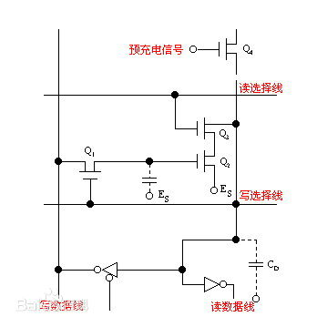
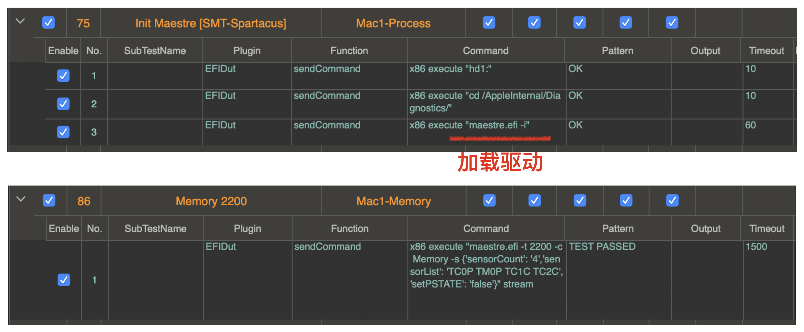
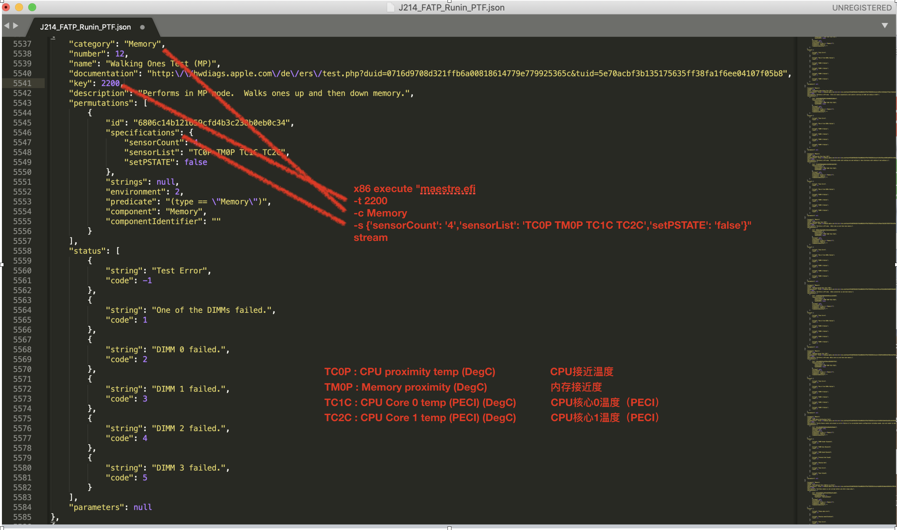

# 存储器

​	存储器是数字系统中用以存储大量信息的设备或部件，是计算机和数字设备中的重要组成部分。存储器可分为随机存取存储器（RAM）和只读存储器（ROM）两大类。

​	随机存取存储器（RAM）既可向指定单元存入信息又可从指定单元读出信息。任何RAM中存储的信息在断电后均会丢失，所以RAM是易失性存储器。

​	ROM为只读存储器，除了固定存储数据、表格、固化程序外，在组合逻辑电路中也有着广泛用途。

# RAM简介

​	随机存取存储器（英语：Random Access Memory，缩写：RAM），也叫主存，是与 CPU 直接交换数据的内部存储器。它可以随时读写（刷新时除外），而且速度很快，通常作为 操作系统 或其他正在运行中的程序的临时数据存储介质。RAM工作时可以随时从任何一个指定的地址写入（存入）或读出（取出）信息。它与ROM的最大区别是数据的易失性，即一旦断电所存储的数据将随之丢失。RAM在计算机和数字系统中用来暂时存储程序、数据和中间结果。

# RAM特点：

​	所谓“随机存取”，指的是当寄存器中的数据被读取或写入时，所需要的时间与这段信息所在的位置或所写入的位置无关。相对的，读取或写入顺序访问（Sequential Access）存储设备中的信息时，其需要的时间与位置就会有关系。它主要用来存放操作系统、各种应用程序、数据等。

​	当RAM处于正常工作时，可以从RAM中读出数据，也可以往RAM中写入数据。与ROM相比较，RAM的优点是读/写方便、使用灵活，特别适用于经常快速更换数据的场合。

​	当电源关闭时，RAM不能保留数据。如果需要保存数据，就必须把它们写入一个长期的存储设备中（例如硬盘）。

​	RAM的工作特点是通电后，随时可在任意位置单元存取数据信息，断电后内部信息也随之消失。

​	正如其他精细的集成电路，随机存取存储器对环境的静电荷非常敏感。静电会干扰存储器内电容器的电荷，引致数据流失，甚至烧坏电路。故此触碰随机存取存储器前，应先用手触摸金属接地。

​	现代的随机存取存储器几乎是所有访问设备中写入和读取速度最快的，存取延迟和其他涉及机械运作的存储设备相比，也显得微不足道。

​	现代的随机存取存储器依赖电容器存储数据。电容器充满电后代表1（二进制），未充电的代表0。由于电容器或多或少有漏电的情形，若不作特别处理，数据会渐渐随时间流失。刷新是指定期读取电容器的状态，然后按照原来的状态重新为电容器充电，弥补流失了的电荷。需要刷新正好解释了随机存取存储器的易失性。

# 静态RAM和动态RAM

​	静态随机存取存储器（Static Random\-Access Memory）是随机存取存储器的一种。根据存储单元的工作原理不同，静态RAM和动态RAM。RAM分为所谓的“静态”，是指这种存储器只要保持通电，里面储存的数据就可以恒常保持。

​	静态存储单元是在静态触发器的基础上附加门控管而构成的。因此，它是靠触发器的自保功能存储数据的。SRAM存放的信息在不停电的情况下能长时间保留，状态稳定，不需外加刷新电路，从而简化了外部电路设计。但由于SRAM的基本存储电路中所含晶体管较多，故集成度较低，且功耗较大。而且，当电力供应停止时，SRAM储存的数据还是会消失（被称为volatile memory），这与在断电后还能储存资料的ROM或闪存是不同的。

​	存储原理：由触发器存储数据。

​	单元结构：六管NMOS或OS构成。

​	优点：速度快、使用简单、不需刷新、静态功耗极低；常用作Cache。

​	缺点：元件数多、集成度低、运行功耗大。

​	常用的SRAM集成芯片：6116（2K×8位），6264（8K×8位），62256（32K×8位），2114（1K×4位）。

# 动态随机存储器（DRAM）

​	DRAM（Dynamic Random Access Memory），即动态随机存取存储器，最为常见的系统内存。DRAM 只能将数据保持很短的时间。为了保持数据，DRAM使用电容存储，所以必须隔一段时间刷新（refresh）一次，如果存储单元没有被刷新，存储的信息就会丢失。 （关机就会丢失数据）

# DRAM的刷新

​	DRAM利用电容存储电荷的原理保存信息，电路简单，集成度高。由于任何电容都存在漏电，因此，当电容存储有电荷时，过一段时间由于电容放电会导致电荷流失，使保存信息丢失。解决的办法是每隔一定时间（一般为2ms）须对DRAM进行读出和再写入，使原处于逻辑电平“l”的电容上所泄放的电荷又得到补充，原处于电平“0”的电容仍保持“0”，这个过程叫DRAM的刷新。

# DRAM特点如下：

​	存储原理：利用MOS管栅极电容可以存储电荷的原理，需刷新（早期：三管基本单元；之后：单管基本单元）。

​	刷新（再生）：为及时补充漏掉的电荷以避免存储的信息丢失，必须定时给栅极电容补充电荷的操作。

​	刷新时间：定期进行刷新操作的时间。该时间必须小于栅极电容自然保持信息的时间（小于2ms）。

​	优点： 集成度远高于SRAM、功耗低，价格也低。

​	缺点：因需刷新而使外围电路复杂；刷新也使存取速度较SRAM慢，所以在计算机中，DRAM常用于作主存储器。

​	尽管如此，由于DRAM存储单元的结构简单，所用元件少，集成度高，功耗低，所以已成为大容量RAM的主流产品。

​                                                                                 
​    动态RAM的工作原理：动态RAM也是由许多基本存储元按照行和列地址引脚复用来组成的。

​	3管动态RAM的工作原理3管动态RAM的基本存储电路如右图所示。在这个电路中，读选择线和写选择线是分开的，读数据线和写数据线也是分开的。

​	写操作时，写选择线为"1"，所以Q1导通，要写入的数据通过Q1送到Q2的栅极，并通过栅极电容在一定时间内保持信息。

​	读操作时，先通过公用的预充电管Q4使读数据线上的分布电容CD充电，当读选择线为高电平有效时\,Q3处于可导通的状态。若原来存有"1"\,则Q2导通，读数据线的分布电容CD通过Q3、Q2放电\,此时读得的信息为"0"，正好和原存信息相反；若原存信息为"0"\,则Q3尽管具备导通条件，但因为Q2截止，所以，CD上的电压保持不变，因而，读得的信息为"1"。可见，对这样的存储电路，读得的信息和原来存入的信息正好相反\,所以要通过读出放大器进行反相再送往数据总线。

​	Es：earthing switch 接地开关

# DRAM的发展

​	“上古”时代的FP/EDO内存，由于半导体工艺的限制，频率只有25MHz/50MHz，自SDR以后频率从66MHz一路飙升至133MHz，终于遇到了难以逾越的障碍。此后所诞生的DDR1/2/3系列，它们存储单元官方频率（JEDEC制定）始终在100MHz\-200MHz之间徘徊，非官方（超频）频率也顶多在250MHz左右，很难突破300MHz。事实上高频内存的出错率很高、稳定性也得不到保证，除了超频跑简单测试外并无实际应用价值。

​	既然存储单元的频率（简称内核频率，也就是电容的刷新频率）不能无限提升，那么就只有在I/O（输入输出）方面做文章，通过改进I/O单元，这就诞生了DDR1/2/3、GDDR1/2/3/4/5等形形色色的内存种类。

# DRAM的种类

# Memory相关测试

说明：测试之前首先加载驱动，之后执行Command。

# ECC

​	修正错误存储器（英语：Error\-Correcting Code memory，缩写：ECC memory或ECC）指能够实现错误检查和纠正错误技术的内存。

​	在ECC技术出现之前，内存中应用最多的另外一种错误检查技术，是奇偶校验位（Parity）技术。

​	在数字电路中，最小的数据单位是“比特（bit）”，也叫“比特”。“比特”也是内存中的最小单位，它是通过“1”和“0”来表示数据高、低电平信号。在数字电路中8个连续的比特是一字节，不带“奇偶校验”的内存中的每个字节只有8位，若它的某一位存储出了错误，就会使其中存储的相应数据发生改变而导致应用程序发生错误。

​	而带有“奇偶校验”的内存在每一字节（8位）外又额外增加了一位用来进行错误检测。比如一个字节中存储了某一数值（1、0、1、0、1、0、1、1），把这每一位相加起来（1＋0＋1＋0＋1＋0＋1＋1=5）。对于偶校验，若其结果是奇数，校验位就定义为1，反之则为0；对于奇校验则相反。当CPU返回读取存储的数据时，它会再次相加前8位中存储的数据，计算结果是否与校验位相一致。当CPU发现二者不同时就会试图纠正这些错误。

​	但奇偶校验位技术有个缺点，当内存查到某个数据位有错误时，由于不一定能确定错误在哪一个位，也就不一定能修正错误。所以带有奇偶校验的内存的主要功能仅仅是“发现错误”，并能纠正部分简单的错误。

​	此外，奇偶校验技术是通过在原来数据位的基础上增加一个数据位来检查当前8位数据的正确性，但随着数据位的增加，用来检验的数据位也成倍增加，就是说当数据位为16位时它需要增加2位用于检查，当数据位为32位时则需增加4位，依此类推。特别是当数据量非常大时，数据出错的几率也就越大，对于只能纠正简单错误的奇偶检验的方法就显得力不从心了。正是基于这样一种情况，错误检查和纠正（Error Checking and Correcting）应运而生了。

​	ECC与奇偶校验不同的是，如果数据位是8位，则需要增加5位来进行ECC错误检查和纠正。数据位每增加一倍，ECC只增加一位检验位。也就是说当数据位为16位时ECC位为6位，32位时ECC位为7位，数据位为64位时ECC位为8位，依此类推。在内存中ECC能够容许错误，并可以将错误自动更正，使系统得以正常的操作，不致因错误而中断。

# 对ECC的误解

​	部分人认为服务器必须使用ECC内存，认为ECC内存性能较高，其实是一种谬误。ECC内存之所以广泛应用于服务器领域，并非其性能，而是因为ECC内存的纠错能力，使服务器保持稳定。事实上，ECC RAM要进行纠错，它的性能比一般的non\-ECC RAM还要低。

​	ECC本身并不是一种内存型号，也不是一种内存专用技术，它是一种广泛应用于各种领域的计算机指令中的指令纠错技术，确保服务器的正常运行。之所以说它并不是一种内存型号，那是因为并不是一种影响内存结构和存储速度的技术。它可以应用到不同的内存类型之中，正如上述的“奇偶校正”内存，它也不是一种内存。最开始应用这种技术的是EDO内存，现在的SDRAM也有应用。ECC内存主要是从SDRAM开始得到广泛应用，而新的DDR、RDRAM也有相应的应用，当前主流的ECC内存其实是SDRAM。

# Walking one/zero test

​	Walking one/zero test 是一种流行的算法，用于测试所有类型的读/写存储器，而不仅仅是SDRAM。
​    它的名称来自测试期间写入内存的模式。Walking one 的“ 1”（对于一个字节宽的存储器）涉及将二进制值“ 00000001”写入读/写存储器中的第一个位置。然后将该值向左移动一个位置，以使二进制值为“ 00000010”。该值被写入存储器中的下一个位置。当从8位值中左移“ 1”时，将重新使用值“ 00000001”，并且从此处再次开始左移。重复这种左移一位然后将新值写入下一个存储单元的模式，直到写入所有存储器为止。
​    一旦所有的存储器都被写入，然后按位置读取该存储器，并将其与原始写入的左移模式进行比较。
​    Walking zero的“ 0”是相同的算法，所使用的模式以“ 11111110”开始写入第一存储位置，而“ 11111101”被写入第二存储位置除外。
​    该测试旨在发现存储设备内部和外部的数据或地址总线问题。

