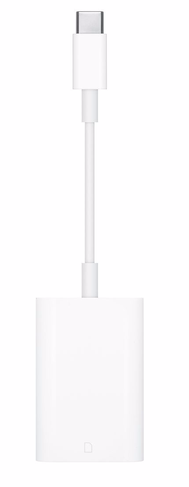

# SD Card Introduction

# SD卡简介

SD卡为Secure Digital Memory Card，即安全数位卡，为一种记忆卡，由于它体积小、数据传输速度快、可热插拔等优良的特性，被广泛地于便携式装置上使用，例如数码相机、个人数码助理（外语缩写PDA）和多媒体播放器等\. 大部份SD卡的侧面设有写保护控制，以避免一些资料意外地写入，而少部分的SD卡甚至支援数位版权管理的技术\.

# SD卡发展历程

1997年，西门子及闪迪共同开发了SD卡前身MultiMediaCard\(MMC\)，技术基于东芝的NAND快闪记忆技术\.

几年后，在MMC卡基础上研发的SD卡又替代了MMC卡\.

2006年3月发布的SDHC标准\(SD 2\.0\)，重新定义了SD卡的速度规格，分 为三档:Class 2、4、6，代表寫入速度分别为2MB/s、4MB/s、6MB/s \.

2010年发布了新的SD 3\.0，定义了SDXC和UHS，并新增了Class 10\.

2018年，SD协会推出了全新的SD Express协议与SDUC卡标准\.

# SD卡分类

## Form\-factor

按物理规格来看，常见的SD卡有三种：

1\. 标准的SD卡

2\. miniSD

3\. TF卡，也称mirco SD

由上至下分别为标准SD、miniSD、microSD卡

##### Capacity of Memory

SD卡按容量分类，可以分为以下几种：

| **容量等级** | **容量范围** | **磁盘格式** |
| :----------: | :----------: | :----------: |
|    **SD**    |  上限至2GB   |  FAT 12,16   |
|   **SDHC**   |  2GB至32GB   |    FAT 32    |
|   **SDXC**   |  32GB至2TB   |    exFAT     |
|   **SDUC**   |  2TB至128TB  |    exFAT     |

## Bus Speed Mode \(using 4 parallel data lines\)

SD卡按总线速度模式来分，有下面几种：

1. SD1\.0规范  速度分级方法："X"表示法（现已不用）

2. SD2\.0规范  速度分级方法： __普通卡__ 和 __高速卡__ 的速率定义为Class2、4、6 、10 四个等级

3. SD3\.01规范被称为 __超高速卡，__ 速率定义为UHS\-I、UHS\-II、UHS\-III

# SD卡传输模式

SD卡共支持三种传输模式：

1. SPI模式（独立序列输入和序列输出）

2. 1位SD模式（独立指令和数据通道，独有的传输格式）

3. 4位SD模式（使用额外的针脚以及某些重新设置的针脚。支持四位宽的并行传输）

其中SD方式采用6线制，使用CLK、CMD、DAT0~DAT3进行数据通信\. 而SPI方式采用4线制，使用CS、CLK、DataIn、DataOut进行数据通信\. SD方式时的数据传输速度比SPI方式要快\.

|        | **最大传输速率** |  **模式**  |
| :----: | :--------------: | :--------: |
| 低速卡 |     400Kbps      | SPI和1位SD |
| 高速卡 |      25Mbps      | SPI和1位SD |
| 高速卡 |     100Mbps      |   4位SD    |

SD模式与SPI模式下的信号功能如下：

为什么SD卡要提供两种模式进行访问呢？

SD卡主要工作于4BIT SD模式下（MMC可能工作在8BIT SD模式下），其读写最高时钟可达50MHz，因此，

市面上的卡的读取速度能到达20MB/s以上，已经算极限了\.

而SPI模式只有1BIT的带宽，而且时钟最高只能到25MHz，因此读取速度通常低于3MB/s\.

但是SPI模式对硬件要求较低，一般广泛用于MP3等对读卡速度要求不高的低端场合\.

SD模式不是也同样支持1 BIT模式吗？为什么不直接用SD的1 BIT模式呢？

1、SPI总线是一个通用总线，大部份芯片都用硬件模块；

2、SPI模式支持不带CRC校验的传输方式，可以降低硬件要求；

3、SD的CMD线与DATA线之间有可能同时产生数据，对没有SD硬件模块的主机支持起来难度较高

# Apple产品支持的SD卡格式

支持哪些格式的 SD 卡？

符合 SD 1\.x、2\.x 和 3\.x 标准的卡均可使用

4 MB 到 2 GB 的标准 SD 卡

4 GB 到 32 GB 的 SDHC（安全数字高容量）卡

4 GB 到 2 TB 的 SDXC 卡

MMC（多媒体卡，MultiMediaCard）

UHS‑II，最大 2 TB（仅限 iMac Pro）

# Apple产品所用的SD CardReader

1. Lightning to SD Card Camera Reader

    System Requirements: iPhone, iPad and iPod touch models with iOS 9 or later

2. USB\-C to SD Card Reader

        System Requirements: Mac, 11\-inch iPad Pro, or 12\.9\-inch iPad Pro \(3rd generation\)

# J137 System Block Diagram

Mac 笔记本电脑使用 USB 总线与 SD 卡插槽进行通信。传输速度最高可达 480 Mbit/s. Mac 台式电脑使用 PCIe 总线与 SD 卡插槽进行通信. 台式电脑的数据传输速率更快.

# J185相关Bristol测试(一)

# J185相关Bristol测试(二)

