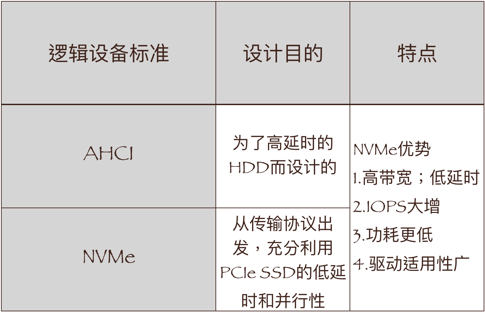
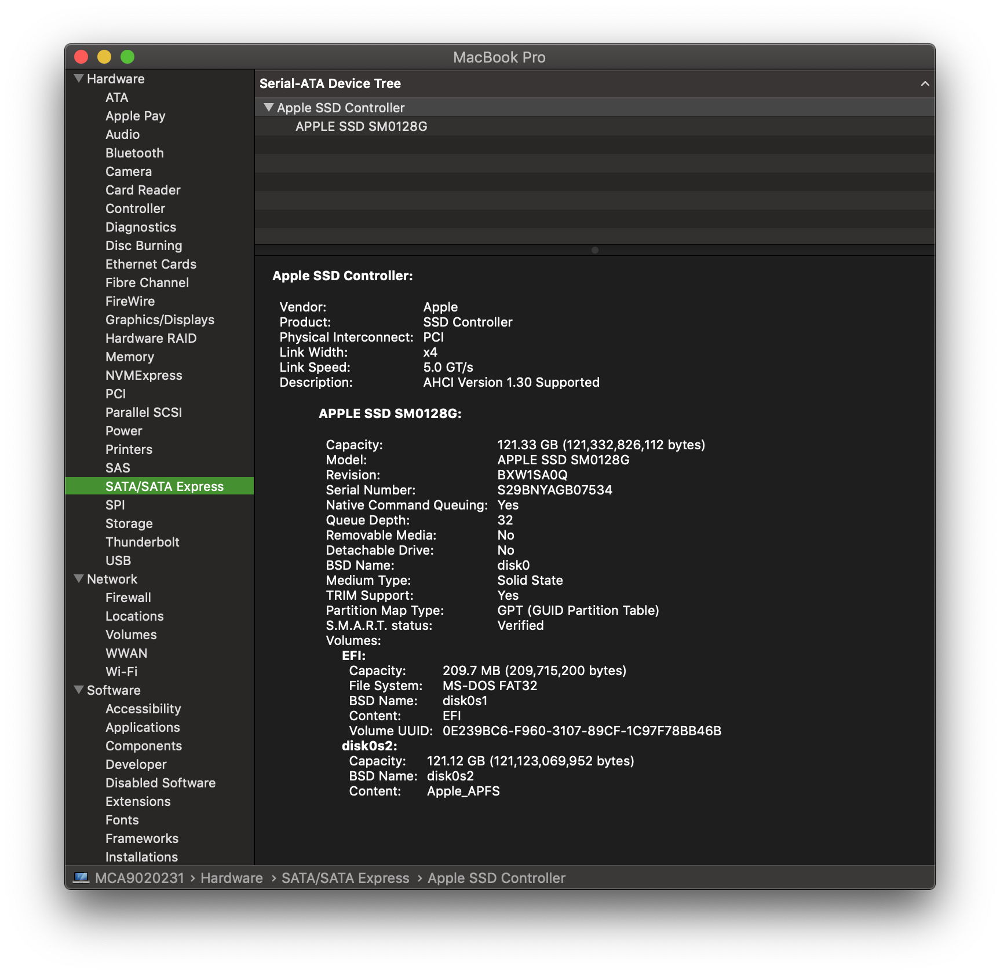
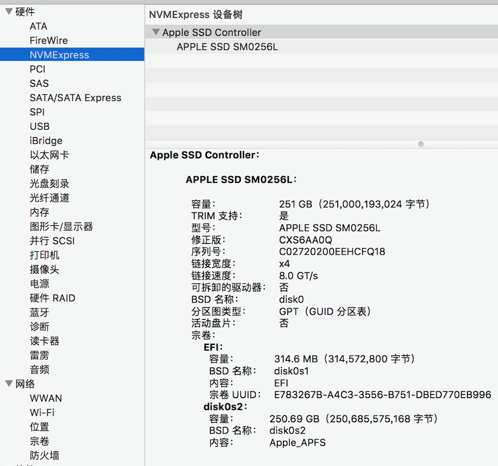
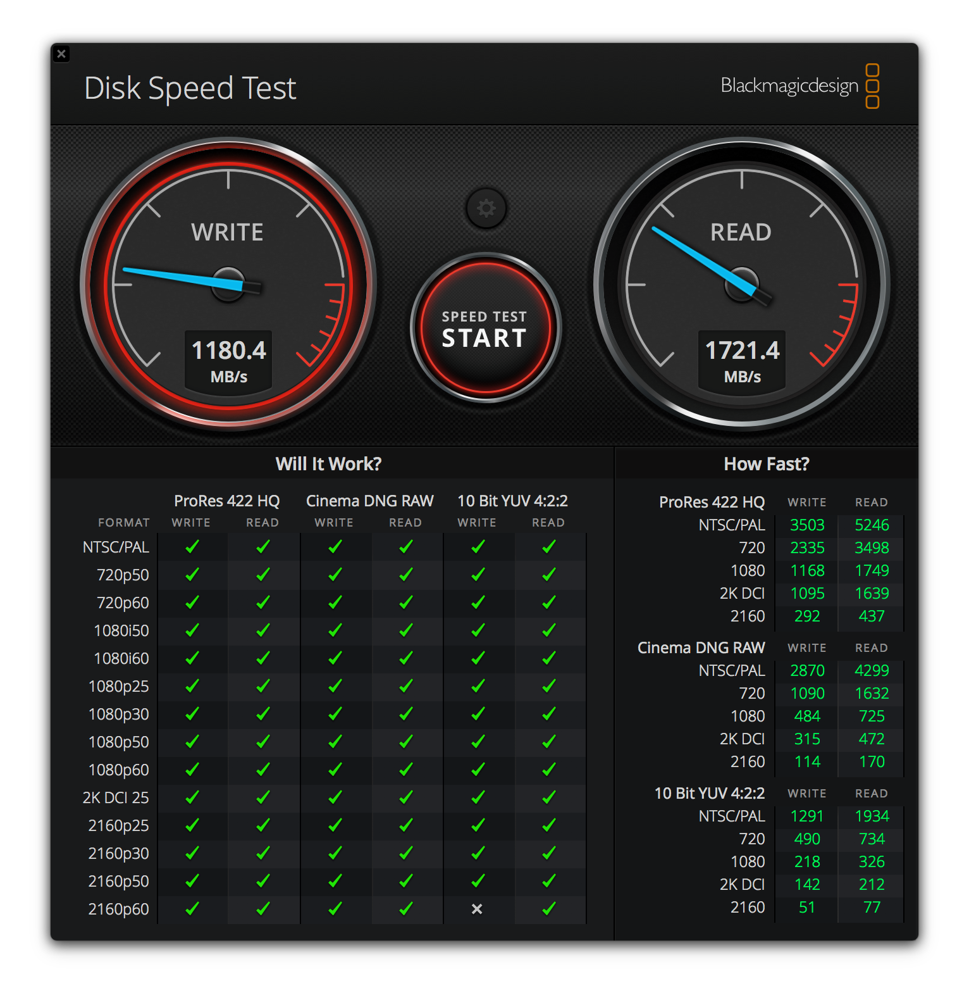
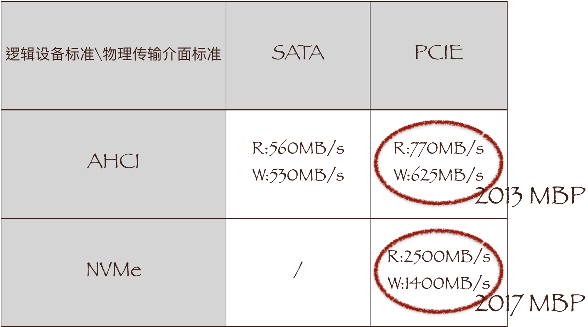
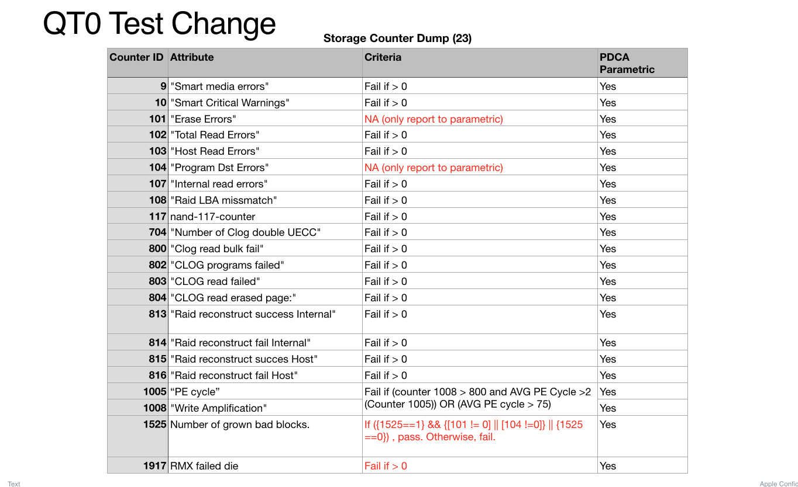

# SSD Brief introduction

# 与中国女排同命运的SSD(一)

1967年，源于华人科学家的发明—Flash （浮栅晶体管（Floating Gate Transistor）的发明，是现在SSD的基础NAND Flash的技术来源）

1976年，土豪的玩具—RAM SSD

1988年，巨磁阻效应的发现使得之后HDD称霸世界。

90年代末，Flash SSD燃起星星之火（Flash SSD（NOR Flash）取代RAM SSD成为主流）。

从2003年开始，现代SSD的时代终于到来，SSD开始成为存储行业的一个热词，固态硬盘的概念开始为许多人知晓。

2005年5月，三星电子宣布进入SSD市场，是第一家进入这个市场的科技巨头。也是第一家我们今天耳熟能详的SSD厂商。

2006 年，SSD进入笔记本（PRAM希望取代NOR Flash；微软的Windows Vista—第一款支持SSD特殊功能的PC操作系统）。

2007年，革命之年（SATA SSD）。

2008年，速度大战爆发（SLC）。

2009年，SSD的容量赶上了HDD，2010年SSD市场开始繁荣（MLC NAND的应用使得SSD在同样的空间内，实现了和HDD一样大的容量）。

2011\-2102年，SSD厂商群雄并起。

2013年，HDD由盛转衰，PCIe SSD进入消费者市场（在协议上引发存储技术的变革）。

2014至今，SSD VS HDD，HDD是否会被彻底取代？

# HDD与SSD(一)

HDD（Hard Disk Drive）

1\. 物理结构: 磁头与碟片、电动机、主控芯片与排线等部件组成。

2\. 原理：写操作：电生磁；读操作：磁生电

3\. 普通的机械硬盘速度100MB/s左右, 容量取决于个人需求

容量公式：c=n\*k\*s

n：盘片数量

K：每个碟片有多少个磁道

S：每个磁道有多少二进制信息

容量：单碟容量，和盘片数量;

速度：与寻址时间和磁头读写时间有关

i\. 碟片转速\(转速增大，读取速度加   快，噪音与热量增加\); 
ii\. 硬盘缓存\(负责数据存储，寄放之类功能，让硬盘减少频繁的读写，让硬盘提高效率，还可以让硬盘更安静，更省电，硬盘缓存越大越好

4\. 特点：容量大，速度慢，成本低，功耗高，有噪音，热量大，避免故障，可恢复丢失的资料但代价极高

# HDD与SSD(二)

SSD\(Solid\-state drive或Solid\-state disk\)一种主要用NAND Flash作为永久性存储器的电脑设备。

1\. 物理结构: PCB盘上集成了NAND闪存，主控制器，缓存芯片（可选）以及跟HOST接口（SATA，SAS，PCIe等）等部件组成，最主要的三部分：主控，NAND闪存以及固件算法。

2\. NAND原理：写操作：即控制栅极去充电，对栅极加压，使得浮置栅极存储的电荷越多，超过阈值，就表示0；读操作：对于闪存的擦除，即对浮置栅极进行放电，低于阈值，就表示1。

用来生产SSD的NAND Flash有四种：

SLC、MLC、TLC、QLC

3\. 一般速度在500MB/s\-3500MB/s左右\, 容量按照个人需求

容量变大，存储密度增加，成本降低

SLC——MLC———TLC—————QLC\->

速度降低，写入次数增加，寿命变短

 
（寿命从10万次降低到500次）

4\. 特点：容量低，速度快，成本高，功耗低，无噪音，热量低，但写入次数有限制，读取有干扰，损坏时不可挽救，掉速。

# SSD的种类

基于闪存的SSD：采用NAND Flash作为存储介质，这是我们常说的SSD。常用作笔记本硬盘，存储卡，U盘。最大优点是可以移动，数据不受电源控制，能适用于各种环境，但使用年限不高。

基于DRAM的SSD：采用DRAM作为存储介质，应用范围较窄。仿照传统硬盘的设计，可被绝大部份操作系统的文件系统工具进行卷设置和管理，并提供工业标准的PCI和FC接口用于连接主机和服务器。它是一种高性能的存储器，使用寿命长，但需独立电源保护数据安全。

# Apple的SSD接口

SATA固态硬盘接口（SATA最初是为HDD设计的接口）：SATA1\.0、SATA2\.0、SATA3\.0

PCI\-e固体硬盘接口：PCI\-E接口相比SATA接口拥有更大宽带\,能使性能和容量取得进一步提升\,充分发挥固态硬盘潜能\,因此广泛应用于对速度拥有更高要求的工业或者服务器领域。

# AHCI和NVMe

# Simon的旧电脑与新电脑(一)

Simon的旧电脑：

Simon的新电脑：

# Simon的旧电脑与新电脑(二)

旧电脑的Disk Speed：

新电脑的Disk Speed

# Simon的旧电脑与新电脑(三)

# S.M.A.R.T.(一)

S\.M\.A\.R\.T\.\(Self\-Monitoring Analysis and Reporting Technology自我监测、分析及报告技术\)，是一种自动的硬盘状态检测与预警系统和规范。

该技术所需相关管理程序（包括加解密程序，自监控程序，自修复程序等）和数据被存放在硬盘物理盘面最前面的磁道中，主机的监控软件可以通过“SMART RETURN STATUS”的命令读取S\.M\.A\.R\.T\.信息，且这些信息不允许被用户直接修改。

# S.M.A.R.T.(二)

该技术能使硬盘更稳定的运行。作用如下：

\* 当硬盘的损坏程度还能在软件可修复的范围内（通常由厂商决定），软件就会自动修理，防止数据的进一步损坏。同时报告异常值，异常程度为警告；

\* 当硬盘的损坏程度已经超出软件的修复承载范围（通常由厂商决定），软件则会尽最大能力防止再次写入数据的丢失（如避开已损坏扇区），同时会报告异常值，异常程度为危险；

\* BIOS自检时，主板会检测硬盘的S\.M\.A\.R\.T\.信息，如果硬盘的异常程度为危险时，会提醒用户及时备份数据（如嗡鸣声或显示文字）。

\* Windows 7或以上的Windows系統，如果檢測到硬碟的S\.M\.A\.R\.T\.錯誤，也會彈出警告視窗，提示用戶備份資料。

详细内容可参考SMART\.json

# 相关测项(一)

# 相关测项(二)

以QT0“Dump Storage Counters”和“Check iTLC NAND”测项为例；下面为常用名词的含义：

Write Amplification：计算TBW\(TeraBytes written\) 和DWPD \(Drive Writes per day\)。

PE cycle：Program/Erase cycle count ，计算擦除次数。

GBB \( Growth Bad  Blocks  \) ：提供已损坏/不能再使用的blocks的数据。

# 相关测项(三)

一：“Dump Storage Counters”测项：

1\. nand \-\-get DebugLog

2\. 拿到各项 SMART需要的检测值，与Apple提供的limit相比较，判断storage好坏

# 相关测项(四)

二：“Check iTLC NAND”测项：

1005 & 1008 check：Fail if \(counter\[1008\] > 800 && counter\[1005\] >2\) OR \(counter\[1005\] > 75\)

1525 check：Pass if \( counter\[1525\]==1 && \(\(counter\[101\] \!= 0\) || \(counter\[104\] \!=0\)\) || counter\[1525\] ==0 \)

