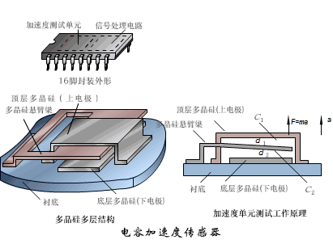

# Foreword

日常生活中有着各式各样的加速度感测器搭配陀螺仪的应用，如：手机的赛车游戏、体感游戏、计步器、室内三维定位等…，高端点的例如机器人、飞机、导弹、航天器的惯性导航设备，这些便利让我们感到习以为常，而忽略了去探所其原理为何\.\.\.\.\.\.

# What’ s Inertial Sensor

定义：惯性传感器是种主要用来检测和测量物体加速度、倾斜、冲击、振动、旋转和多自由度运动的传感器，是解决导航定向和运动载体控制的重要部件。

构成：惯性传感器包括加速度计（或加速度传感器）和角速度传感器（陀螺仪）以及它们的单、双、三轴组合IMU（惯性测量单元），AHRS（包括磁传感器的姿态参考系统）。

# IMU

六轴IMU（Inertial Measurement Unit）属于捷联式惯导，主要由三轴MEMS（微机电系统）加速度传感器、三轴陀螺仪及解算电路组成，是测量物体加速度以及三轴姿态角（角速率）的装置。加速度计检测物体在载体坐标系统独立三轴的加速度信号，而陀螺检测载体相对于导航坐标系的角速度信号，测量物体在三维空间中的角速度和加速度，并以解算出物体的姿态，在导航以及动作捕捉中有着很重要的应用价值。

# IMU

InvenSense（已被日本TDK电子制造商收购）、博世（Bosch）和意法半导体（STMicroelectronics）是全球领先的三大IMU供应商，一直在竞争激烈的消费类市场中拼搏厮杀。不过，随着2017年第四季度苹果（Apple）最新产品的发布，博世已经成为消费类IMU领域无可争议的领导厂商。这是因为：（1）博世取代了InvenSense，成为苹果新手机iPhone 8和iPhone X的供应商；（2）同时博世也取代了意法半导体，成为Apple Watch Series 3的供应商。

Bosch BMI085 IMU（用于AR和VR应用）将一个三轴加速度计和一个三轴陀螺仪的功能组合到单个MEMS惯性测量单元中。低漂移、低噪音惯性测量单元可快速精确地检测头部运动，显著减少滞后时间以及减轻晕动症。BMI085 IMU支持SPI和I2C数字接口进行系统集成，同时提供1\.2V至3\.6V VDDIO电压范围，用户可以单独操作陀螺仪和加速度计，也可以同步两者之间的数据。这些Bosch IMU采用3\.0mm x 4\.5mm x 0\.95mm封装。BMI085 IMU满足高性能、消费级VR和AR以及混合现实应用的所有要求。

# Accelerometer

基本原理：加速度传感器也叫做重力感应器\(G\-Sensor\)\,是基于重力加速度的基本原理去实现工作的，实际上是可以感知任意方向上的加速度（重力加速度则只是地表垂直方向加速度），加速计通过测量元件在某个轴向的受力情况来得到结果，表现形式为轴向的加速度大小和方向（XYZ）。

工作方式：根据传感器敏感元件的不同，加速度计主要分为电容式、电感式、压电式、压阻式，无论哪种类型，基本原理都是加速度的存在导致相应的物理量产生变化，再由解算电路计算出加速度。

加速度计的半壁江山—电容式加速度计这类加速度计是利用特殊硅材料特质而设计出的可移动式结构，如图是悬臂梁式硅微机械加速度计（CMSA）结构，机械结构包括一端固定，一端活动的多晶硅悬臂梁，上下两层多晶硅电极，分别作为电容的两极。当外界因加速度而使得质量块与弹簧固定端发生相对位移时，两极间的电容量即会产生变化，通过相应的放大和滤波电路进行采集，并进行解算得到相应加速度值，在一定的技术上三个单轴就可以变成一个三轴，测算物体在三维空间的运动状态。

# Accelerometer Application

## 汽车安全气囊
气囊控制系统包括车身外的冲击加速度传感器、车门、车顶，前后座等位置的加速度传感器、电子控制器，安全气囊等。当车身受到撞击时，冲击传感器会在几微秒内将信号发送至该电子控制器，随后电子控制器会立即根据碰撞的强度、乘客数量及座椅/安全带的位置等参数，配合分布在整个车厢的传感器传回的数据进行计算和做出相应评估，并在最短的时间内通过电爆驱动器\(SquibDriver\)启动安全气囊保证乘客的生命安全。

在汽车安全应用中，用于探测加速度的常用方法是测量可移动震动体的位移，然后将该值转换为可变电容来测量。在汽车突然受到迅速的外部碰撞时，加速度传感器的快速反应是非常重要的，其反应速度决定了安全气囊弹出的速度，所以对加速度传感器的精度要求特别高必须在瞬间做出反应。通过采用可迅速达到稳定状态而不是振动不止的传感器设计可以缩短器件的反应时间，目前很多汽车安全气囊都采用性能较好的MEMS加速度传感器。

## 硬盘保护系统（Active Protection System）
电脑、手机等便携电子设备硬盘内存储着大量的数据，这些设备不可避免地会意外跌落或受到碰撞，虽然良好的缓冲设计可由设备外壳或PCB板来分解大部分冲击力，但硬盘等高速旋转的器件却在此类冲击下显得十分脆弱造成对内部元器件的巨大冲击。为了使设备以及其中数据免受损伤，工程师们开发出了APS硬盘保护技术。

原理 __APS__ 硬盘保护技术，是由内嵌于主板上的加速度传感器芯片和预装在系统中的震动预测管理软件组成。通过对电脑的角度、震动、撞击的监测（即对横纵加速度变化的监测），来决定是否将硬盘磁头从工作状态收回到磁头停止区，从而减小撞击对硬盘的损害，保护硬盘及硬盘内的数据。

Apple的产品比如MacBook(初代硬盘版)内置SMC（Sudden Motion Sensor）传感器，其实也就是加速度计传感器。

# Gyroscope

原理：陀螺仪也叫地感器（GYRO\-Sensor）是基于角动量守恒定律设计出来用于测量和维持方向的仪器，主要由一个位于轴心且可旋转的转子构成 ，当陀螺转子以高速旋转且没有任何外力矩作用在陀螺仪上时，由于转子的角动量守恒，陀螺仪的自转轴在惯性空间中的指向保持稳定不变，即指向一个固定的方向；同时反抗任何改变转子轴向的力量。这种物理现象称为陀螺仪的定轴性或者稳定性。三轴陀螺仪的工作原理是透过测量三维坐标系内陀螺转子的垂直轴与装置之间的夹角，并计算角速度，通过夹角和角速度判别物体在三维空间的运动状态。

结构：主要部分是一个相对旋转轴以极高角速度旋转的转子，转子装在一支架内，在通过转子中心轴上加一内环架，那么陀螺仪就可环绕平面两轴作自由运动；然后，在内环架外加上一外环架；这个陀螺仪有两个平衡环，可以环绕平面三轴作自由运动，就是一个完整的太空陀螺仪\(space gyro\)。三轴陀螺仪可以同时测定上、下、左、右、前、后等六个方向（合成方向可分解为三轴坐标），最终可以通过自身的旋转状态判断出被测物体的移动轨迹及加速度。

MEMS Gyroscope：传统陀螺仪主要利用角动量守恒原理，所以主要是一个不停旋转的物体，转轴指向不随承载它的支架的旋转而变化。而微机电陀螺仪因为体积尺寸的要求没有转子和轴承等结构。主要是利用相互正交的振动和转动引起的科氏力原理把角速率转换成特定感应直向位移讯号。

# Gyroscope Application

在航空上，陀螺仪用来测量飞机的姿态角如俯仰角\(pitch angle\)，横滚角\(roll angle\)，航向角和航向，飞控系统如自动驾驶仪和自动稳定器，则是以这些数据为基础控制飞机。它是三自由度均衡陀螺仪，其底座固连在飞机上，转子轴提供惯性空间的给定方向。

姿态仪（或称人工地平线）：姿态仪（Attitude Indicator）显示飞机相对于地平线的姿态，看姿态仪，飞行员能判断飞机姿态为偏左偏右，及偏上和偏下。姿态仪作用原理为一高速旋转的陀螺，不论飞机的姿态如何变化，此陀螺的定轴性在空间保持相同，因而能显示出飞机的俯仰及偏左偏右的姿态。姿态仪是仪表飞行时的重要仪表，在能见度差的飞行天气中，失去或不相信姿态仪，飞行员极易进入空间迷失。

2010年，IPhone 4是世界首台内置MEMS三轴陀螺仪的手机，采用了意法半导体的MEMS陀螺仪芯片，芯片内部包含有一块微型磁性体，可以在手机进行旋转运动时产生的科氏力作用下向X，Y，Z三个方向发生位移，利用这个原理便可以测出手机的运动方向。而芯片核心中的另外一部分则可以将有关的传感数据转换为iPhone4可以识别的数字格式。

# Accelerometer vs Gyroscope

## 应用对比

加速计的强项在于测量装置的受力情况，对装置相对外部参考物\(比如地面\)的运动更擅长，但用来测量装置相对于地面的摆放姿势，则精确度不高。

陀螺仪的强项在于测量装置自身的旋转运动，对装置自身运动更擅长，但不能确定装置的方位。

# Test at Apple Watch

顺便讲一下Apple watch相关的测试，首先这是第五代的配置，可以看到配有最大量程为32g的加速度计和陀螺仪。

IMU站测试加速度计和陀螺仪，位于组装测试QT站之后，BurnIn站之前，理想情况下，加速度计水平放置时，XY轴0输出，Z轴1个g，因此需要对加速度计进行XY轴零点校正；同样陀螺仪水平时各轴输出为0，因此需要对陀螺仪三轴校正。方法就是把unit标准水平静止放置时采集到的几百次数据平均计算作为校准值保存起来，测试时各轴输出的数据就是采集来的数据减去校准值。

主要测项是加速度偏移：当加速度输出值为0时的值；加速度噪声\(Noise\):每个固定位置（校准和测试位置）100个样品的标准偏差；加速度计灵敏度\(sensitivity\)：传感器对一定加速度变化范围越敏感，输出电压变化越大，测量更容易，从而获得更准确的测量值。加速度计后校准误差\(Postcal\_Error\)：各轴的输出平均值与IMU参考值之间的差值。在每个固定测试位置计算校准后误差。每个平均值由100个样本计算组成。

# 总结

通过查找相关文献资料和学习，对IMU模块有了初步的了解，也对生活中常见的电子产品的功能原理有了理解，扩展了自己的视野。

锻炼资料的收集和过滤能力。

本文部分资料与图片选自网络，不准确之处欢迎大家指正。

