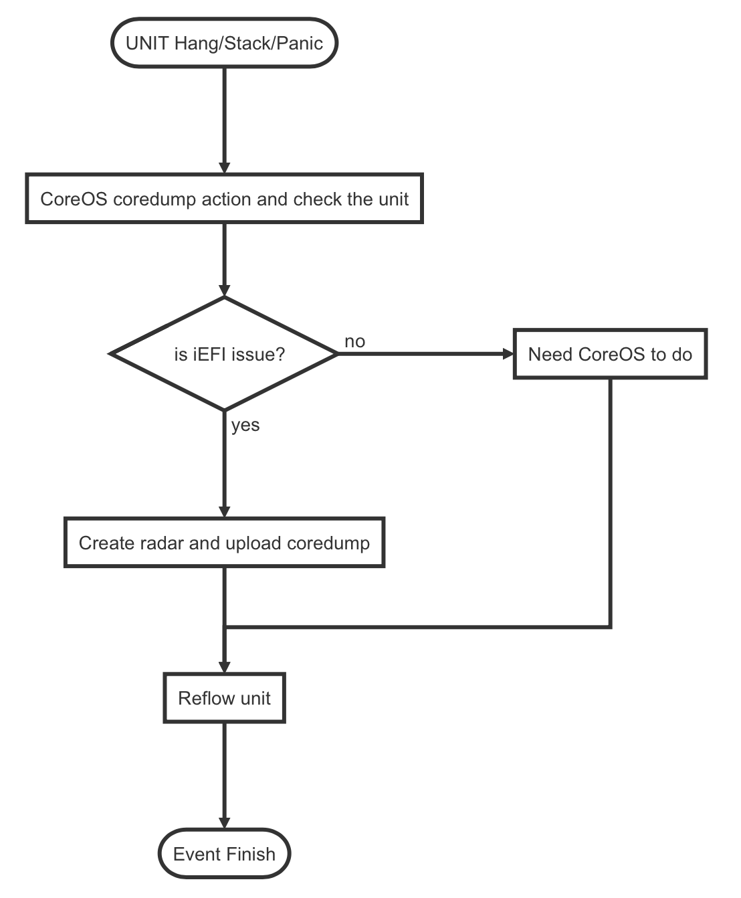
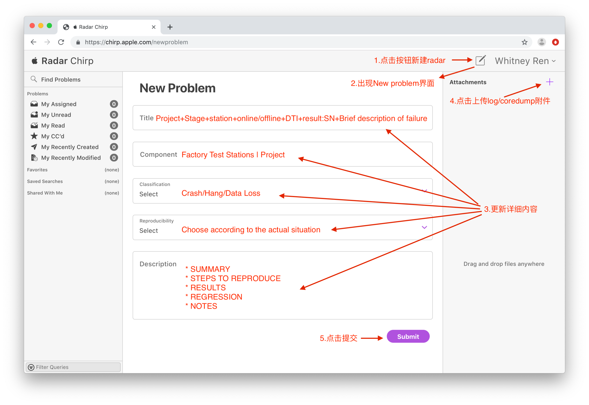
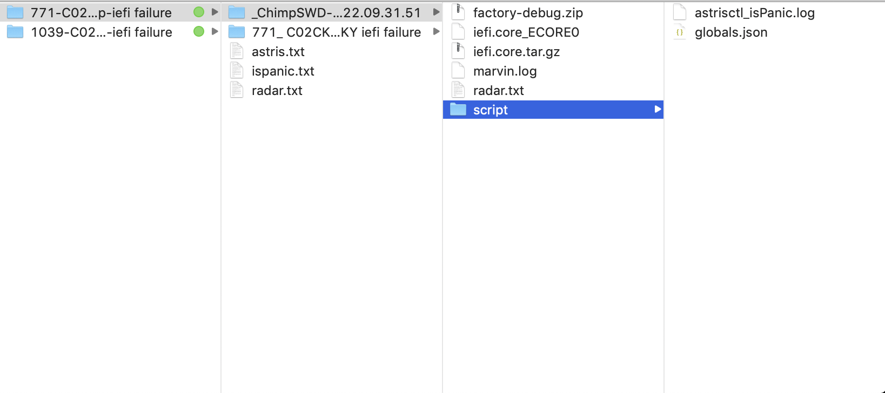
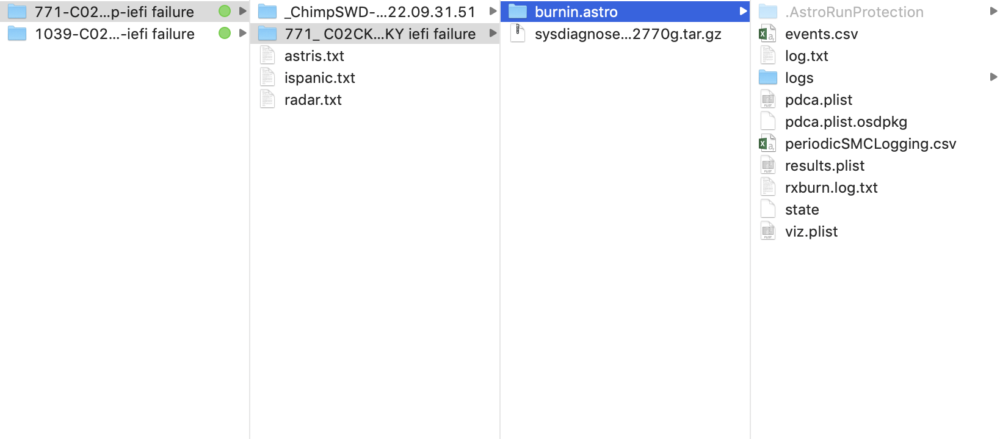

# UNIT Hang/Stack/Panic Process Flow




# How to Create an iEFI Hang Radar?




## Radar Description
### Title
```
* Project+Stage+station+online/offline+DTI+result:SN+failure brief description
```
### Component
```
* Factory Test Stations | Project
    Example: Factory Test Stations | PGY
```

### Classification
```
* Choose "Crash/Hang/Data Loss"
```
### Reproducibility
```
* Choose according to the actual situation
    Always/Sometimes/Rarely/Unable/D'dn't Try/Not Applicable
```

### Description
```
* SUMMARY
  1. Recap the problem title and/or include more descriptive summary information.

* STEPS TO REPRODUCE
  1. Setup or prep work
  2. Include explicit and accurate steps to reproduce. Do not include extraneous or irrelevant steps.

* RESULTS
  1. Describe your results and how they differed from what you expected.

* REGRESSION
  1. Provide information on steps taken to isolate the problem. Describe circumstances where the problem 
  2. occurs or does not occur, such as software versions and/or hardware configurations.

* NOTES
  1. Document any additional information that might be useful in resolving the problem, such as references to related problems, leads on diagnosis, screen shots, included attachments, and any workarounds.
```
## Attachments (are included in CoreDump)

```
* Coredump
* Sysdiagnose
* Astro_full_log
* Other logs as shown in the following pictures
```



