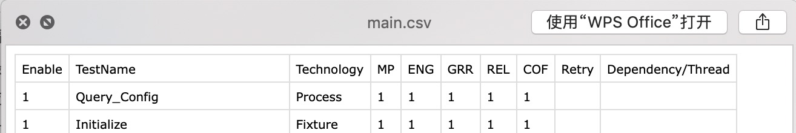
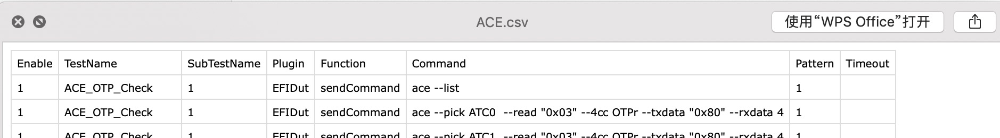

# Python Sharing: DiagsExtractor
Version 1.0
Jan 14, 2020

Authors:
Anna Ning         Anna.Ning@quantacn.com

# Content
[toc]

#Revision History

| Version | Author/Editor | Summary of Changes | Date       |
| ------- | ------------- | ------------------ | ---------- |
| 1.0     | Anna Ning     | Initinal verison   | 2020-01-14 |

# Purpose

- 从DFU/FCT的overlay中抓出diags 相关command&expect value
- 重置为SWCM's Atlas格式

# Process Flow

1. dlog_name

2. Read scripts arguments

3. Get csv files list
4. Determine if the export_path exists
5. Determine if there is a csv document to be processed
6. Data processing
7. Data storage

