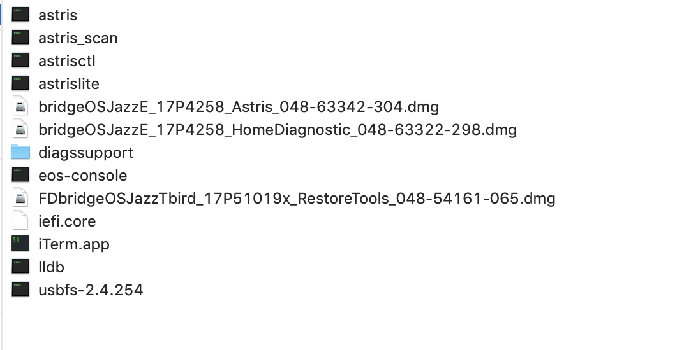
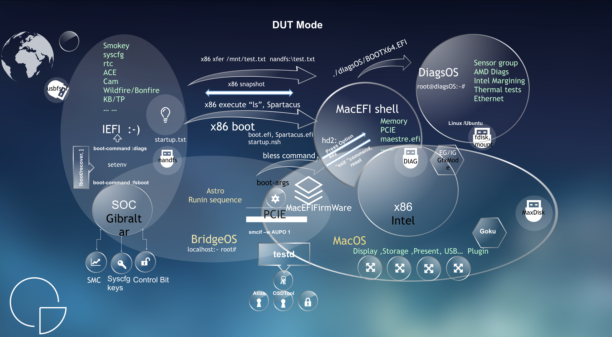
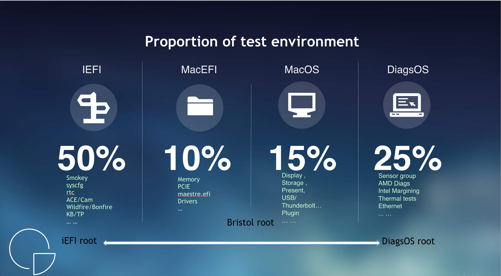
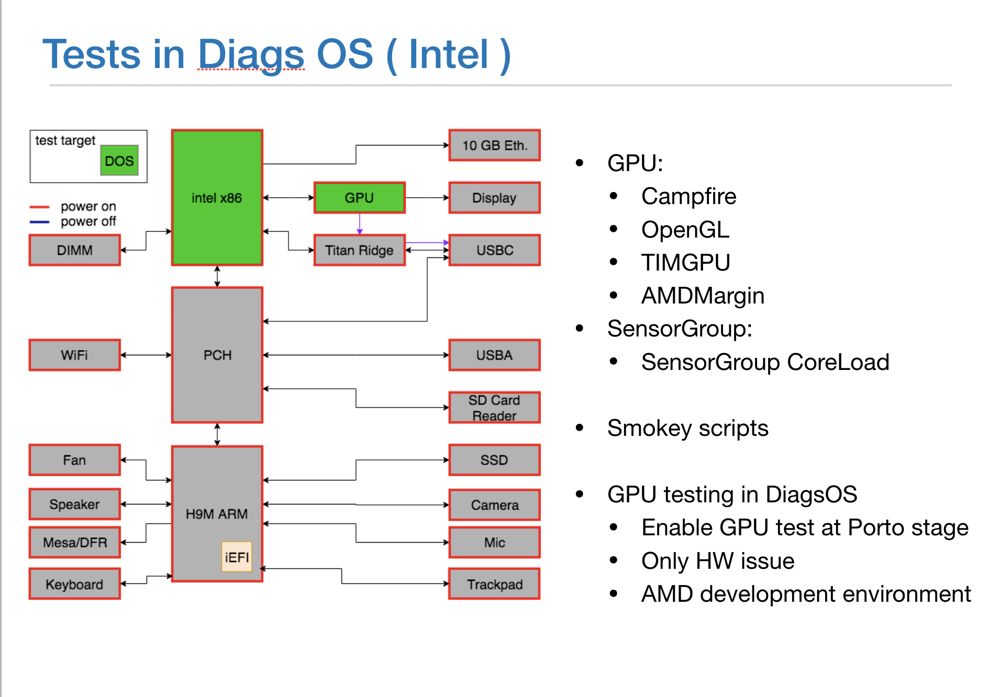
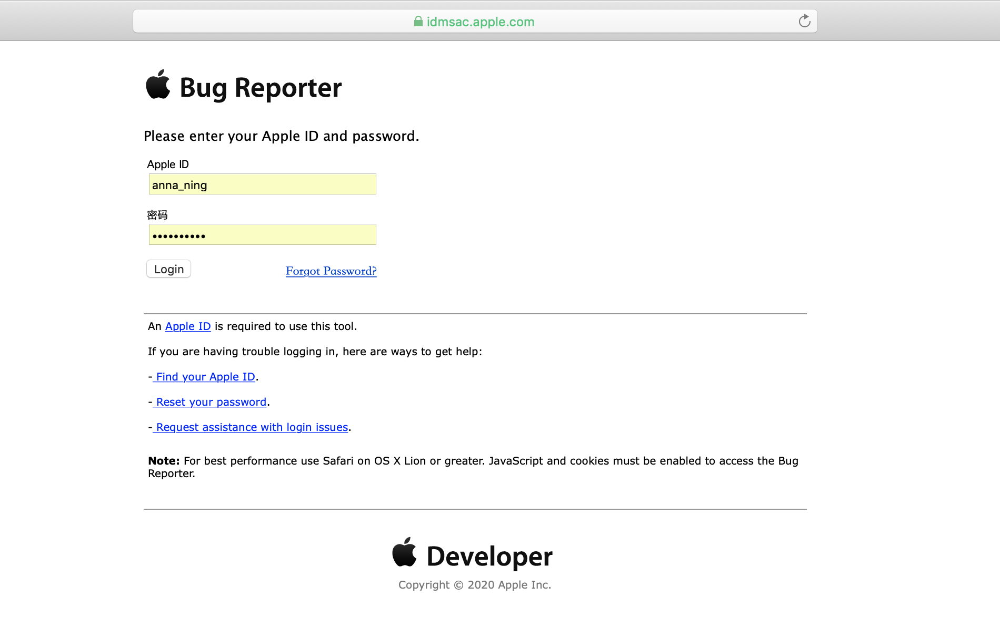
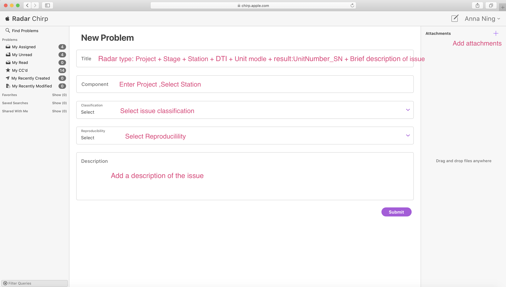

---
author:
    name: Zhen Zhang
    email: Zhan.zhang@quantacn.com
title: Diags Work SOP

---


# Diags Work SOP

Version 1.2
Apri 14, 2020

History:

| Name      | E-MAIL                  | Date      | Version |
| --------- | ----------------------- | --------- | ------- |
| Zhen Zang | Zhen.Zhang@quantacn.com | 2020-3-18 | 1.0     |
| Anna Ning | Anna.Ning@quantacn.com  | 2020-3-30 | 1.1     |
| Yume Wu   | Yume.Wu@quantacn.com    | 2020-4-14 | 1.2     |


# CM-Diags precautions [VERY IMPORTANT]

1. No reset No reboot
2. Need to sync and communicate with the A-DRI all the time.
3. A-Diags is like the police to inspect the case，CM-Diags is the one to collect the evidence to the police (log)，the key to break the case is to provide and keep all intact evidence。Remember, there is only one truth.🕵️‍♀️
4. Need to ask A-Diags before you want to do any action to the unit，then tell the relevant team how to handle the unit.
5. shared-resources，update on going task file in time.

# Install the necessary configuration files for Diags to work

1. Below are some documents necessary for Diags work



2. Install in order according to the dmg file installation sequence below and configure the Diags working environment
```
(1)bridgeOSJazzE_17P4258_Astris_048-63342-304.dmg
Note：Determine the state of the environment and whether it is panic
(2)FDbridgeOSJazzTbird_17P51019x_RestoreTools_048-54161-065.dmg
Note：One RestoreTools
(3)bridgeOSJazzE_17P4258_HomeDiagnostic_048-63322-298.dmg
    (3-1)HomeDiagnostic.pkg
    (3-2)CoreAutomation.pkg
    (3-3)TestAutomation.pkg
```

3. A diagssupport folder，put It in a suitable place, it mainly introduces diags, including lldb
```
initialize lldb

New Hidden Party Document ~/.lldbinit
command script import
~/Diags/Tools/diagssupport/scripts/debug/LLDB/Python/efi.py

```
~/Diags/Tools/diagssupport/scripts/debug/LLDB/Python/efi.py is the specific location of the efi.py file

4. These binary files are placed in usr / local / bin
```
lldb
usbfs-2.4.254
astris
astris_scan
astrisctl
astrislite
eos-console
```
5. Verify that the Diags working environment is successfully configured
```
Open a new terminal and enter lldb -c coredumpfile
```
The following figure appears, indicating that the configuration is successful


6. eos-console and item.app

```
When our computer is connected to the machine，Terminal input eos-console can open 3 windows(x86 , soc ,smc ), the role of item.app is to make the 3 windows side by side

```
# ternimal setting:
execute the follow command in ternimal:
```shell
>> chsh -s /bin/bash
>> sh -c "$(curl -fsSL https://raw.githubusercontent.com/robbyrussell/oh-my-zsh/master/tools/install.sh)"
```

# Who do we work with? And how does it work?

1. Station DRIs that manage factory test stations
2. Test Design Leads (TDLs), who design factory line flow
3. SPL/Runin DRI, who define Ruin sequence
4. CM SW / CoreOS Team
5. EE teams (system and module),other software teams
6. Thermal ,AppleCare, REL, SDA …

##**Apple Diags Contacts**  


| Project | P-Code | Location | A-Diags         |
| ------- | ------ | -------- | --------------- |
| J293    | PGY    | F3       | Paul            |
| J313    | PJL    | F3       | Jason           |
| J456    | P7J    | F3       | Jason           |
| J185    | P7G    | F7       | Mohai           |
| J215    | PWX    | F5       | Linda           |
| J223    | PGV    | F5       | Linda           |
| J214    | PGU    | F6       | Wendy / Yu-Chen |
| J230    | PJJ    | F6       | Wendy / Yu-Chen |


| Name         | iMessage                                    | Located |
| -------      | ------------------------------------------- | ------- |
| Bei He       | bhe2@apple.com /+1 (408) 476-8022           | CPTN    |
| Jason Wang   | jingqian_wang@apple.com /+86 185 5011 8907  | SH      |
| Paul  Zhang  | paul_zhang_es@apple.com / +86 187 0210 6578 | SH      |
| Yu Chen      | yu_chen_hwte@apple.com /+86 132 0816 7710‬   | CD      |
| Mohai Wang   | mohai_wang@apple.com / +86 134 8237 6077‬    | SH      |
| Linda  Li    | li_lan@apple.com / +86 136 3650 1418        | SH      |
| Wendy Yu     | f_yu@apple.com / +86 136 1165 5224          | SH      |

## DUT HANG
```flow
st=>start: DUT HANG
DRI1=>operation: DRI check unit state
op1=>operation: Ask Q-CoreOS to check
cond1=>condition: is Diags issue?
Q-diags1=>operation: **Q-Diags check
Q-diags2=>operation: **Borrowing DUT from production lines
cond2=>condition: Discuss with A-diags is Diags issue？
Q-diags3=>operation: **Collect coredump
Q-diags4=>operation: Return the DUT to the production line
others=>operation: **Collect (kern.log,syslog)/full log
others1=>operation: creat radar and update logs
others2=>operation: Ask DRI find other function team to check
others3=>operation: Ask DRI find other function team to check and update logs
e=>end: EVENT FINISH

st->DRI1->op1->cond1(yes)->Q-diags1->Q-diags2->Q-diags3->cond2(yes)->others->Q-diags4->e
cond1(no,right)->others2->e
cond2(no,right)->others3->Q-diags4->others1->e
```
**Borrowing DUT from production lines:

1. 於 RunIn 下架區域借機器
2. 於登記處, 請 OP 檢查機器外觀是否正常, 且無刮痕
3. 登記 工號 手機號 機器SN 部門 使用原因 預計歸還原因, 如逾期, 須通知產線
4. 進行 Q-Diags check
5. 與 A-Diags 討論後續流程
6. 歸還機器, 歸還時 OP 會檢查外觀. 故, 需特別注意 Step 2

**Q-Diags check 流程:

1. 检查机器环境状态，屏幕是否显示有用信息，屏幕背光是否开启，机器是否烫手等
2. 在 terminal 输入 eos-console 打开 3x log 窗口
```
判断是否hang机，如果unit没有hang，根据以下表格3xlog状态使用debug command
```
| x86  | SOC(iEFI) | SMC  | FA step                          |
| ---- | --------- | ---- | -------------------------------- |
| on   | on        | on   | 1.x86 status  2.consolerouter -t |
| on   | off       | on   | -----------                      |
| off  | on        | on   | 1.x86 status  2.consolerouter -t |
| off  | off       | on   | 执行步骤3～9                     |
| off  | off       | off  | Return unit to  P/L              |

3. 在 CoreDump 工作機  運行 astris

```
>> astris
NOTE: 如果 x86 沒有運行則執行 astris --pwrgate false
```
4. 確認是否為 iEFI

```
astris
>> is_in_efi
Return:
True = DUT in iEFI
False = DUT not in iEFI，执行步骤12
```
5. 確認是否為 Panic

```
is_efi_panic
Return: True = DUT Panic
```
6. 收集 cpu list

```
cpu list
```
7. CoreDump

```
efi_coredump -debug ~/Desktop/iefi.core
```

8. lldb解析coredump

```
1.lldb -c CoredumpfilePath
2.lldb
>> process connect connect://localhost:8000
Debug command:
>> symbols
## `symbols`命令用于符号化。它会自动检测你是否正在运行本地或库存构建，并进行适当的符号化。

>> triage
## `triage`命令主要由panic.apple.com服务器使用，它是运行上述所有命令的简单方法。
## 它还将转储第一个0x100字节的RAM，以帮助诊断出现 false EFI panics 时的分流时间。

>> ramlog
## 与该命令类似，如果在设备上启用了`ramlog`命令，则可以访问ramlog缓冲区。
## 根据ramlog缓冲区的设置，这个命令可能需要几分钟才能完成。

>> console
## `console`命令允许您访问设备中的取证缓冲区。

>> bt
## 显示当前线程的调用堆栈。任何数值参数最多显示这么多帧。参数'all'显示所有线程。

```

9. 判断是否Diags issue

```
Runin unit hang 一般是 smokey test hang：
1. 未进到DiagsOS env，即smokey 相关log 中没有出现Spartacus version on x86 is 3.0，则表明不是Diags issue，收完log 后执行步骤12
2.出现 Spartacus version on x86 is 3.0 后仍吐出部分log，则表明已经进到DiagsOS env，基本判定是Diags issue,执行步骤10-11
**Collect coredump,(kern.log,syslog)/full log
```

10. reset机器, Collect kern.log,syslog

```
1. 在Astris窗口输入reset。
2. H9窗口敲enter，进iboot 设置boot-args。
3. 进iEFI输入以下指令：
    a. x86 execute "tar -zcvf /diagsos_log.tar.gz /var/log"
    b. x86 execute "sync"
    c. x86 xfer /diagsos_log.tar.gz nandfs:AppleInternal\diagsos_log.tar.gz
    d. used usbfs command.
        usbfs -f ~/Desktop/VarLog
        usbfs -m
    e. cp nandfs:AppleInternal\diagsos_log.tar.gz usbfs:/
```

11. 在機器 MacOS 執行腳本 @Get Full log.command 來收集 full log
12. astris: `go -cpu cpu0` 将cpu唤起，以免机器无法充电掉电导致其他team无法继续FA

<p style = "color:red">** 收完log后请检查log大小，一般var log 为 7～10M，full log 为400M～700M，iefi.core 为110M～130M</p>

```shell
➜  full_log ll
total 2037632
-rw-r--r--   1 yume  staff   238B Apr 15 15:24 2706_astroStatus.txt
drwxr-xr-x  17 yume  staff   544B Apr 15 15:24 J185_J185f
-rw-r--r--@  1 yume  staff   985M Apr 15 15:24 Logs-C02CG00WPLFD-2020-04-15-07-19-21.zip
-rw-r--r--@  1 yume  staff   9.7M Apr 15 15:24 log.txt
-rw-r--r--   1 yume  staff   583B Apr 15 15:24 nvram.txt
-rw-r--r--   1 yume  staff   431B Apr 15 15:24 release_notes.html
-rw-r--r--   1 yume  staff   212B Apr 15 15:24 unit_info.txt
```

** FA过程中的所有操作均需保存log，log命名方式为：Project+Unit ID+SN+DTI+build stage+Date+log type

## TEST FAILED

```flow
st=>start: TEST FAILED
e=>end: EVENT FINISH
op1=>operation: DRI collect log and file radar
cond1=>condition: is Diags issue?
others1=>operation: A-TDL assign radar to others function team
op3=>operation: A-TDL assign Radar to A-Diags
cond2=>condition: is Q-Diags action?
op4=>operation: Q-Diags to do
others2=>operation: Need DRI to do.

DOE=>operation: DOE and find rootcause
st->op1(right)
op1->cond1
cond1(yes)->op3
cond1(no,right)->others1->DOE->e
op3->cond2(yes)->op4->DOE
cond2(no)->others2->DOE
```

# About DiagsOS environment











# How to use radar ?








# How to copy files in different environments?

## iEFI && local
```
1.Set USB insertion path

> usbfs -f ~/Desktop/

2.Mount usb

> :)usbfs -m

3.Copy files

> :)cp -r nandfs:\Folder usbfs:
> :)cp -r usbfs: nandfs:\Folder

Attention：

> usbfs: == ~/Desktop/
```
## DiagsOS && iEFI
```
DiagsOS一>iEFI:

> :)x86 xfer nandfs:\iEFI\FileName /DiagsOS/FileName

iEFI一>DiagsOS:

> :)x86 xfer nandfs:\iEFI\FileName /DiagsOS/FileName

Attention：

> x86 status 一> DiagsOS
```
## gOS && local
```
local一>gOS:

> MCA9070087:~ zhen$eos-scp -r ~/Desktop/Folder  eos:/AppleInternal/

gOS一>local:

> MCA9070087:~ zhen$eos-scp -r eos:/AppleInternal/ ~/Desktop/Folder  
```
## MacOS && gOS
```
MacOS一>gOS:

> local@Mac ～ %eos-scp -r /Folder eos:/AppleInternal/

gOS一>MacOS:

> local@Mac ～ %eos-scp -r eos:/AppleInternal/ /Folder  
```


# Diags related paths

Smokey：
```
Example with Smokey TIMGPU
> Control File:   nandfs:\AppleInternal\Diags\Logs\Smokey\TIMGPU\Project\Main.plist
> Script File:    nandfs:\AppleInternal\Diags\Logs\Smokey\TIMGPU\Project\Main.lua
> Log File:     nandfs:\AppleInternal\Diags\Logs\Smokey\TIMGPU\Smokey.log
> Results File:   nandfs:\AppleInternal\Diags\Logs\Smokey\TIMGPU\PDCA.plist
> Signature File: nandfs:\AppleInternal\Diags\Logs\Smokey\TDiags_Work_SOP/imgPU\Earthbound.sig
```
GoKu:
```
Example with J215 [Resources at 111]
>APP:   /AppleInternal/Diagsnotics/GoKu.app
>
>Script File:   /AppleInternal/Diagnostics/Resources/111/J215_FATP_Runin_PTF.json
>
>Log File:    /AppleInternal/Diagnostics/Logs/testd.log
```
DiagsOS root:
```
> /Volumes/DIAG/diagsOS
```


# Test Environment Transition
```
Boot DiagsOS:
> x86 boot --bootstate diagsos

Shutdown DiagsOS:
> x86 execute "sleep 2; poweroff"

Boot MacEFI:
> x86 boot --bootstate spartacus

Shutdown MacEFI :
> iEFI: x86 execute "reset -s" --async
> MacEFI: reset -s

Shutdown MacOS:
> shutdown -h now

MacEFI --> DiagsOS:
> x86 execute "/diagsOS/BOOTX64.efi"

gOS --> macOS :
> ssh root@localmac

MacOS --> gOS:
> eos-ssh

# Setup Root:
macOS env:
> eos-darwinwup install gOSRootPath
> eos-darwinwup uninstall gOSRootPath
> eos-darwinwup list

gos env:
> darwinup install macOSRootPath
> darwinup uninstall macOSRootPath
> darwinup list

# IG/EG mode conversion
macOS env: IG-->EG
> sudo nvram GfxMode=E
> reboot

macOS env: EG-->IG
>  sudo nvram GfxMode=I
>  reboot

# SOC environments settings
## iboot
> 1. printenv
> 2. setenv variableName variable
> 3. saveenv

## iEFI
> 1. nvram -l
> 2. nvram --set variableName variable
> 3. nvram --save

## gOS
> 1. nvram -p
> 2. nvram variableName="variable"
> 3. nvram -s
```

# iEFI Tool

This tool is temporarily used in PGU PWX and P7G to preliminarily determine whether there is an iEFI issue.