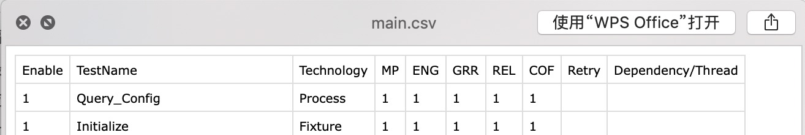
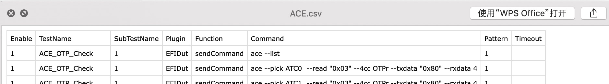

# Purpose

- 从DFU/FCT的overlay中抓出diags 相关command&expect value
- 重置为SWCM's Atlas格式

# Process Flow

1. dlog_name
2. Read scripts arguments
3. Get csv files list
4. Determine if the export_path exists
5. Determine if there is a csv document to be processed
6. Data processing
7. Data storage

