# Diags Sharing - Smokey IdleLoad & SystemLoad

Version 1.0
Feb 12, 2020

Authors:
Anna Ning         Anna.Ning@quantacn.com

# Content

[TOC]

# IdleLoad

* What’s the IdleLoad test?
* About the smokey test of IdleLoad\(J214\)

* SystemLoad
    * What’s the SystemLoad test?
    * About the smokey test of SystemLoad\(J214\)
* IdleLoad & SystemLoad
    * The difference between IdleLoad and SystemLoad

## What’s the IdleLoad test?

将DUT启动起来后，通过Starfire读取不同时段的key值，监控负载相关sensors的空闲状态性能。

## About the smokey test of IdleLoad\(J214\)

* run smokey
* 准备活动
* BootDiagsOS
* WifiPoweroff
* Starfire
* ShutdownDiagsOS
* 收尾工作
* 打印debug信息

### run smokey

* smokey IdleLoad \-\-clean \-\-run
* smokey IdleLoad\_EG \-\-clean \-\-run
* smokey IdleLoad\_IG \-\-clean \-\-run
* Smokey \-\-clean \-\-run IdleLoad \-\-testargs '"Starfire Idle",SpecPath="nandfs:\\\\AppleInternal\\\\Diags\\\\Logs\\\\Smokey\\\\IdleLoad\\\\FactorySpecific\.lua'"

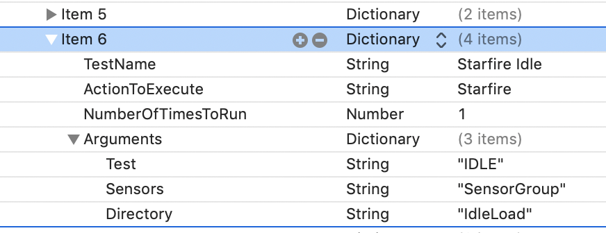

### 准备活动

* RamlogInit
* DumpNVRAM
* DumpNandDebugCounters

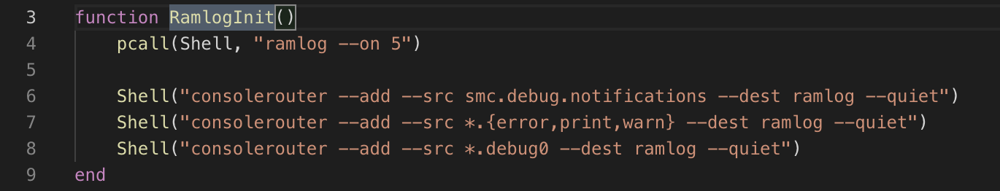

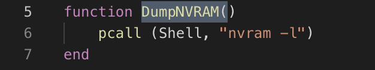

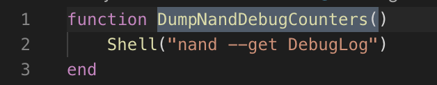

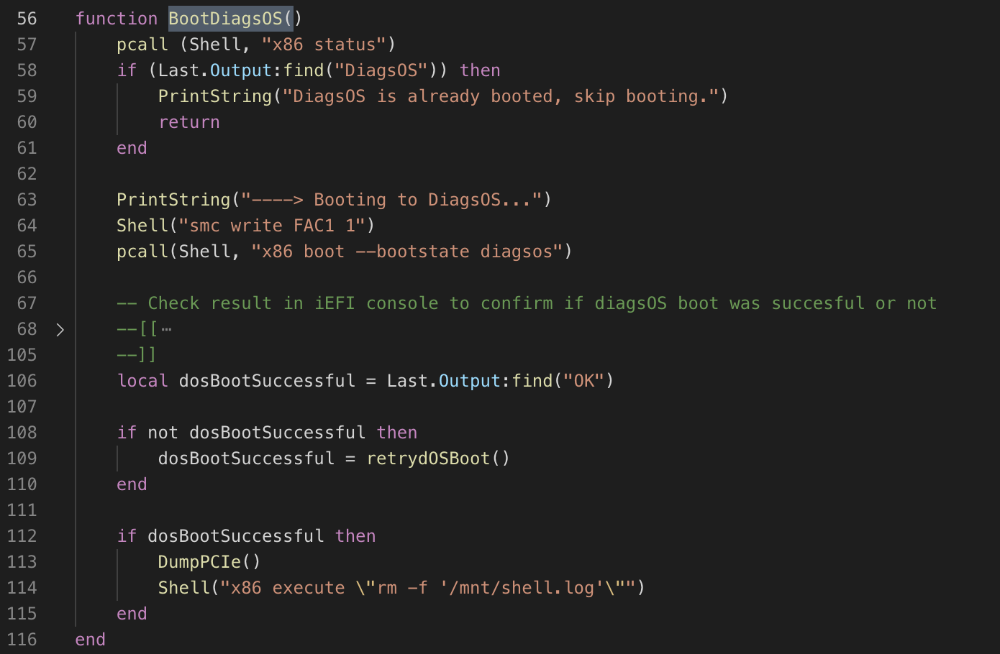

### BootDiagsOS

* 查询x86端状态

* smc write FAC1 1

* boot diagsos

* DumpPCIe

* rm \-f /mnt/shell\.log

  

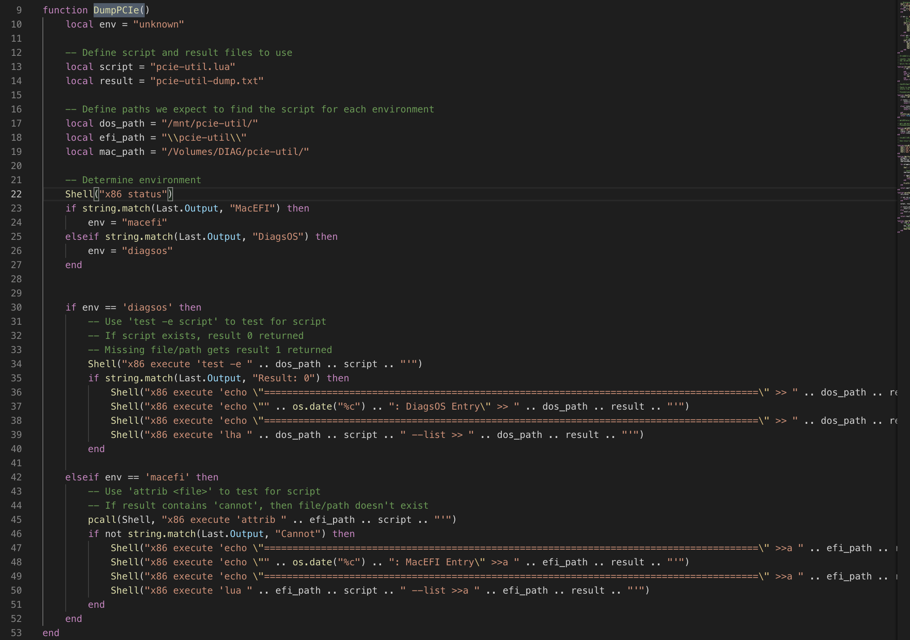

### WifiPoweroff

* smc write MPWF 0

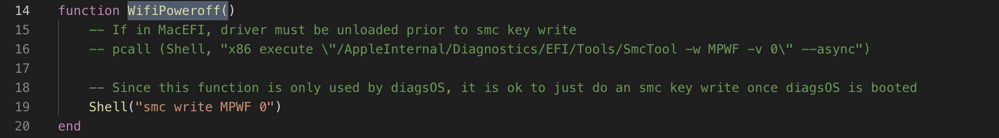

### Starfire

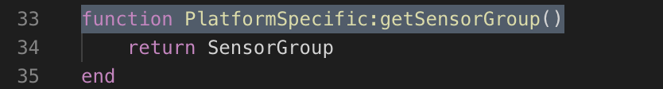

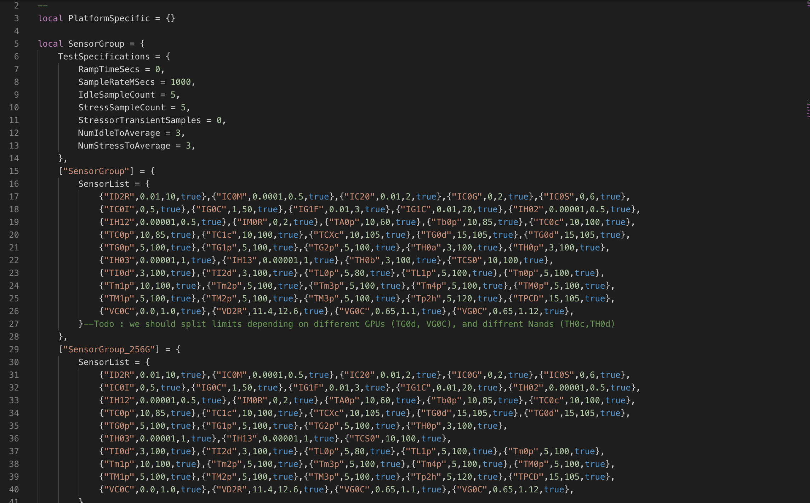

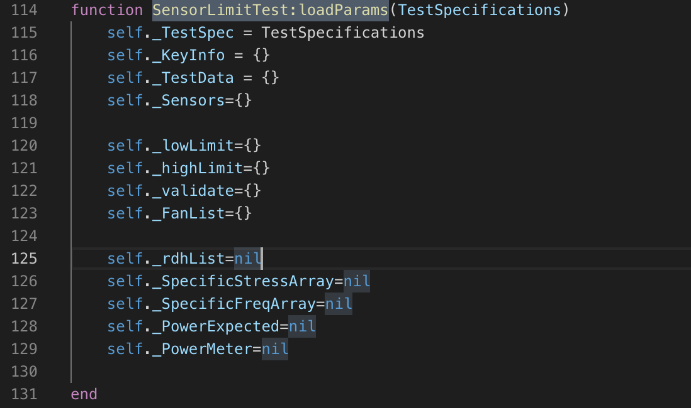

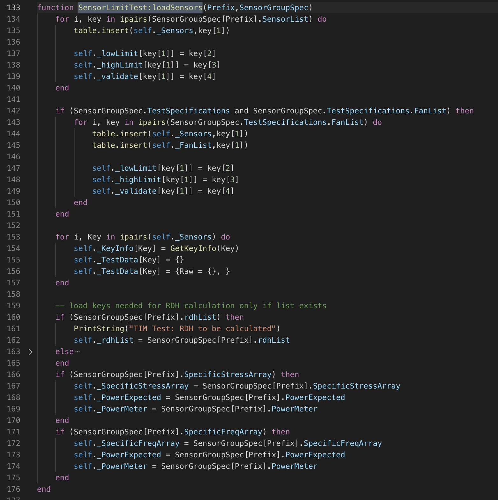

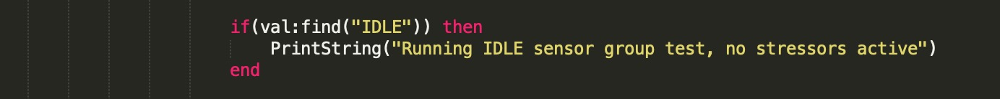

### ShutdownDiagsOS

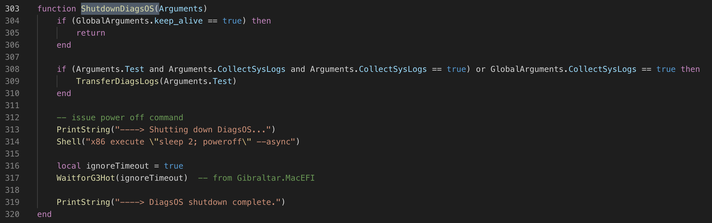

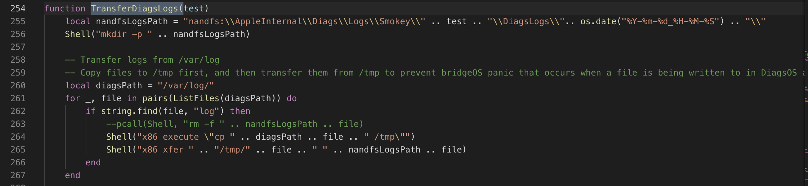

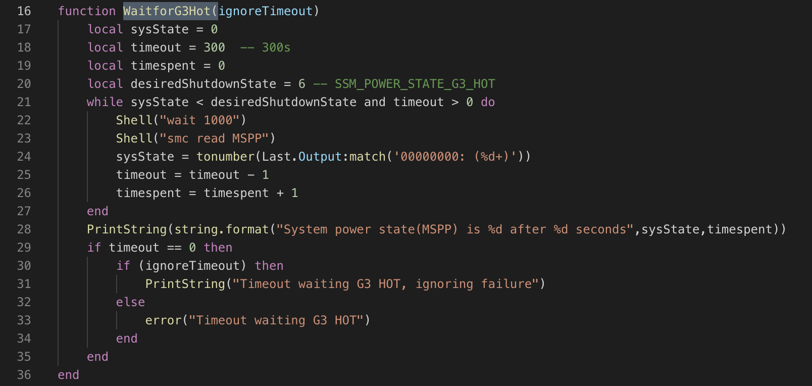

### 收尾工作

* DumpNVRAM
* SaveNVRAM
* DumpNVRAM

### 打印debug信息

* consolerouter \-t

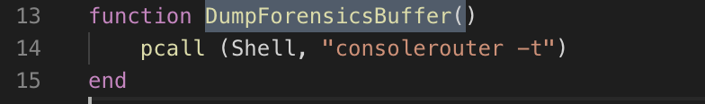

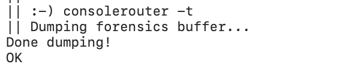

# SystemLoad

  * What’s the SystemLoad test?
* About the smokey test of SystemLoad
    * run smokey
    * 准备活动\+BootDiagsOS\+WifiPoweroff
    * EnableBacklightControl
    * TurnBacklightOn
    * Starfire
    * ShutdownDiagsOS\+ 收尾工作\+打印debug信息

## What’s the SystemLoad test?

将DUT启动起来后，开启Backlight。通过fio模拟机器运行读取不同时段的key值，监控负载相关sensors的性能状态。

## About the smokey test of SystemLoad

### EnableBacklightControl

* i2c \-\-devwrite 10 0x09 0x67 0x02

### TurnBacklightOn

* i2c \-\-devwrite 10 0x09 0x68 0xFF 0xFF

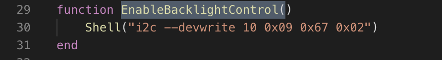

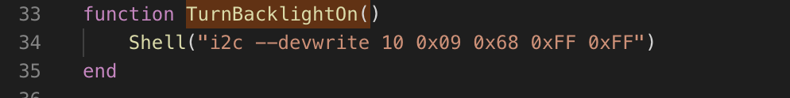

### Starfire

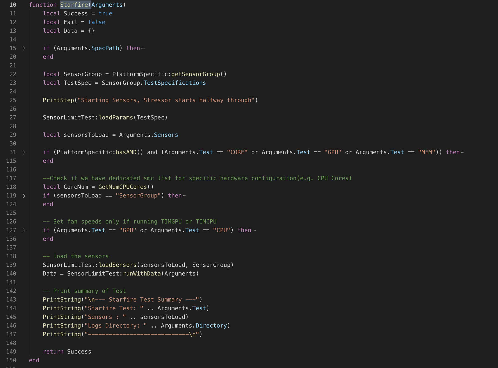

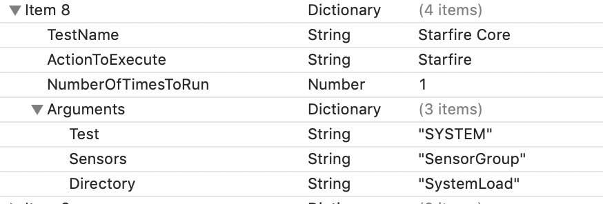

https://fio\.readthedocs\.io/en/latest/fio\_doc\.html\#i\-o\-type

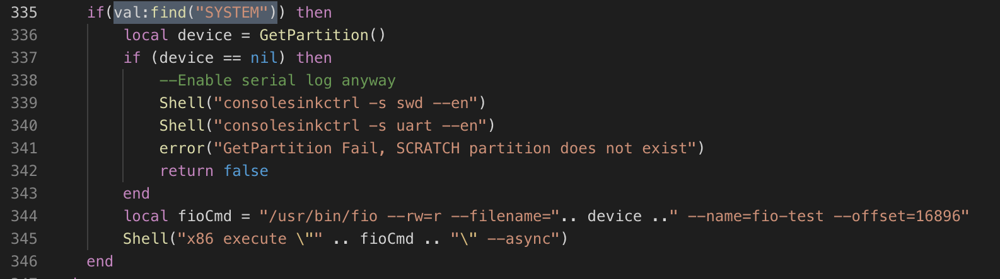

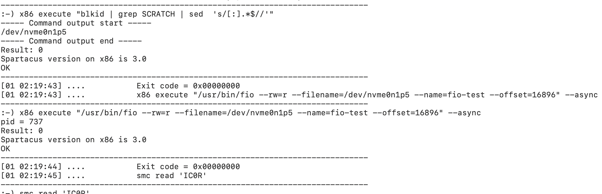

# The difference between IdleLoad and SystemLoad

## 机器状态

Idle:no stressors

System:使用fio模拟机器运行\(通过对memory\,cpu\,storage施加 stressor\)

## key\(请看附件\)

# END

