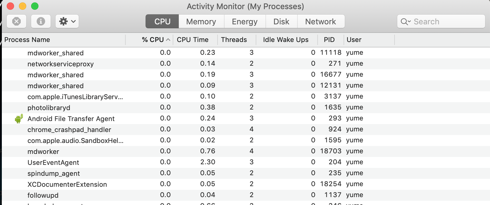
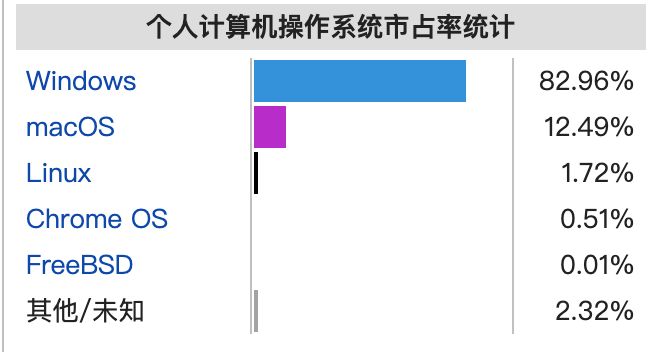

---
author:
  name: Yume Wu
  email: yume.wu@quantacn.com
date: 2020-1-9
title: MacOS Introduce
---


# Revision History

| Version | Author/Editor | Summary of Changes | Date     |
|---------|---------------|--------------------|----------|
| 1.0     | Yume Wu       |                    |2020-01-09|


# Chimp 和 Potassium的区别
| **Feature**                                                  | **Chimp** | **Potassium**   |
| ------------------------------------------------------------ | --------- | -------------   |
| High Speed USB Host Connection （高速USB主机连接）              | YES       | YES             |
| Dock Channel Access （Dock Channel 访问）                      | YES       | YES             |
| DCSD LEDs （DCSD LED灯）                                      | YES       | YES             |
| SWD Debugging Access （SWD调试访问）                           | YES       | YES             |
| Mojo support （支持Mojo）                                     | YES       | YES             |
| Dock Channel and Mojo concurrently （Dock channel和Mojo同时）  | YES      | YES             |
| CTDI Register Space （CTDI注册空间）                           | YES       | YES             |
| Use with Astris （使用Astris）                                | YES       | YES             |
| Captive Cable to DUT （连接电缆至DUT)                          | YES       | YES             |
| Removable Cable to DUT (可移除电缆至DUT)                       | YES       | YES             |
| I2C Expansion Connection （I2C扩展头）                         | YES       | YES             |
| USB Pass-through （USB直连）                                   | YES       | YES             |
| Charge-through （充电直连）                                     | YES       | YES             |
| Control via Dock Channel （通过Dock channel控制 ）              | YES       | YES             |
| Hippo Channel support （支持Hippo channel）                    | YES       | YES             |
| Active Channel support （支持Active channel）                  | YES       | YES             |
| Dedicated Ground connection (直接接地)                         | YES       | YES             |
| VBus voltage measurement （Vbus电压测量）                       | YES       | YES             |
| VBus current measurement （Vbus电流测量）                       | YES       | YES             |
| VConn voltage and current measurement （VConn电压电流测量）      | YES       | YES             |


# Hyperion, atlascore
```shell
ps aux | grep Hyperion | grep -v grep | awk {'print $2'} | xargs kill -9

MCA9020096:~ yume$ ps aux | grep Hyperion
yume             49396   0.0  0.0  4277256    804 s001  S+    2:48下午   0:00.00 grep Hyperion
yume             49362   0.0  0.7  4955848  61848   ??  S     2:48下午   0:00.64 /AppleInternal/Applications/Hyperion.app/Contents/MacOS/Hyperion
MCA9020096:~ yume$ ps aux | grep Hyperion
yume             49407   0.0  0.0  4268040    796 s001  S+    2:48下午   0:00.00 grep Hyperion
MCA9020096:~ yume$ ps aux | grep Hyperion
yume             49411   0.0  0.0  4277256    812 s001  S+    2:48下午   0:00.00 grep Hyperion
MCA9020096:~ yume$
```

```shell
ps aux | grep tlas | grep -v grep | awk {'print $2'} | xargs kill -9

MCA9020096:~ yume$ ps aux | grep tlas
yume             49517   0.0  0.0  4268040    784 s001  S+    2:50下午   0:00.00 grep tlas
yume             49366   0.0  0.2  4348440  15444   ??  S     2:48下午   0:00.25 /AppleInternal/usr/local/bin/atlascore
MCA9020096:~ yume$ ps aux | grep tlas
yume             49527   0.0  0.0  4268040    784 s001  S+    2:50下午   0:00.00 grep tlas
yume             49366   0.0  0.2  4346344  15364   ??  S     2:48下午   0:00.25 /AppleInternal/usr/local/bin/atlascore
MCA9020096:~ yume$ ps aux | grep tlas
yume             49548   0.0  0.0  4268040    784 s001  S+    2:50下午   0:00.00 grep tlas
yume             49536   0.0  0.1  4333900   9904   ??  S     2:50下午   0:00.04 /AppleInternal/usr/local/bin/AtlasPluginLoader
yume             49535   0.0  0.1  4333368   7332   ??  S     2:50下午   0:00.03 /AppleInternal/usr/local/bin/AtlasPluginLoader
yume             49534   0.0  0.1  4336832   9168   ??  S     2:50下午   0:00.04 /AppleInternal/usr/local/bin/AtlasPluginLoader
yume             49533   0.0  0.1  4334236   8048   ??  S     2:50下午   0:00.04 /AppleInternal/usr/local/bin/AtlasPluginLoader
yume             49532   0.0  0.1  4333152   7340   ??  S     2:50下午   0:00.03 /AppleInternal/usr/local/bin/AtlasPluginLoader
yume             49531   0.0  0.1  4336832   9580   ??  S     2:50下午   0:00.05 /AppleInternal/usr/local/bin/AtlasPluginLoader
yume             49529   0.0  0.1  4336832   9192   ??  S     2:50下午   0:00.06 /AppleInternal/usr/local/bin/AtlasPluginLoader
yume             49366   0.0  0.2  4347392  15532   ??  S     2:48下午   0:00.29 /AppleInternal/usr/local/bin/atlascore
MCA9020096:~ yume$ ps aux | grep tlas
yume             49366   5.5  0.3  4351724  21192   ??  S     2:48下午   0:01.65 /AppleInternal/usr/local/bin/atlascore
yume             49582   0.0  0.0  4268040    792 s001  S+    2:50下午   0:00.00 grep tlas
MCA9020096:~ yume$ ps aux | grep tlas
yume             49585   0.0  0.0  4268040    784 s001  S+    2:50下午   0:00.00 grep tlas
yume             49366   0.0  0.3  4351724  21192   ??  S     2:48下午   0:01.65 /AppleInternal/usr/local/bin/atlascore
MCA9020096:~ yume$ ps aux | grep tlas
yume             49587   0.0  0.0  4268040    784 s001  S+    2:50下午   0:00.00 grep tlas
yume             49366   0.0  0.3  4351724  21192   ??  S     2:48下午   0:01.66 /AppleInternal/usr/local/bin/atlascore

```

# 收集的一些command
```shell
## 根据 CPU 使用来升序排序 (cpu降序, 5s一刷新, 展示20个进程, 动态刷新)
>> top -o cpu -O +rsize -s 5 -n 20

## 根据 内存使用 来升序排序
>> top -o mem -O +rsize -s 5 -n 20
```

前三个指1、5、15分钟内的平均进程数
load average: 1.64, 1.75, 1.84 . load average后面的三个数分别是1分钟、5分钟、15分钟的负载情况。
load average 数据是每隔5秒钟检查一次活跃的进程数, 然后按特定算法计算出的数值。如果这个数除以逻辑CPU的数量, 结果高于5的时候就表明系统在超负荷运转了。
```shell
Last login: Thu Jan  9 14:54:40 on ttys002
MCA9020096:~ yume$ top
Processes: 390 total, 2 running, 388 sleeping, 1633 threads                                17:06:29
Load Avg: 2.29, 2.02, 1.90  CPU usage: 8.17% user, 12.36% sys, 79.45% idle
SharedLibs: 232M resident, 66M data, 42M linkedit.
MemRegions: 112109 total, 2155M resident, 93M private, 1111M shared.
PhysMem: 8109M used (1876M wired), 82M unused.
VM: 2313G vsize, 1376M framework vsize, 0(0) swapins, 0(0) swapouts.
Networks: packets: 1296153/817M in, 995516/156M out. Disks: 796556/12G read, 505316/7574M written.

PID    COMMAND      %CPU TIME     #TH   #WQ  #PORT MEM    PURG   CMPRS  PGRP  PPID  STATE
99889  MTLCompilerS 0.0  00:00.22 2     2    23    7452K  0B     0B     99889 1     sleeping
99861  com.apple.We 0.0  00:02.49 4     1    122   179M   3300K  0B     99861 1     sleeping
99273  mdworker_sha 0.0  00:00.11 4     1    61    4676K  0B     536K   99273 1     sleeping
99272  com.apple.We 0.7  00:14.00 13    5    157   191M-  4636K  6276K- 99272 1     sleeping
98787  ocspd        0.0  00:00.02 2     1    30    1376K  0B     624K   98787 1     sleeping
98762  mdworker     0.0  00:00.57 3     1    65    9292K  0B     8652K  98762 1     sleeping
98761  mdworker     0.0  00:00.58 3     1    65    9316K  0B     8712K  98761 1     sleeping
95926  mdworker_sha 0.0  00:00.09 4     1    61    3340K  0B     2184K  95926 1     sleeping
94642  mdworker_sha 0.0  00:00.16 3     1    69    4836K  0B     3448K  94642 1     sleeping
93631  mdworker_sha 0.0  00:00.46 4     1    61    11M    0B     4952K  93631 1     sleeping
93630  mdworker_sha 0.0  00:00.52 4     1    61    7420K  0B     980K   93630 1     sleeping
93537  mdworker_sha 0.0  00:00.26 4     1    61    5976K  0B     712K   93537 1     sleeping
93418  mdworker_sha 0.0  00:00.15 4     1    58    9164K  0B     5560K  93418 1     sleeping
93260  mdworker_sha 0.0  00:00.04 3     1    59    3028K  0B     2708K  93260 1     sleeping
93231  mdworker_sha 0.0  00:00.12 4     1    52    3992K  0B     2928K  93231 1     sleeping
93140  mdworker_sha 0.0  00:00.13 4     1    58    7856K  0B     5396K  93140 1     sleeping
93009  mdworker_sha 0.0  00:00.04 3     1    59    2944K  0B     2472K  93009 1     sleeping
92981  mdworker_sha 0.0  00:00.11 4     1    61    5216K  0B     3968K  92981 1     sleeping
92834  mdworker_sha 0.0  00:00.08 4     1    61    5104K  0B     4424K  92834 1     sleeping
92635  FileMerge    0.0  00:01.30 4     2    226   26M    0B     13M    92635 1     sleeping
92548  com.apple.dt 0.0  00:00.05 2     2    37    1348K  0B     924K   92548 1     sleeping
92485  XCDocumenter 0.0  00:00.03 2     1    52    1412K  0B     564K   92485 1     sleeping
92484  GPUToolsAgen 0.0  00:00.08 2     2    49    2456K  0B     1100K  92484 92442 sleeping
92442  Xcode        0.0  00:10.46 10    2    372   137M   0B     74M    92442 1     sleeping
86462  mdworker_sha 0.0  00:00.04 3     1    50    3008K  0B     2212K  86462 1     sleeping
82481  LookupViewSe 0.0  00:00.81 5     2    216   21M    0B     7476K  82481 1     sleeping
74138  mdworker_sha 0.0  00:01.25 4     1    59    6684K  0B     5160K  74138 1     sleeping
73672  XprotectServ 0.0  00:00.04 2     2    45    2952K  0B     1972K  73672 1     sleeping
68525  CoreServices 0.0  00:00.49 3     1    210   5036K  0B     1788K  68525 1     sleeping
67882  mdworker_sha 0.0  00:00.11 3     1    56    3224K  0B     2072K  67882 1     sleeping
67666  usbmuxd      0.0  00:00.02 3     1    39    1136K  0B     660K   67666 1     sleeping

```

单个CPU的load和idle具有很高的相关性。如果load的值大于1, idle的值基本上接近0%；反之如果idle接近于100%, 则load值也会很小。
| key      | explain   |
| -----    | --------- |
|* pid     |  Process ID (default).   |
|* command |  Command name.           |
|* cpu     |  CPU usage.              |
|* time    |  Execution time.         |
|* th      |  Threads, Number of threads (total/running).|
|* wq      |  Work queue, The workqueue total/running.   |
|* MEM     |  Physical memory footprint of the process.  |
|* PURG    |  Purgeable memory size.                     |
|* CMPRS   |  表示属于您的进程的压缩数据的字节数(不是位)        |
|* PGRP    |  Process group ID.                          |

https://github.com/iglance/iGlance

https://github.com/davehax/macos-network-monitor



```shell

## 设置默认 显示隐藏文件
>> defaults write com.apple.finder AppleShowAllFiles -boolean true
>> killall Finder

## 关闭Mac更改拓展名时的提示：
>> defaults write com.apple.finder FXEnableExtensionChangeWarning -bool false
>> killall Finder

```


```shell

## 显示"安全与隐私"中的"任何来源"
>> sudo spctl --master-disable

## 查看电脑基本硬件参数
>> system_profiler SPHardwareDataType

MCA9020096:~ yume$ system_profiler SPHardwareDataType
Hardware:

    Hardware Overview:

      Model Name: MacBook Pro
      Model Identifier: MacBookPro12,1
      Processor Name: Intel Core i5
      Processor Speed: 2.7 GHz
      Number of Processors: 1
      Total Number of Cores: 2
      L2 Cache (per Core): 256 KB
      L3 Cache: 3 MB
      Hyper-Threading Technology: Enabled
      Memory: 8 GB
      Boot ROM Version: 184.0.0.0.0
      SMC Version (system): 2.28f7
      Serial Number (system): C02R4WVNFVH3
      Hardware UUID: FE04FB45-E0D4-5A7E-AD79-C401633F71A9

```

# brew

* /usr/bin/ruby -e "$(curl -fsSL https://raw.githubusercontent.com/Homebrew/install/master/install)"
* brew analytics off關閉analytics    analytics: 谷歌會收集用戶信息並對brew進行改進
* brew update 更新brew
* brew install [包名]安裝軟件包
* brew outdated 查看可更新包
* brew upgrade 更新所有
* brew upgrade [包名]更新指定包
* brew cleanup 清理所有包的旧版本
* brew cleanup [包名]清理指定包的旧版本
* brew cleanup -n 查看可清理的旧版本包, 不执行实际操作
* brew pin $FORMULA锁定不想更新的包

```shell
MCA9020096:~ yume$ brew list
aom         gmp         libogg          lzo             python@2        tree
cairo       gnutls      libpng          nettle          qt              unbound
cmake       graphite2   libsamplerate   node            readline        unrar
ffmpeg      harfbuzz    libsndfile      opencore-amr    redis           webp
flac        icu4c       libsoxr         openjpeg        rtmpdump        wget
fontconfig  jpeg        libtasn1        openssl         rubberband      x264
freetype    lame        libtiff         openssl@1.1     sdl2            x265
frei0r      leptonica   libunistring    opus            snappy          xvid
fribidi     libass      libvidstab      p11-kit         speex           xz
gdbm        libbluray   libvorbis       pandoc          sqlite          zabbix
gettext     libevent    libvpx          pcre            telnet
giflib      libffi      little-cms2     pixman          tesseract
glib        libidn2     lua             python          theora
MCA9020096:~ yume$

```

To be continued : docker

# Opreation

1. DOS : Disk Operating System



2.
|Operation | 发布时间       |
|----------|------------   |
|* Windows | 1985年       |
|* MacOS   | 1999年       |
|* Linux   | 1991年10月5日 |
|* FreeBSD | 1993年发布    |

<https://zh.wikipedia.org/wiki/操作系统使用份额>

# 电脑组成

<http://www.study-area.org/compu/compu.htm>

主板：1、技嘉（GIGABYTE）2 、华硕（ASUS） 3、 微星（MSI）

CPU：Intel,  AMD

显卡：NVIDIA, AMD, Intel

声卡：

内存：东芝, 西门子, Micron美光, HY(现代), 三星

硬盘: 希捷、西部、sandisk

电源:

散热器: 水冷散热

显示器：ISP, LED, OLED

# Linux

Linux就是一套作業系統！如同下圖所示,  Linux就是核心與系統呼叫介面那兩層。


```shell
MCA9020096:~ yume$ uname -a
Darwin MCA9020096.local 18.6.0 Darwin Kernel Version 18.6.0: Thu Apr 25 23:16:27 PDT 2019; root:xnu-4903.261.4~2/RELEASE_X86_64 x86_64
MCA9020096:~ yume$ uname -m
x86_64
MCA9020096:~ yume$ uname -n
MCA9020096.local
MCA9020096:~ yume$ uname -p
i386
MCA9020096:~ yume$ uname -r
18.6.0
MCA9020096:~ yume$ uname -s
Darwin
MCA9020096:~ yume$ uname -v
Darwin Kernel Version 18.6.0: Thu Apr 25 23:16:27 PDT 2019; root:xnu-4903.261.4~2/RELEASE_X86_64
MCA9020096:~ yume$

```

http://linux.vbird.org/linux_basic/0110whatislinux.php#uselinux_person

https://forum.ubuntu.org.cn/

国内果粉网站 https://www.feng.com/
