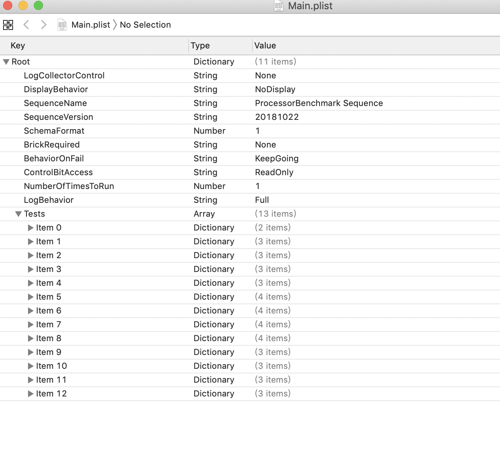

# ProcessorBenchmark Smokey sequence

Version 1.0
Feb 12, 2020

Authors:
Anna Ning         Anna.Ning@quantacn.com

# Content

[TOC]

# 怎样查看smokey的某个测项？

- 手动查找法
- 工具法

## 手动查找法

第一步:打开ProcessorBenchMark调用的所有lua文档

第二步:打开和main\.lua同一路径下的main\.plist

## 工具法

第一步:使用visual studio code\(command\+o\)打开smokey文件夹

第二步:使用visual studio code自带的搜索工具查找function

# ProcessorBenchmark sequence

- ProcessorBenchmark的测试内容及目的

- 测项分析及参数设置

# ProcessorBenchmark的测试内容及目的

ProcessorBenchmark包含以下四个测试，其目的：

- 为了检测Diagsos启动成功后，看执行命令的过程中是否出现异常；

- 检测Diagsos的启动过程中是否出现异常

## RamlogInit

清除上一次测试产生的ramlog，将具体的debug、错误、警告信息显示存储在ramlog中

1.ramlog --on 5                                                                               清除5M的ramlog

------

:-) ramlog --on 5
Initializing ram logger to 5Mbytes...
Will wrap contents when buffer gets full...
Turning on logging...
OK

2\.consolerouter \-\-add \-\-src smc\.debug\.notifications \-\-dest ramlog —quiet    将smc\.debug\.notifications的信息悄悄地添加到ramlog中

------

:-) consolerouter --add --src smc.debug.notifications --dest ramlog --quiet
OK

3\.consolerouter \-\-add \-\-src \*\.\{error\,print\,warn\} \-\-dest ramlog —quiet          将所有的error\,print\,warn的信息添加到ramlog中

------

:-) consolerouter --add --src *.{error,print,warn} --dest ramlog --quiet
OK

4\.consolerouter \-\-add \-\-src \*\.debug0 \-\-dest ramlog —quiet                           将所有的debug的信息添加到ramlog中

------

:-) consolerouter --add --src *.debug0 --dest ramlog --quiet
OK

## DumpNVRAM

将测试开始前的所有环境设置属性打印出来，为了排除测试开始前的某些设置影响测试结果，例如boot\-args\,boot\-command

1.nvram -l   打印当前环境设置属性

------

:-) nvram -l
nonce-seeds = 96 bytes
	00 00 00 00 00 00 00 00 EF 83 EF E3 3C FD AA 5E |............<..^|
	05 19 C2 F7 E5 15 22 01 00 00 00 00 00 00 00 00 |......".........|
	E8 1B 18 90 7E E4 C4 30 66 25 8D A9 C8 2B FA EC |....~..0f%...+..|
	00 00 00 00 00 00 00 00 B8 53 BA ED 53 2E 06 D4 |.........S..S...|
	03 D1 34 CF 63 B2 0B 42 00 00 00 00 00 00 00 00 |..4.c..B........|
	F1 6B 2F 64 86 10 3C ED B1 08 A3 16 EF 09 A3 9F |.k/d..<.........|
auto-boot = true
usbcfwflasherResult = No errors
root-live-fs = 1
boot-args = debug=0x14e serial=3 amfi=-1 cs_enforcement_disable=1 macefi.secure_boot_policy=0 macefi.startup_manager_policy=0x13 enable-acsleep=1 noidle=1 macefi.dam=1 apfs_edt_rw_mount=1
bootdelay = 0
debug-uarts = 3
obliteration = main: NVRAM variable autoboot-oblit not detected.
preserve-debuggability = 0x1
boot-command = diags

## DumpNandDebugCounters

读取soc测试开始前nand中存储的系统属性信息

1.nand --get DebugLog     读取nand中存储的系统属性信息

------

:-) nand --get DebugLog
	DebugLog = 
     ID  LENGTH   VALUE
      1       8 0000000000000001
      2       8 0000000000000001
      3       8 00000000002DF8DA
      4       8 0000000002C47E93
      5       8 0000000001D18547
      6       8 0000000002B28F5F

......

## BootDiagsOS

1.x86 status                  查看DiagsOS是否开启,若是开启状态，则不用执行23两条命令

------

:-) x86 status
Off
OK

2\.smc write FAC1 1           将FAC1写为1

------

:-) smc write FAC1 1
Key Write "FAC1":
00000000: 01                                              |.|
OK

3\.x86 boot \-\-bootstate diagsos                       开启Diagsos

------

:-) x86 boot --bootstate diagsos
Using default ROM file: nandfs:\usr\standalone\firmware\MacEFI\MacEFI.img4
Loading BootROM
Starting x86
Waiting for x86 to boot to diagsos
Result: 0
Spartacus version on x86 is 3.0
OK

[18 05:30:51] .... 			Exit code = 0x00000000

	--> DiagsOS Booted successfully

4\.i2c \-\-devwrite 10 0x09 0x1C 0x81                   检查并设置Fan的最大值（only  J160）

------

:-) i2c --devwrite 10 0x09 0x1C 0x81
Set  bytes:	0x81 	Writing 1 bytes

5\.x86 execute "dmidecode \-t memory | grep \-i 'size' | awk '\{print $2\}' | grep \-iv no | awk '\{x \+= $1\} END \{print x\}’"

------

:-) x86 execute "dmidecode -t memory | grep -i 'size' | awk '{print $2}'|grep -iv no | awk '{x += $1} END {print x}'"
----- Command output start -----
8192
----- Command output end -----
Result: 0
Spartacus version on x86 is 3.0
OK

6\.x86 execute "dmidecode \-t memory | grep \-i 'size' | awk '\{print $2$3\}' | head \-n1"

------

:-) x86 execute "dmidecode -t memory | grep -i 'size' | awk '{print $2$3}' | head -n1"
----- Command output start -----
4096MB
----- Command output end -----
Result: 0
Spartacus version on x86 is 3.0
OK

[18 05:30:55] .... 			Exit code = 0x00000000
Got MemoryString: 4096MB
Memory reported in MB; Converting into GB
Memory config: 8
REPORTED MEMORY: 8

7\.x86 status                    查看当前DiagsOS状态，若没有一次boot成功的话，会检查Spartacus\.efi是否存在后，再次boot

------

:-) x86 status
DiagsOS
OK

8\.x86 execute 'test \-e /mnt/pcie\-util/pcie\-util\.lua'      查找pcie\-util\.lua，找到返回0打印pcie device，没找到返回1

------

:-) x86 execute 'test -e /mnt/pcie-util/pcie-util.lua'
----- Command output start -----
----- Command output end -----
Result: 1
Spartacus version on x86 is 3.0
OK

9\.x86 execute "rm \-f '/mnt/shell\.log'"                       清除之前测试产生的shell\.log

------

:-) x86 execute "rm -f '/mnt/shell.log'"
----- Command output start -----
----- Command output end -----
Result: 0
Spartacus version on x86 is 3.0
OK

## PrintMotd

运行可执行文件，展示DiagsOS的版本信息

1.x86 execute "run-parts /etc/update-motd.d"                  展示DiagsOS的版本信息

------

:-) x86 execute "run-parts /etc/update-motd.d"
----- Command output start -----
Welcome to diagsOS

*Kernel Version:  4.13.0-38.48-diags

*Base Version:    0.11

*Test Version:    0.22 (b136a6a)

*Vendor Version:    0.1

*Build Timestamp: Mon, 05 Aug 2019 04:32:01 +0000

*Build Version:   (f09aa46)

*DiagsOS Version:   DiagsOS_J214-6

*DiagsOS built by dosbuild

*Documentation:   https://confluence.sd.apple.com/display/MDS/DiagsOS

*Radar Component: Mac Diags FW Triage | J214
----- Command output end -----
Result: 0
Spartacus version on x86 is 3.0
OK

## RunProcessorBenchmark

作DOE，通过改变CPU最小和最大时钟频率，并通过MSR读取和记录内核电压

1.rm -f nandfs:\AppleInternal\Diags\Logs\Smokey\ProcessorBenchmark\whetstone.log           删除DiagsOS log，如果存在的话

2\.x86 execute "sync"           将log同步到disk

3\.x86 execute "grep ^cpu\\\\scores /proc/cpuinfo | uniq |  awk '\{print $4\}'"           Get the number of cores on a system with hyperthreading

------

:-) x86 execute "grep ^cpu\\scores /proc/cpuinfo | uniq |  awk '{print $4}'"
----- Command output start -----
4
----- Command output end -----
Result: 0
Spartacus version on x86 is 3.0
OK

4.x86 execute "perl /root/whetstone/whet.pl 4 t45"          执行whet.pl，numcores为4，时间为45s

5\.x86 execute "cat /root/whetstone/whetstone\.log"          查看whetstone\.log中的信息

------

:-) x86 execute "cat /root/whetstone/whetstone.log"
----- Command output start -----
START /usr/bin/whetstone instances: 4, loops: 1, time: 45 @ Wed Sep 18 05:31:05 UTC 2019
whet.pl - Elapsed Time: 40, Loops completed: 8 with 0 Errors
----- Command output end -----
Result: 0
Spartacus version on x86 is 3.0
OK

6\.x86 xfer /root/whetstone/whetstone\.log nandfs:\\AppleInternal\\Diags\\Logs\\Smokey\\ProcessorBenchmark\\whetstone\.log          将产生的whetstone\.log复制到iEFI下smokey文件夹下

------

:-) x86 xfer /root/whetstone/whetstone.log nandfs:\AppleInternal\Diags\Logs\Smokey\ProcessorBenchmark\whetstone.log
Source = /root/whetstone/whetstone.log
Dest   = nandfs:\AppleInternal\Diags\Logs\Smokey\ProcessorBenchmark\whetstone.log
x86 -> host
.

File nandfs:\AppleInternal\Diags\Logs\Smokey\ProcessorBenchmark\whetstone.log written (150 bytes)
Result: 0
Spartacus version on x86 is 3.0
OK

## RunCPUFrequencyShmooDOE

读取和记录改变频率后每个CPU时钟频率的内核电压

1.x86 execute "modprobe msr"               加载MSR驱动，以便我们可以读取MSR存的信息

2\.x86 execute "grep \-c ^processor /proc/cpuinfo"                获取CPU的数量

3\.x86 execute "/root/pstate\.sh \-i "

4\.x86 execute "/root/pstate\.sh \-m "

5\.x86 execute "/root/pstate\.sh \-x "

使用pstate\.sh脚本来控制频率初始化调速器，以便我们设置频率

6\.x86 execute "/root/pstate\.sh \-s 400000"                  设置Target frequency为400000\-4100000，并打印当前的频率变化

7\.x86 execute "rdmsr \-d \-\-bitfield 47:32 0x198\.                   从MSR上循环读取五次0x198这个位置的电压值

8\.wait 500                     等待500ms后进行下一次电压读取

9\.x86 execute "echo 400000 > /sys/devices/system/cpu/cpu0/cpufreq/scaling\_min\_freq\."     将最小频率重置为初始值

10\.x86 execute "echo 4100000 > /sys/devices/system/cpu/cpu0/cpufreq/scaling\_max\_freq" 将最大频率重置为初始值

## ShutdownDiagsOS

1\.x86 execute \\"sleep 2; poweroff\\" \-\-async     关闭DiagsOS ，若脚本中设置了keep\-alive=true，则跳过不执行

## DumpNVRAM

1\.nvram \-l                测试结束，打印当前环境设置

## SaveNVRAM

1\.nvram \-\-save                保存设置

# END

