---
author:
    name: Whiteny Ren
    email: Whitney.Ren@quantacn.com
title: Overlay Release Process & Rule
date: 2020-3-2
---

# Release overlay process

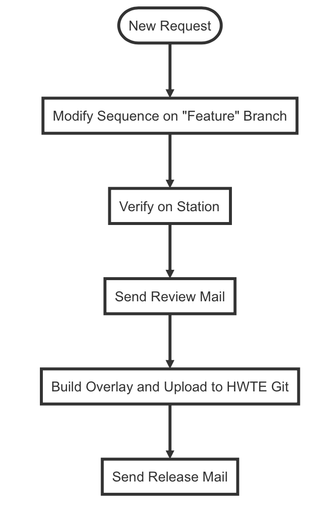

## New Request

​    根据客户提出的 new request, 注意以下几点：

1. 根据目前的具体情况，可以从以下几点看 new request 是否合理：

​      1）考虑到UPH， 测试时间是否合理;

​      2）时间,紧迫度,难度, dri a\-dri多方面合作；

​      3）谁先验证或由 CMSW 验证;

2. 目前的DTI是否 support 新的 request。

3. 手动验证测试时，出现其他issues及时反馈给客户。

4. Team 内部 review。

5. 先处理优先级高的。

## Modify Sequence on "Feature" Branch

编辑脚本时需要注意几点：

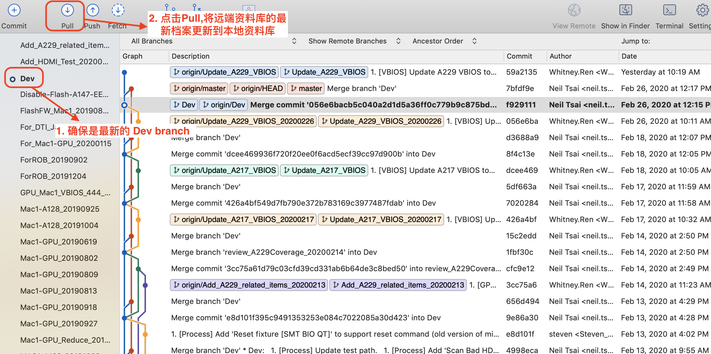

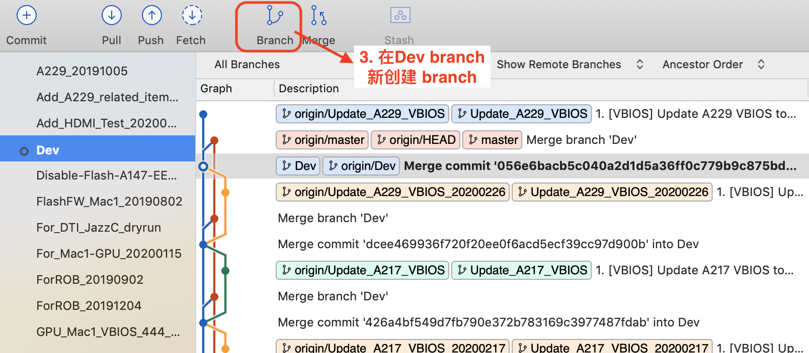
    

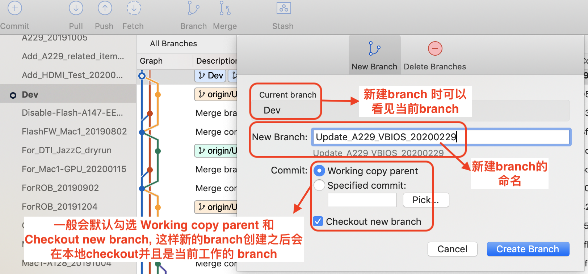

在Dev创建的branch 统一命名为：***feature\_[StationName]\_[Date]***，在 feature branch修改脚本并且 commit。

##Verify on Station

编辑脚本后，将本地资料库的最新档案 push 到远端资料库, 验证 overlay。

验证 overlay 时，用 AtlasBuildServer 来 build overlay，需要注意以下几点：

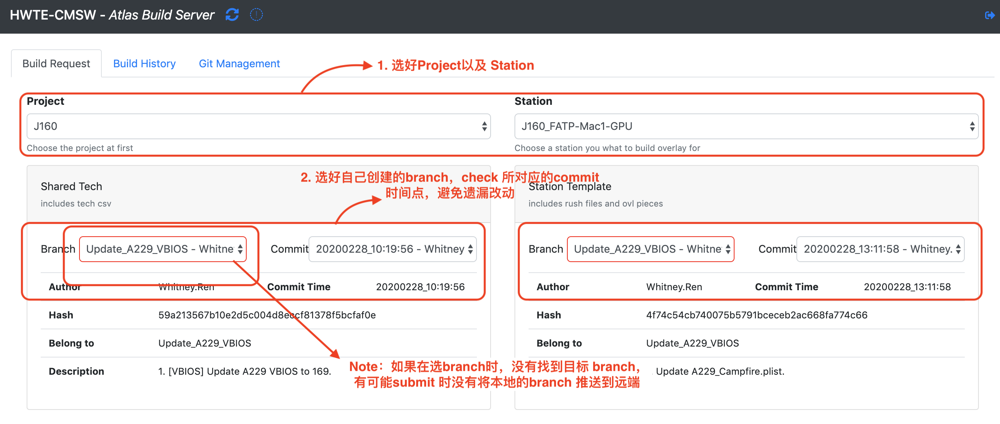

*Atlas Build Server 所有设定的功能&作用*

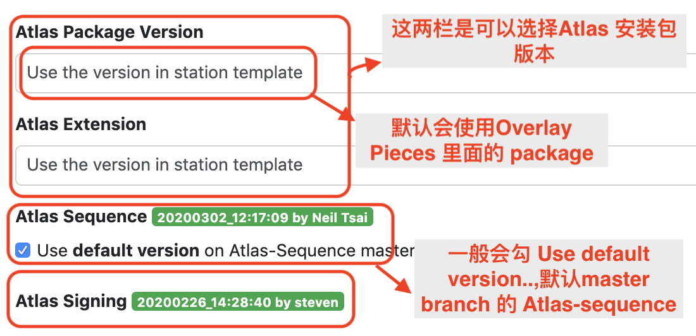

***Note***: *如果有新增 station，则需要在 Atlas Signing 增加 station cb code，避免使用 Atlas build server build 的 Overlay 没有 sign*。

***验证完成后，如果发现 Dev 不是最新的 commit 点，该如何处理？***

*在 Dev 最新的 commit 点新开个 feature branch，merge 先前的 feature branch，重新验证一次。*

##Send Review Mail

​    将改动的详细信息以信件的形式发送给有 review 资格的人员，抄送 HWTE\-CMSW。Overlay Reviewer 名单:  

| Name   | Date     |
| ------ | -------- |
| Hank   | 20200302 |
| Uplay  | 20200302 |
| Neil   | 20200302 |
| Carmmy | 20200302 |

***Note***：  
1. SharedTech \+ Main 和 Sequence git 的改动需要分开发 review mail。
2. 附带测试 log。

*Sharedtech + Main*

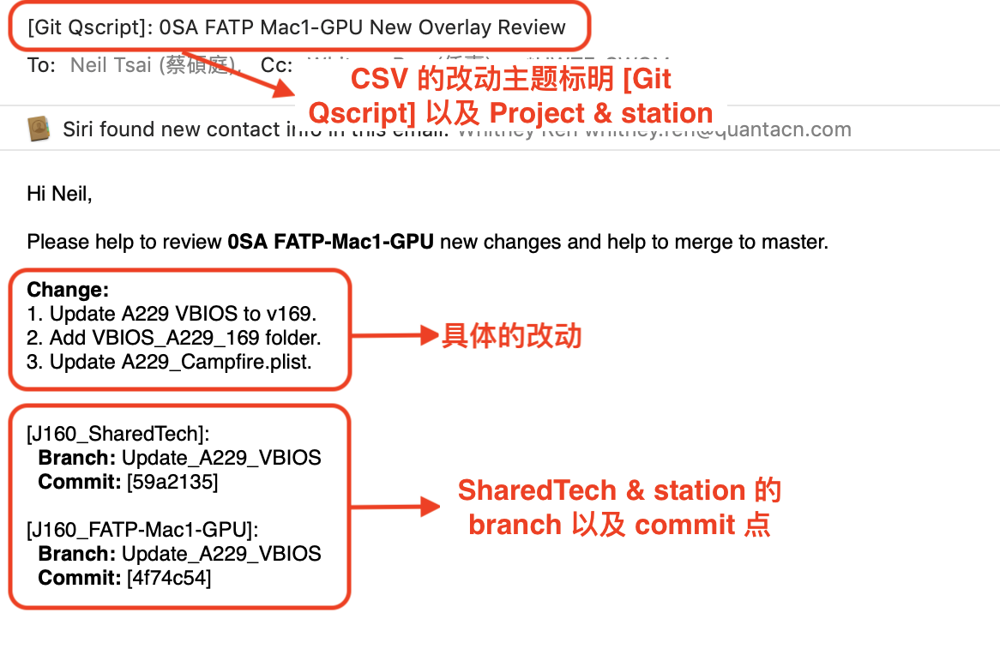

*Atlas-Sequence*

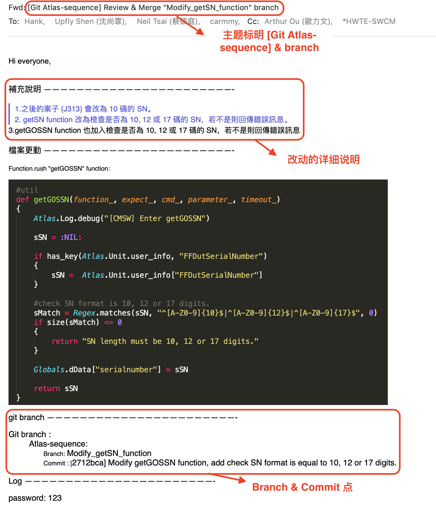

##Build overlay and Upload to HWTE Git

​    branch merge to master后,可以用 AtlasBuildServer 选 master branch build 一版新的 overlay ，Upload to HWTE git。

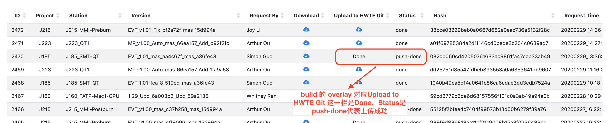

##Send Release Mail

Send build request mail 之后，在 GH 查看 overlay version，则发送release mail.

​    1) Release mail 要发送给 QSMC station DRI，抄送 Hank, Lewis, Kent, Kelvin, HWTE\-SWCM, A-TDL, Q-TDL.

* FATP 还需要抄送 Harry/Star +  Jerry.Li12@quantacn.com ;
* SMT 需要抄送 Vinva ；

​    2) 附上 release note history change list (10x\) & Coverage change list\.

*Release mail*

**GH 上 unsigned overlay 版本号 作为 release note version. 发Overlay release mail 标明具体的改动后，A-TDL 才会sign overlay.**

*Coverage change list*

1. 用CSVEditor 导出main\.csv，添加 Change note 和 build stage 栏位 (1.38 版的 CSVEditor 可以新增栏位)

*( 用快捷键 cmd + i ,下方会出来视窗 ,“+”，”-“ 图标 可以添加删除栏位,如下图，
 保存后，Preferences 的 SaveAs Option也会同步，也可以调整栏位顺序，导出CSV)*

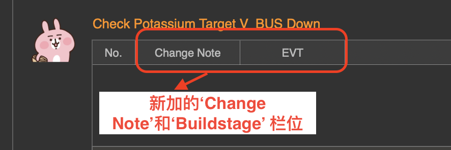

*如何用 CSVEditor 导出 main\.csv*

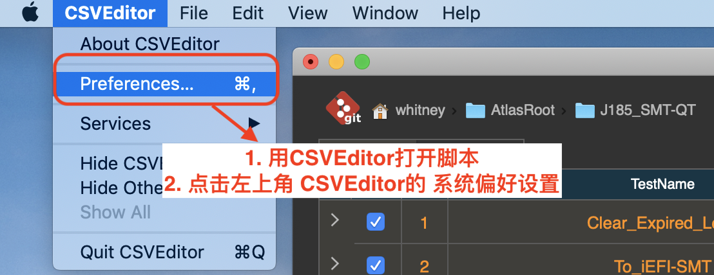

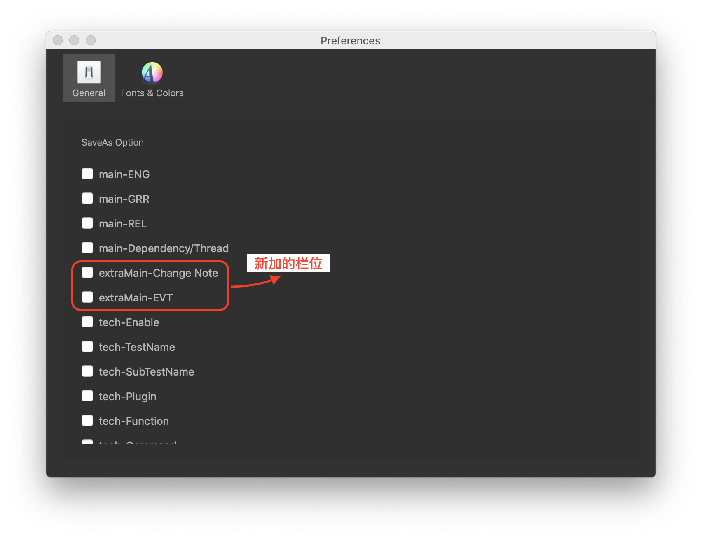

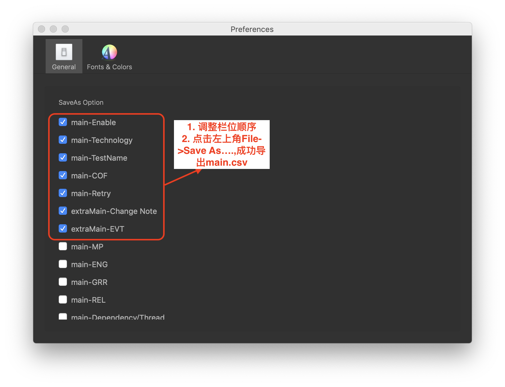

附件的Coverage Change list 如下图

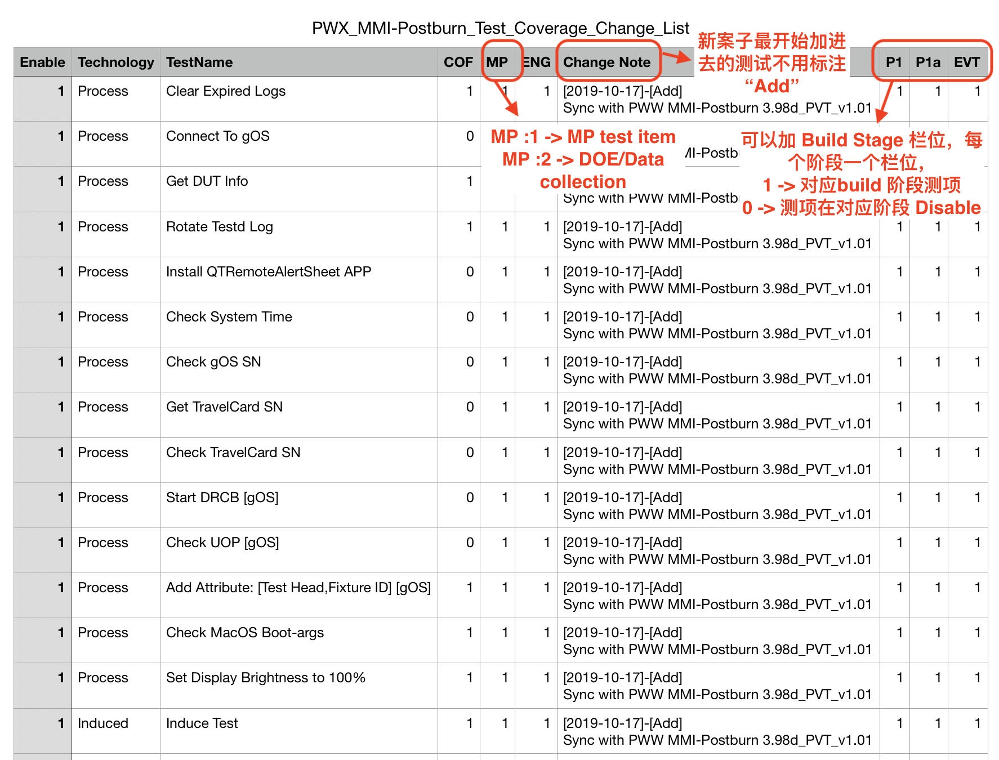

## [Appendix] Set HWTE Git Info

参考下图来set stationConfig：

**Note**: *对于AtlasBuildServer这一区块的信息，Server只会参考 “master” branch 最新的commit 的版本*

设置完成并merge 回 master之后，可以查看 Server 是否有更新。

在Atlas Build Server 的Git Management一栏，点击目标Project & Station，点击小眼睛图标

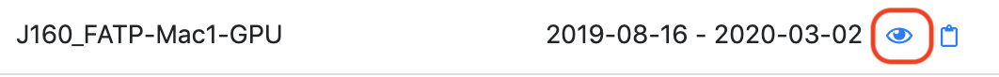

​如下图所示会出现部分info, 表示HWTE Git info 已设置好。

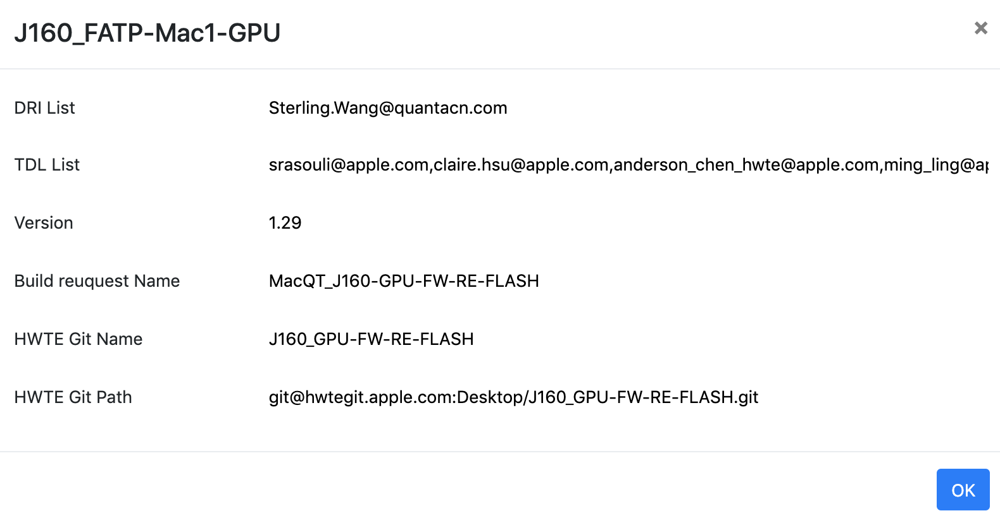

