# Overlay Release Process & Rule
<p align="left">Authors:</p>
<p align="right">Whiteny Ren        Whitney.Ren@quantacn.com</p>
##Content
[TOC]

##Revision History
| Version | Author/Editor | Summary of Changes | Date       |
| ------- | ------------- | ------------------ | ---------- |
| 1.0     | Whiteny Ren   | Initial version    | 2020-03-02 |

##Release overlay process

~~~flow
```flow 
st=>start: New Request
op1=>operation: Modify Sequence on "Feature" Branch
op2=>operation: Verify on Station
op3=>operation: Send Review Mail
op4=>operation: Build Overlay and Upload to HWTE Git
op5=>operation: Send Release Mail
e=>end
st->op1->op2->op3->op4->op5->e
```
~~~

##New Request

​    根据客户提出的 new request, 注意以下几点：

1. 根据目前的具体情况，可以从以下几点看 new request 是否合理：

​      1）考虑到UPH， 测试时间是否合理;

​      2）时间,紧迫度,难度, dri a\-dri多方面合作；

​      3）谁先验证或由 CMSW 验证;

2. 目前的DTI是否 support 新的 request。

3. 手动验证测试时，出现其他issues及时反馈给客户。

4. Team 内部 review。

5. 先处理优先级高的。

##Modify Sequence on "Feature" Branch

编辑脚本时需要注意几点：

<center>
    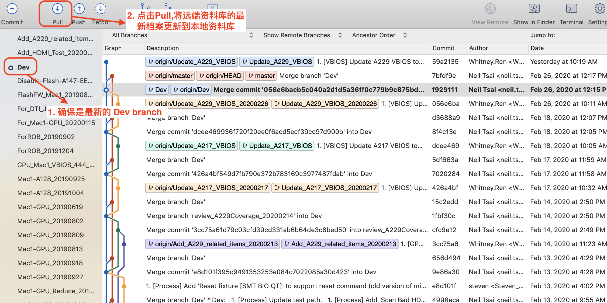
    <br>
    <div style="color:orange; solid:#d9d9d9; display:inline-block; color:#999; font-size:14px">
        图2. create new branch 1
    </div>
</center>


<center>
    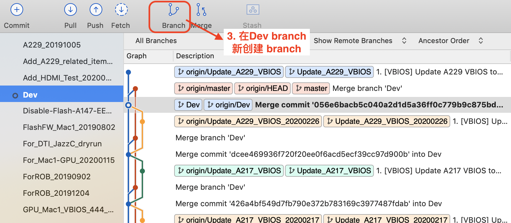
    <br>
    <div style="color:orange; solid:#d9d9d9; display:inline-block; color:#999; font-size:14px">
        图3. create new branch 2
    </div>
</center>

<center>
    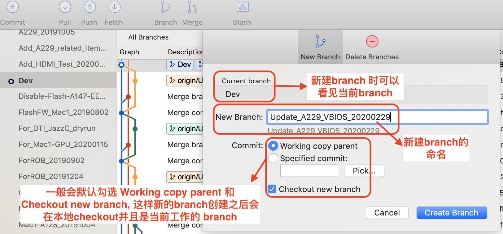
    <br>
    <div style="color:orange; solid:#d9d9d9; display:inline-block; color:#999; font-size:14px">
        图4. create new branch 3
    </div>
</center>

在Dev创建的branch 统一命名为：***feature\_[StationName]\_[Date]***，在 feature branch修改脚本并且 commit。

##Verify on Station

编辑脚本后，将本地资料库的最新档案 push 到远端资料库, 验证 overlay。

验证 overlay 时，用 AtlasBuildServer 来 build overlay，需要注意以下几点：

<center>
    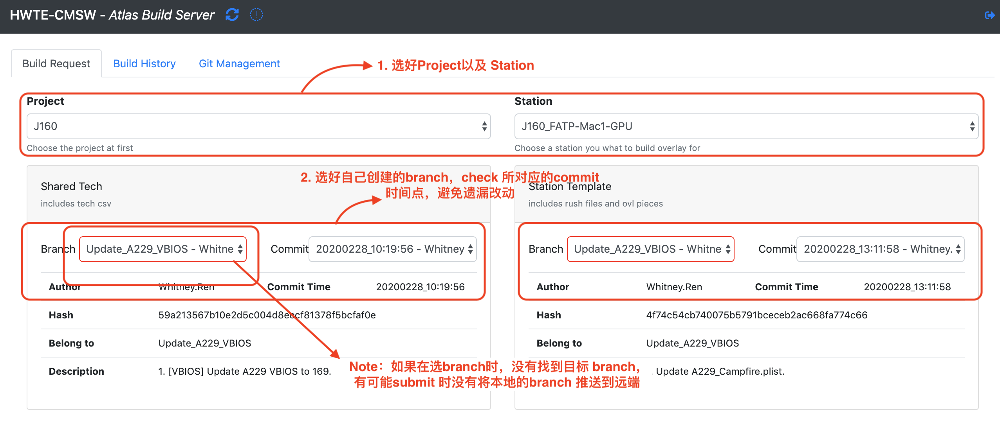
    <br>
    <div style="color:orange; solid:#d9d9d9; display:inline-block; color:#999; font-size:14px">
        图5. Build overlay
    </div>
</center>
*Atlas Build Server 所有设定的功能&作用*

<center>
    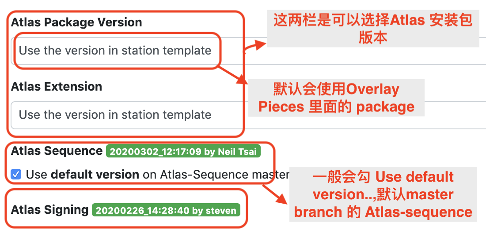
    <br>
    <div style="color:orange; solid:#d9d9d9; display:inline-block; color:#999; font-size:14px">
        图6. Atlas build server 设定的功能
    </div>
</center>
***Note***: *如果有新增 station，则需要在 Atlas Signing 增加 station cb code，避免使用 Atlas build server build 的 Overlay 没有 sign*。

***验证完成后，如果发现 Dev 不是最新的 commit 点，该如何处理？***

*在 Dev 最新的 commit 点新开个 feature branch，merge 先前的 feature branch，重新验证一次。*

##Send Review Mail

​    将改动的详细信息以信件的形式发送给有 review 资格的人员，抄送 HWTE\-CMSW。

| Name   | Date     |
| ------ | -------- |
| Hank   | 20200302 |
| Uplay  | 20200302 |
| Neil   | 20200302 |
| Carmmy | 20200302 |

<p style="text-align:center; color:orange; solid:#d9d9d9; height:25px; color:#999; font-size:15px">
               表1. Overlay Reviewer 名单
</p>

***Note***：1\. SharedTech \+ Main 和 Sequence git 的改动需要分开发 review mail。

​            2\. 附带测试 log。

*Sharedtech + Main*

<center>
    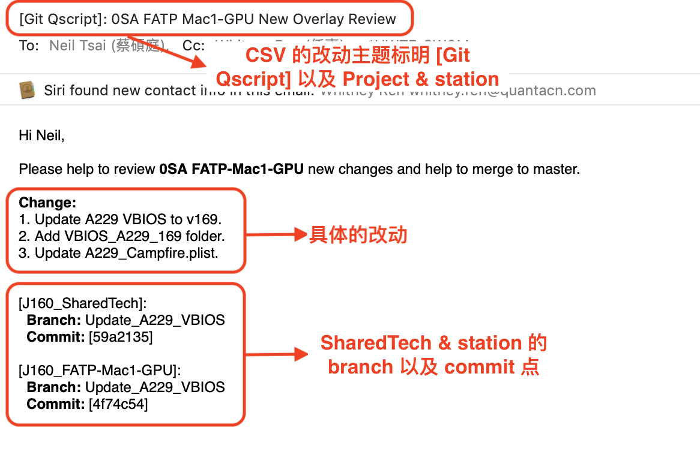
    <br>
    <div style="color:orange; solid:#d9d9d9; display:inline-block; color:#999; font-size:14px">
        图7. Sharedtech review mail
    </div>
</center>
*Atlas-Sequence*

<center>
    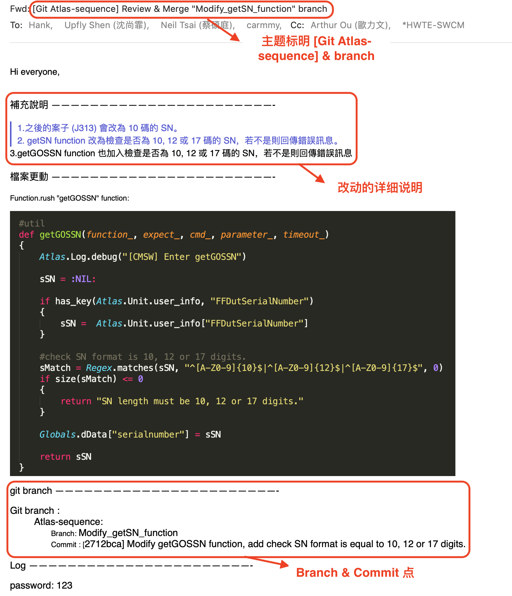
    <br>
    <div style="color:orange; solid:#d9d9d9; display:inline-block; color:#999; font-size:14px">
        图8. Atlas-sequence review mail
    </div>
</center>

##Build overlay and Upload to HWTE Git

​    branch merge to master后,可以用 AtlasBuildServer 选 master branch build 一版新的 overlay ，Upload to HWTE git。

<center>
    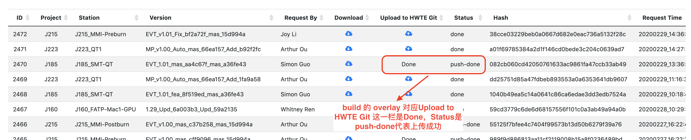
    <br>
    <div style="color:orange; solid:#d9d9d9; display:inline-block; color:#999; font-size:14px">
        图9. Upload to HWTE Git
    </div>
</center>

##Send Release Mail

Send build request mail 之后，在 GH 查看 overlay version，则发送release mail.

​    1) Release mail 要发送给 QSMC station DRI，抄送 Hank, Lewis, Kent, Kelvin, HWTE\-SWCM, A-TDL, Q-TDL.

* FATP 还需要抄送 Harry/Star +  Jerry.Li12@quantacn.com ;
* SMT 需要抄送 Vinva ；

​    2) 附上 release note history change list (10x\) & Coverage change list\.

*Release mail*

**GH 上 unsigned overlay 版本号 作为 release note version. 发Overlay release mail 标明具体的改动后，A-TDL 才会sign overlay.**

*Coverage change list*

​        1\. 用CSVEditor 导出main\.csv，添加 Change note 和 build stage 栏位 (1.38 版的 CSVEditor 可以新增栏位)

*( 用快捷键 cmd + i ,下方会出来视窗 ,“+”，”-“ 图标 可以添加删除栏位,如下图，
 保存后，Preferences 的 SaveAs Option也会同步，也可以调整栏位顺序，导出CSV)*

 <center>    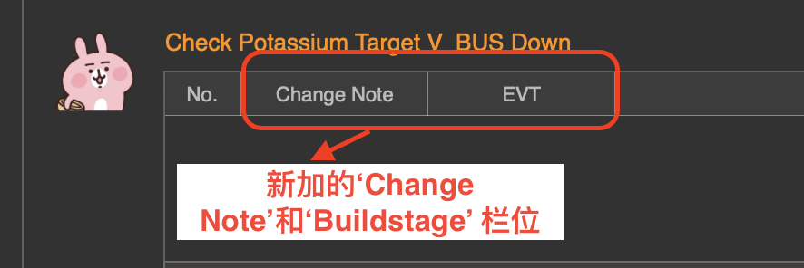    <br>    <div style="color:orange; solid:#d9d9d9; display:inline-block; color:#999; font-size:14px">        图10. 添加栏位    </div></center>

   *如何用 CSVEditor 导出 main\.csv*

<center>    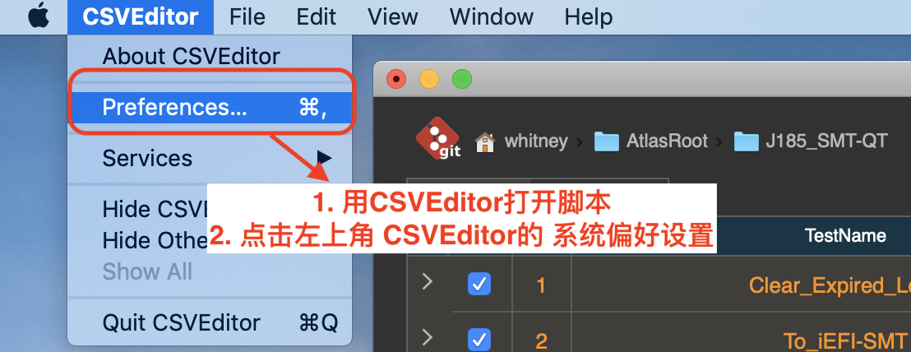    <br>    <div style="color:orange; solid:#d9d9d9; display:inline-block; color:#999; font-size:14px">        图11. 导出 main.csv 1    </div></center>

<center>    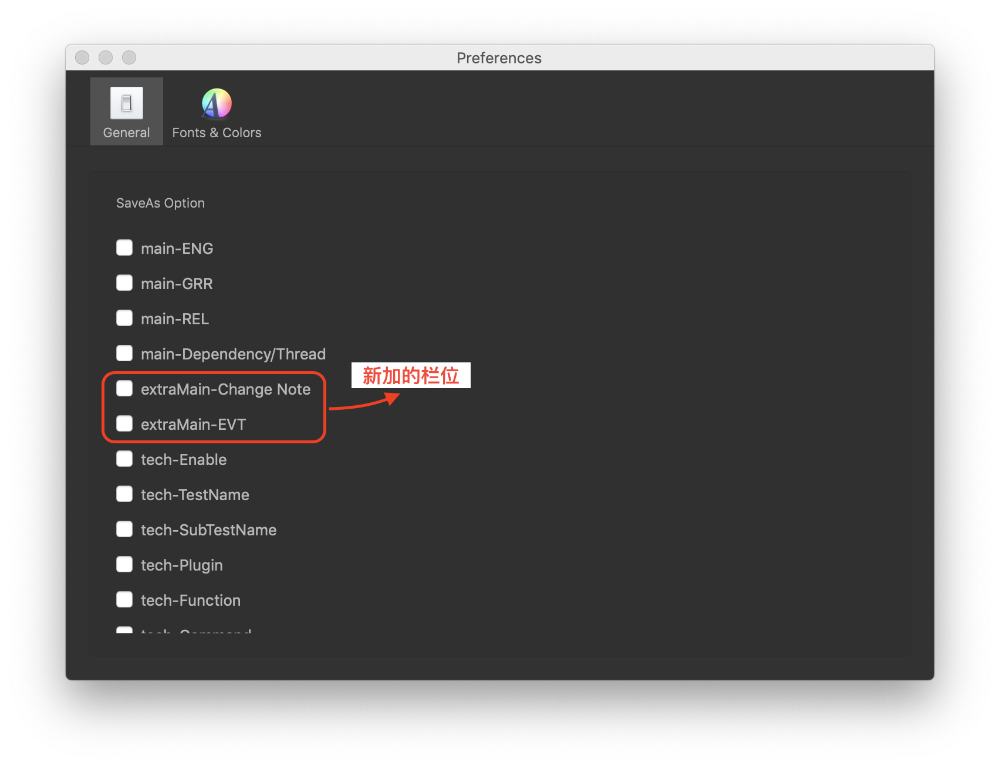    <br>    <div style="color:orange; solid:#d9d9d9; display:inline-block; color:#999; font-size:14px">        图11. 导出 main.csv 2   </div></center>

<center>    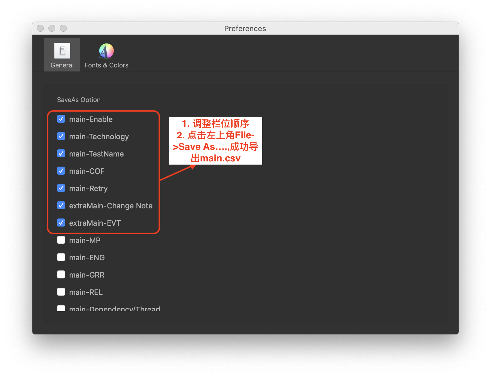    <br>    <div style="color:orange; solid:#d9d9d9; display:inline-block; color:#999; font-size:14px">        图11. 导出 main.csv 3   </div></center>

   附件的Coverage Change list 如下图

<center>    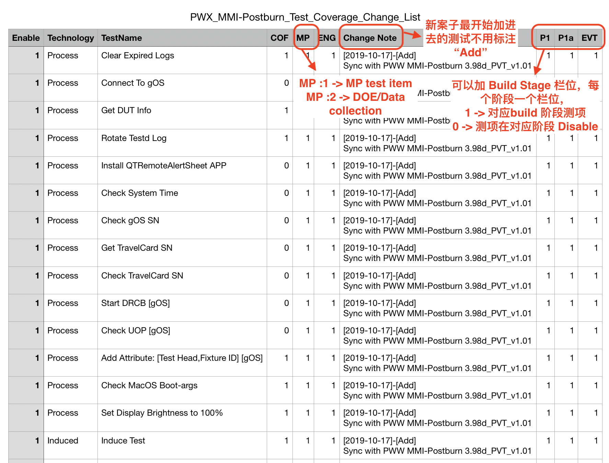    <br>    <div style="color:orange; solid:#d9d9d9; display:inline-block; color:#999; font-size:14px">        图12. Coverage Change list    </div></center>

##[Appendix] Set HWTE Git Info

参考下图来set stationConfig：

<center>        <br>    <div style="color:orange; solid:#d9d9d9; display:inline-block; color:#999; font-size:14px">        图13. AtlasBuildServerinfo    </div></center>                        

**Note**: *对于AtlasBuildServer这一区块的信息，Server只会参考 “master” branch 最新的commit 的版本*

设置完成并merge 回 master之后，可以查看 Server 是否有更新。

​    在Atlas Build Server 的Git Management一栏，点击目标Project & Station，点击小眼睛图标

<center>    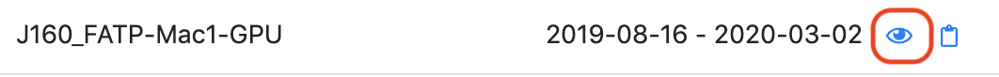    <br>    <div style="color:orange; solid:#d9d9d9; display:inline-block; color:#999; font-size:14px">        图13. git management 1    </div></center>  

​    如下图所示会出现部分info, 表示HWTE Git info 已设置好。

<center>    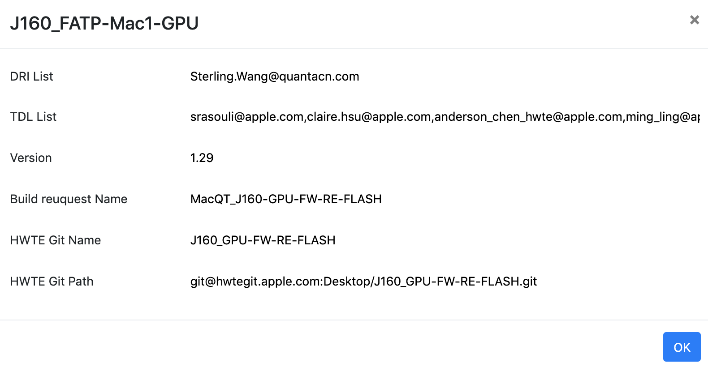    <br>    <div style="color:orange; solid:#d9d9d9; display:inline-block; color:#999; font-size:14px">        图14. git management 2    </div></center>  

