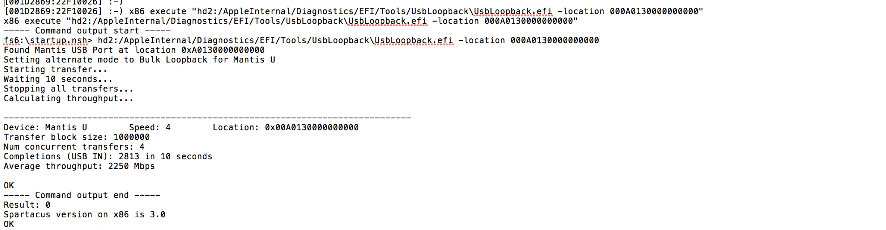
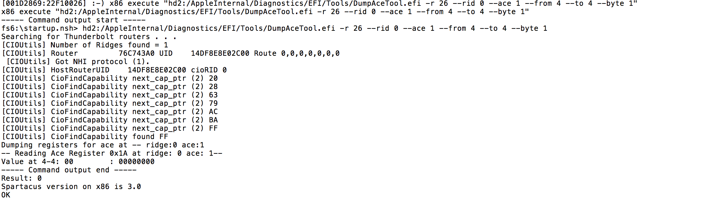

# Introduction of the Caesium & related test for J185

# Agenda

# Cable routing & diagram between DUT and Caesium.
Caesium introduction
Caesium inner cercuit Diagram 
CYUSB3014 (USB Controller)
LCP11U37 (LowSpeed)
ASM1352R
Caesium Box Setup
Caesium related test coverage.

# Cable routing I

Ethernet to USBA

Telnet via Ethernet to USBC

Comm to Host \(Neutron\)

Cable routing II

Ethernet to USBA

ENET\-USBA dongle \(B19B\)

Comm to Host \(Neutron\)

# Box IP address

# CaesiumCaes

# 一端用网线连接到Switch, 另一端接到DUT，测试。
需要注意的是XA和XB要连接正确（请看page5连接图)

XA的IP是10\.0\.100\.61，是透过XA连接到MLB，类似Potassium\.

XB只是测试USBC

# Mantis

# 一端用网线连接到Switch, 另一端接到DUT，测试。
需要注意的是USBA线也要按照对应的顺序接到DUT上。（请看page5连接图)

# HUB

# 

# QTestStudio vs Atlas

Main change of the box related tests

# Caesium Introduction

# Caesium is a USB-C device designed to exercise multiple aspects of the USB3.1 and USB-C protocols.To combine with SS+ and Legacy port.
Caesium is a test device designed by Apple for internal use by groups at Apple and by contract manufacturers doing business with Apple.

# Caesium Inner Cercit Diagram

DC Barrel

From Galium

5V\,3\.3V\,1\.8V\,1\.2V

DC To DC Supplies

Ground Screw

Terminal

GalliumController

LCP11U37

LS Device

Controller

Serial Port \(USB Type\-B\)

SATA Mass Storage2x drives in RAID0

CYUSB3014USB3\.0 Device Controller

USB  MUX

（multiplexer）

Circuit

MAX13054

CAN

Transceiver

ASM1352R

SUB TO SATA

Bridge

W5500

Ethernet to SPI

CYUSB3014USB3\.0 Device Controller

# USB Controller 
用于创建USB设备的SS/FS/HS/控制器，管理USB连接并处理速度切换。
Present test
Change CLeft/CRight to FS (Up/Down)
Change CLeft/CRight to HS (Up/Down)
Change CLeft/CRight to SS (Up/Down)

LCP11U37

LS Device

Controller

# LowSpeed USB Controller 
LowSpeed Controller 是一个由LCP11U37 控制的微调器（microcontroller ）它提供低速设备的接口。
目前我们没有测试LowSpeed， 只有测试SS/FS/HS

ASM1352R

SUB TO SATA

Bridge

# USB3.1 Gen 2 USB Controller (ASM) 
为了提供USB3.1 Gen 2（10 Gbps）功能，Cesium使用了ASMedia的ASM1352 USB-3.1至SATA桥
ASM在RAID0配置中控制两个128GB mSATA SSD。这提供了使10Gb链路饱和的机会。

SATA Mass Storage2x drives in RAID0

ASM1352R

SUB TO SATA

Bridge

# Apple Debug Channel

# 目前我们是通过caesium 与 MLB 连接，Apple 的调试接口位于Ethernet connector 连接器上，然后Cesium在端口31337上提供了一个TCP服务器，当连接到支持dock channels或UART的DUT时，可以将Cesium配置为将该信息转发到TCP端口.
相关应用：
我们在测试前会将caesium 的其中一个设置为 10.0.100.61 的IP，然后通过10.0.100.61的caesium通过31337连接到MLB。
Present test: Open GB Plugin

# Rush function:

# LED Indicators

# USB Speed 
USBC 的速度不同，caesium上的LED灯亮的颜色是不一样的
No USBC data connection detected ——off
LowSpeed (1.5Mbps) connection detected ——Pink
FullSpeed (12Mbps) connection detected ——Orange
HighSpeed (480Mbps) connection detected ——green
SuperSpeed (5Gbps) connection detected ——Blue
SuperSpeed+ (10Gbps) connection detected ——White
Passthrough port enable (Rev 2 only) ——Red

# LED Indicators

# Board Status在caesium 正面有3个Board Status 的指示灯。当盒子重启的时候会按照顺序从上到下闪一次绿灯。当顶部的LED 灯开始闪绿灯的时候表示caesium 进入正常运转的模式，当执行一个命令时，第二个灯会变绿
USBC Status当检测到USBC 连接的时候，这个指示灯会闪烁。when a PD contract is negotiated 这个灯将会持续稳定点亮。
TCP Status当端口4444上的TCP端口连接处于活动状态时，该指示灯将稳定点亮，而在该端口上存在超时条件时，该指示灯将闪烁。
Debug Status当Caesium正在协商Type-C端口上的调试路径时，该指示灯将闪烁，并在协商完成后常亮。

# Caesium Box Setup

# Box IP address

# 这些 IP addresses 被定义在stationConfig.plist

# Caesium Box Setup

# 连接caesium盒子电源
用网线连接caesium盒子与Hub
用网线连接Hub和MacMini，（或者用连接mini端连接到自己的电脑用Trunks Debug）
用USBC的线连接caesium与MLB
用Trunks设置caesium IP的方法：用mini2.0线连接caesium，USBA一端连接电脑，另一段连接caesium。Run Trunks select the serial device.然后从COM一栏找到set_ip，设置IP10.0.100.xx, 再把set_mask设置成255.255.0.0最后记得设置完之后要重启盒子。
需要注意的是6个盒子设置的方法都是一样的（两个caesium，4个Mantis)但是其中一个caesium必须设为10.0.100.61，使用来和MLB沟通，所以10.0.100.61的盒子还需要设置write_register，args：0x55，0x27.然后save_option_bits. 最后可以dump_raw_regs，查看设置。
如果IP 设置好以后你想用你自己的电脑debug，请先把自己的电脑ip改为10.0.100.1.

# Caesium Box Setup

# Caesium Box

# HUB

# Hub

# MINI

# TELNET 的使用方法

# 当IP 已经设置好以后，可以将接MINI 一段的网线接到自己电脑上，（记得要将自己的电脑IP设置为10.0.100.61）
然后用telnet连接31337:出现  ]  后敲击就可以进入MacEFI(目前只有在MacEFI下telnet才可以连进31337）
接下来就可以用telnet对MLB下指令，指令和用potassium一样。没有什么特殊的指令。

# Box Related Test Category

# 目前185 的测试coverage大部分是USBA/USBC相关测试。          
USBC/USBA throughput [UP/DOWN] [FS/HS/SS] USBC Orientation [UP/DOWN] [FS/HS/SS]USBC Presence Test [UP/DOWN] [FS/HS/SS] [8066]
Storage [2740] [2735] [2737] [3914] [3594]
WIFI Test [8008] [8016]
Ethernet Controller [8008] [8016]
Thunderbolt-0 [8008]
Display [2379]
ThermalInterface 4014 [TIM_CPU_Stress]
SensorGroup 3116 [sensor_group 3116]
Ethernet Test [loopback]

# USB Speed Test

# 前面讲到如何手动切换USB速度，接下来简单讲一下atlas command 测试 USB speed
在讲COM测试之前先要认识一下 UsbLoopback.efi 和 Location: IDUsbLoopback.efi 的路径 MaxDisk:/AppleInternal/Diagnostics/EFI/Tools/UsbLoopback\UsbLoopback.efi这个可以读出目前板子上所有的USB接口的Speed 和 Location ID 以及盒子的类型
Test  command x86 execute "hd2:/AppleInternal/Diagnostics/EFI/Tools/UsbLoopback\UsbLoopback.efi"

# USB Speed Test Log

# USB Throughput Test

# USB throughput test 实际上就是测试USB 的speed, 前面讲到，可以用UsbLoopback.efi 读出USB 的Location ID，USB throughput test就是指定location读取当前指定location id 的USB 的速度
Com:x86 execute “hd2:/AppleInternal/Diagnostics/EFI/Tools/UsbLoopback\UsbLoopback.efi -location IP”
其中的hd2就是maxdisk盘。

然后通过parse function 截取Average throughput 和 Mbps之间的数字，作limit判断上传。

# Orientation Test

# Orientation test 实际上就是测试盒子的正反面。在前面11页说到由于Type-c 支持正反插，cc pin 被用来侦测正反插，所以虽然你在插USBC的时候可以随意不用区分正反面，但是对于USBC来说它依然是有正反之分的，详细了解请看11页相关内容，或者问upfly。现在只讲command。
Command：x86 execute "%@/AppleInternal/Diagnostics/EFI/Tools/DumpAceTool.efi -r 26 --rid 0 --ace 1 --from 4 --to 4 --byte 1”。 %@是MaxDisk, 里边的参数是根据174用的。
其中 rid 0 ace 1 指的是USBCRight，rid 0 ace 0 是值USBCLeft。
我们根据Value at 4-4: 00/Value at 4-4: 01来判断USBC Up/Down,所以测试方法就是，先切换USBC Up/Down，然后用DumpAceTool.efi 读取是否切换成功，根据Value at 4-4 来判断。

# USBC Presence Test [UP/DOWN] [FS/HS/SS] [8066]

# 我们知道 8008 测试带速，8016 测试带宽，8007 测试error code。8066 测试我目前只是知道它会load Devices.json 里边的东西，比如CLeft

Command:x86 execute "%@/AppleInternal/Diagnostics/maestre.efi -t 8066 -c USBPort -ci CLeft”
如果Devices.json 里边有Cleft 并且env 是1 （类似于PTF）就可以测试。

# USBC Test Speed

# 1. Ethernet Test
2. Noun Interpretation
VBus
SPI
UART
CAN
I2C
SATA
3. USB-C CC pin
4. Mantis Box Setup

# Ethernet Test

# Ethernet Test [loopback]

# 最后讲一下Ethernet Test [loopback]测试，因为这个测试目前我是第一次遇到，他是在DiagsOS下ping网络。
具体测试过程：
测试环境是diagsOS ：smc write FAC1 1；x86 boot --bootstate otheros  ；x86 execute "diagsOS/BOOTX64.EFI "  --async
x86 execute “ifconfig -a” -a all 
x86 execute "ifconfig enp6s0 10.0.100.2 netmask 255.255.255.0 up”  给enp6s0 设置ip为10.0.100.2
x86 execute "ping -c 10 10.0.100.1”  -c count ping 10 次。

# Ethernet Test [loopback]

# Noun Interpretation

# VCONN & VBUS
CC: Configuration Channel
SPI
SATA
UART
CAN
I2C

# VBUS

# VBUS
VBUS线是HOST/HUB 向USB 设备供电的电源线，USB接口有以下引脚：VBUS:USB电压（5V）DM， DP：USB两根差分信号，也叫D-,D+ 。GND ：电源地，0电平。SHLD：固定USB座子的两个或四个定位孔。

# SPI

# SPI
SPI 是 Serial Peripheral Interface 的缩写，中文意思是串列周边介面。
SPI 为一主从式架构，通常由一个master和一个或者多个slave。连接方法也很简单，只需要把同名的接脚接到一起就可。
SPI 通常由4个接脚：MOSI | 主出从入 | master 数据输出, slave 数据输入MISO | 主入从出 | master 数据输入, slave 数据输出SCLK | 时脉讯号 | 时脉讯号 由master产生并控制/SS      | 晶片致能 | slave 选择信号，由master 控制，slave 只有在 /SS 信号为低电位时才会对master的指令有反应

# SPI

# SPI 读写SPI在硬件设计上采用的双数据线制，根据设计，在SPI通信过程中，主从设备之间会形成一个数据环形链路——即主设备向从设备写一次数据，从设备就会回一次数据(至于从设备回复的数据是否有效，则另当别论——如果有效，主设备就把它读入，否则丢弃）

# UART

# UART
UART用一条传输线将数据一位位地顺序传送,以字符为传输单位。(Universal Asynchronous Receiver / Transmitter）非同步串列通信口
数据发送方和数据接收方没有同步时钟，只有数据信号线，只不过发送端和接收端会按照协商好的协议（固定频率）来进行数据采样。数据发送方以每秒钟57600bits的速度发送数据，接收方也以57600bits的速度去接收数据，这样就可以保证数据的有效和正确。
UART由波特率产生器，UART接收器，UART发送器，UART仅使用两条线TXD和RXD用于数据的发和收。起始位：逻辑”0”的信号，表示传输字符的开始数据位：停止位：空闲位：波特率：数据传输的方式：300、600、1200、2400、4800、9600、19200、38400、43000、56000、57600、115200

# CAN

# CANCAN，全称为“Controller Area Network”，即控制器局域网，是国际上应用最广泛的现场总线之一CAN是一个广播类型的总线，所有节点都接收总线上的数据，硬件上的过滤机制决定消息是否提供给该接点用。CAN 通讯距离最大是10 公里（设速率为5Kbps）,或最大通信速率为1Mbps(设通信距离为40 米)。CAN 采用非破坏性的总线仲裁技术，当多个节点同时发送数据时，优先级低的节点会主动退出发送，高优先级的节点可继续发送，节省总线仲裁时间。CAN 是多主方式工作，网上的任一节点均可在任意时刻主动地向网络上其他节点发送信息。

# CAN
两个CAN连接器位于串行端口和地面端口之间。它们用于提供本地“仅测试设备”网络
相关应用设置caesium 的IP（这个会在caesium 设定中详细解答0

MAX13054

CAN

Transceiver

# I2C

# I2C
I2C接口包括时钟线（SCL）和数据线（SDA）。这两条线都是漏极开路或者集电极开路结构，使用时需要外加上拉电阻，可以挂载多设备。每个设备都有自己的地址，主机通过不同地址来选中不同的设备。
主机给从机发数据1，发送开始条件START和从机地址2，发送数据3，发送停止条件STOP结束。

# SATA

# SATA
SATA是serial ATA 的缩写，即串行ATA，是一种电脑总线，使用嵌入式信号时钟信号，具有更强的纠错能力，与以往相比最大的特点是能对于传输指令（不只是数据）进行检查，如果发现错误会自动矫正。还具有接口简单，支持热插拔的优点。

# Mantis Box Setup

# Mantis的设置和caesium（10.0.100.60）设置一样的方法，只设置IP.

# USB-C CC pin

# CC: Configuration Channel
USB Type-C 定义了CC pin, 理解CC pin 的功能也就大致理解了Type-C .下面四个项目是Type-C 所定义的CC pin的功能。
DFP (Downstream facing port) 为host端，UFP(Upstream facing port) 为device端。
在DFP 的CC pin会有上拉电阻Rp,在UFP 会有下拉电阻Rd。在DFP与UFP未连接之前，DFP的VBUS 是没有输出的，当DFP与UFP 连接之后，CC pin 相接，DFP CC pin 侦测到UFP pulldown Rd，表示连接到Device，DFP便打开VBUS的FET开关，输出VBUS电源给UFP.
DFP  可以由CC1和CC2 pin的负载阻抗来吧判断连接状态。

# Resolve orientation of the attached cable
由于Type-c 支持正反插，cc pin 被用来侦测正反插，从DFP的角度来讲当CC1连接到Pulldown就是正插，当CC2连接到Pulldown就是反插，在侦测到正反插后，就会有对应的USB信号，例如CC1对应的是SSTX1 & SSRX1, 由于USB 3.1 支持高速data rate 到10 G，为力避免PCB走线出现分支，所以正反插进来的信号有由MUX来切换，正插切换SSTX1&SSRX1，反插切换SSTX2&SSRX2.

# Discover and configure VBUS，USB Type-C current  modes or USB power Delivery
Type-C 如何去决定要执行的是那个模式呢？这需要靠CC pin, 前面提到DFP会有上拉电阻Rp，UFP 会有下拉电阻Rd, 当DFP与UFP 相连接的时候，CC pin上就会有分压，Rd是固定的5.1k，而Rp就会依照DFP的类别，而有不一样的电阻值。UFP会monitor CC pin上的分压来知道DFP的VBUS 种类。另外DFP也用不用大小的电流供给CC pin，当电流流到uRd 同样可以产生电压，让UFP 知道DFP的VBUS类型。
DFP  CC pin power supply如何得知DFP的VBUS输出能力？例如：3.0A@5V，他可以在CC pin上供330 μA的电流，在UFP 的CC pin端会得到330 μA *5.1k=1.683VUPF就会判断DFP为vRd-3.0，同样DFP 用一个上拉电阻到10k到VBUS，UFP端CC pin的电压为5V*（5.1+10）=1.688V，UFP 一样可以判断DFP 为vRd-3.0.

# Configure VCONN
CC pin 有CC1 & CC2，当其中一个pin被用来做DFP和UFP 的连接，另一个pin就会用来供应VCONN，VCONN是用5V 1W的电源，用于带有电子标记的Type-C电缆内的IC供电，启动时，DFP将提供VCONN电源。
当CC pin检测到有一个有效的Rp/Rd之后，在连接VCONN之前，另一个CC pin会监测另一个有效的Ra

# 参考网址

# https://blog.csdn.net/qq_41179988/article/details/85676362

https://blog.csdn.net/u010183728/article/details/81984433

https://blog.csdn.net/ywhputx0802/article/details/77359958

http://magicjackting.pixnet.net/blog/post/164725144-spi-(serial-peripheral-interface)-%E4%B8%B2%E5%88%97-(%E5%BA%8F%E5%88%97)-%E9%80%B1%E9%82%8A%E4%BB%8B

